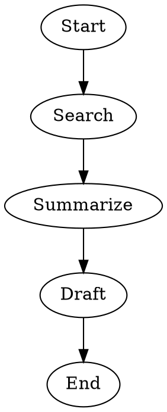
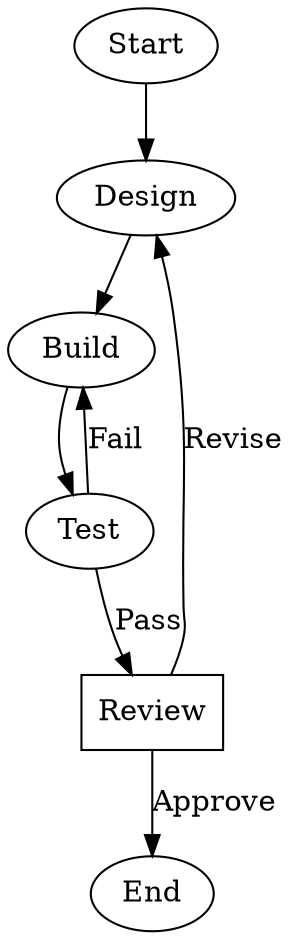
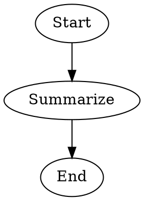

## Overview

Create a new workflow directory and `WORKFLOW.md` file for Stencila. A workflow is a directory under `.stencila/workflows/` containing a `WORKFLOW.md` file with YAML frontmatter and a Markdown body. The body usually includes a first `dot` fenced code block defining the pipeline, plus optional human-readable documentation.

Use this skill when the user wants to define a multi-stage AI workflow, orchestrate several agent or human steps, or scaffold a reusable pipeline that can be validated and run with Stencila.

## Steps

1. Determine the workflow name, description, and intended goal from the user's request
2. Validate the name against the naming rules below
3. Resolve the closest workspace by walking up from the current directory to find the nearest `.stencila/` directory; if none exists, use the repository root or current working directory and create `.stencila/workflows/<name>/`
4. Ask clarifying questions if the workflow's stages, branching behavior, agents, or goal are unclear
5. Check whether a workflow with the same name already exists in the target workspace; if it does, ask whether to overwrite, merge, or abort before changing anything
6. Decide whether the workflow should be permanent or ephemeral:
   - default to a normal permanent workflow unless the user asks for a temporary workflow or the creating tool explicitly uses ephemeral creation
   - prefer ephemeral workflows for agent-created drafts, quick experiments, or workflows the user may want to discard after immediate use
   - if ephemeral, plan to mark the workflow directory using a `.gitignore` sentinel file containing `*`
7. Create the directory `<closest-workspace>/.stencila/workflows/<name>/`
8. Write `WORKFLOW.md` with:
   - YAML frontmatter containing at least `name` and `description`
   - Prefer `goal` in frontmatter when the user provides a stable high-level objective; only duplicate it in graph attributes when required by execution semantics or existing project conventions
   - A Markdown body with the first `dot` fenced code block containing the workflow pipeline
   - Optional surrounding Markdown documentation that explains the workflow to humans
9. If ephemeral, create the `.gitignore` sentinel file with exactly `*` on its own line; if permanent, do not add that sentinel
10. Prefer a simple linear pipeline first, then add branching, retry loops, conditions, human review, or agent overrides only when the user asks for them or the workflow clearly needs them
11. Use `list_agents` when agent selection matters so you can choose from available specialized agents instead of guessing names
12. Reference existing agents by name with the `agent` attribute when appropriate, preferring specialized agents returned by `list_agents` when they fit the node's role; do not invent agent names unless the user requests them or they are already clear project conventions
13. Replace placeholders such as `TODO` before considering the workflow complete
14. Validate the finished workflow with `stencila workflows validate <name>`, the workflow directory path, or the `WORKFLOW.md` path and report that validation result back to the user when possible

When working from a nested directory in a repository, create the workflow in the closest workspace's `.stencila/workflows/` directory rather than creating a new `.stencila/` tree under the current subdirectory.

## Naming Rules

Workflow names must be **lowercase kebab-case**:

- 1–64 characters
- Only lowercase alphanumeric characters and hyphens (`a-z`, `0-9`, `-`)
- Must not start or end with a hyphen
- Must not contain consecutive hyphens (`--`)
- Must match the parent directory name
- Pattern: `^[a-z0-9]([a-z0-9-]{0,62}[a-z0-9])?$`

By convention, names describe the workflow's purpose (e.g., `code-review`, `test-and-deploy`, `lit-review`, `plan-implement-validate`).

Common corrections: `workflowBuilder` → `workflow-builder`, `test_deploy` → `test-deploy`, `Code-Review` → `code-review`.

## WORKFLOW.md Format

The file has two parts:

1. **YAML frontmatter** between `---` delimiters — metadata such as `name`, `description`, and optional `goal`
2. **Markdown body** — a DOT pipeline in the first `dot` fenced code block, plus optional documentation

### Required frontmatter fields

- `name` — the workflow name (must match directory name)
- `description` — what the workflow does and when to use it; keep it concise and specific

### Optional frontmatter fields

- `goal` — a high-level objective for the workflow; prefer this location for stable intent that prompts interpolate as `$goal`
- `license` — SPDX identifier or reference to a license file if needed
- `compatibility` — environment requirements (max 500 characters)
- `metadata` — arbitrary key-value pairs if the workflow needs extra structured metadata

Ephemeral status is not stored in frontmatter. It is determined by whether the workflow directory has a `.gitignore` sentinel file containing exactly `*`.

### DOT Pipeline Expectations

- Put the executable pipeline in the first `dot` fenced code block in the Markdown body
- Use a directed graph such as `digraph code_review { ... }`
- Prefer frontmatter `goal` for the workflow objective when it is known and stable
- Add a graph attribute like `graph [goal="..."]` only when required by execution semantics or to match an existing project style
- Use node attributes such as `prompt`, `agent`, and `shape=human` where needed
- Use edges to express sequencing, branching, retry loops, and approval paths
- Keep the initial scaffold minimal and readable unless the user explicitly asks for a complex pipeline

Markdown content outside the first DOT block is documentation for humans. Only the first DOT block is extracted as the pipeline definition.

## Ephemeral Workflows

An ephemeral workflow is a temporary workflow directory under `.stencila/workflows/` that includes a `.gitignore` file containing exactly:

```text
*
```

This sentinel marks the workflow as temporary without adding any special frontmatter or DOT attributes.

Use ephemeral workflows when:

- the workflow is being created by an agent for immediate execution
- the user wants a draft or throwaway workflow
- the workflow should be easy to discard if the user does not keep it

Do not make a workflow ephemeral unless the user asks for temporary behavior or the surrounding flow clearly implies it.

When describing the result to the user:

- explain whether the workflow is ephemeral or permanent
- if ephemeral, mention that it can be kept with `stencila workflows save <name>`
- if ephemeral, mention that it can be removed with `stencila workflows discard <name>`

## Common Workflow Patterns

House style for examples in this skill:

- use frontmatter with `name`, `description`, and `goal` when the objective is stable
- omit extra Markdown headings unless they add important human-facing documentation
- use `Start` and `End` nodes for readability
- place node definitions after edge definitions
- use simple edge labels such as `Pass`, `Fail`, `Approve`, and `Revise`
- use `$goal` in prompts when the workflow has a frontmatter `goal`

### Linear workflow

````markdown
---
name: lit-review
description: Search and summarize recent literature
goal: Review recent literature on CRISPR gene editing
---


````

### Agent-driven workflow with review gate

````markdown
---
name: code-review
description: Automated code review with human approval gate
goal: Implement and review the feature
---


````

## Authoring Guidance

- Start from the user's real objective, then map it to stages such as research, plan, build, test, review, and publish
- Use `Start` and `End` nodes for readability unless the workflow format or user request suggests a different style
- Use `list_agents` before assigning non-obvious agents so the workflow can reference real available agents rather than guessed names
- Use `agent="name"` to reference existing agents by name; when available, prefer specialized agents whose descriptions match the node's task. Stencila resolves workspace agents first, then user-level agents, then CLI-detected agents
- When a node has no `agent` attribute, the engine uses a default agent; this fallback is unlikely to be optimal for a well-designed workflow, so prefer explicit agent selection unless the user wants a minimal draft
- Use inline `agent.*` dotted attributes only when the user explicitly wants node-specific overrides such as `agent.model`, `agent.provider`, or `agent.reasoning-effort`
- Use `shape=human` for explicit human approval or review steps
- Put reusable high-level intent in frontmatter `goal` and refer to it in prompts with `$goal`
- Prefer frontmatter `goal` over repeating the same objective in both frontmatter and graph attributes
- Prefer explicit edge labels and conditions when a branch depends on success, failure, approval, or revision
- Do not try to encode ephemeral status in frontmatter or the DOT graph; use the `.gitignore` sentinel instead when needed
- Do not overcomplicate the first draft; a shorter valid workflow is better than an elaborate but unclear one

## Practical Workflow Design Guidance

Design the workflow so that each stage makes visible progress toward the goal instead of just adding more prompts.

- Break broad objectives into stages that reduce uncertainty or produce a concrete artifact for the next step
- For each non-trivial node, be able to state its input, output, success condition, and revision path
- Prefer node prompts that describe the local task; use frontmatter `goal` for the stable overall objective
- After major generative steps, add a test, review, critique, or approval gate when the next action depends on quality
- Add loops only when a later node can provide specific feedback that improves an earlier node
- Base branches on meaningful decisions such as pass/fail, approve/revise, or sufficient/insufficient evidence
- Use human approval when the workflow crosses a trust boundary such as publish, deploy, or accept consequential changes
- If a stage does not change what the workflow knows, decides, or produces, it is usually unnecessary

## Workflow Design Heuristics by Objective Type

Use patterns like these as a starting point, then simplify or extend them to fit the request.

| Objective type | Convergence-oriented shape |
|---|---|
| Research / literature review | clarify question → search → extract evidence → synthesize → critique gaps → draft |
| Coding / implementation | clarify requirements → design → implement → test → review → revise or approve |
| Publishing / editorial | brief → draft → edit → fact-check → approve → publish |
| Decision support | define criteria → gather options → evaluate → compare → recommend → approve |
| Data analysis | define question → collect data → clean/validate → analyze → interpret → review |

In each pattern, try to alternate generation and evaluation so later steps decide whether earlier work is good enough to continue.

## Example Walkthrough

Input: "Create a workflow that designs, implements, tests, and then asks for human approval before finishing"

Process:

1. Derive name: `plan-implement-validate` or a similarly specific kebab-case name that matches the user's stated purpose
2. Resolve workspace: find the nearest `.stencila/` directory, for example at the repository root
3. Target path: `.stencila/workflows/plan-implement-validate/WORKFLOW.md`
4. Check whether `.stencila/workflows/plan-implement-validate/` already exists; if it does, ask whether to overwrite, merge, or abort
5. Capture the goal and choose a pipeline with design, build, test, and human review steps
6. Use a DOT graph with clear edges, simple branch labels, and prompts or agents for each non-human node
7. Write the file, then validate it

Output:

````markdown
---
name: plan-implement-validate
description: Design, build, test, and review a requested software change
goal: Implement and validate the requested feature
---


````

Validated with: `stencila workflows validate plan-implement-validate`

## Ephemeral Example

Input: "Create a temporary workflow I can try once to summarize a set of notes"

Process:

1. Derive name: `note-summary`
2. Resolve the nearest workspace and target `.stencila/workflows/note-summary/`
3. Confirm this should be ephemeral rather than permanent
4. Check whether the target directory already exists; if it does, ask whether to overwrite, merge, or abort
5. Write `WORKFLOW.md` using the same frontmatter and DOT house style as the other examples
6. Create `.gitignore` containing exactly `*`
7. Validate the workflow and explain how to save or discard it

Output structure:

```text
.stencila/workflows/note-summary/
├── .gitignore   # contains exactly: *
└── WORKFLOW.md
```

Example `WORKFLOW.md`:

````markdown
---
name: note-summary
description: Summarize a temporary set of notes
goal: Summarize the provided notes into a concise brief
---


````

Notes to include when reporting completion:

- this workflow is ephemeral because the directory contains the `.gitignore` sentinel
- keep it with `stencila workflows save note-summary`
- remove it with `stencila workflows discard note-summary`

Validated with: `stencila workflows validate note-summary`

## Edge Cases

- **Workflow directory already exists**: Ask the user whether to overwrite, merge, or abort before modifying an existing workflow. Never silently overwrite.
- **Name mismatch**: If the requested name is not valid kebab-case, suggest a corrected version rather than failing silently.
- **Nested workspaces**: If multiple `.stencila/` directories exist in the ancestor chain, use the nearest one. Do not create a duplicate `.stencila/workflows/` tree.
- **Empty or placeholder content**: Do not consider the workflow complete if any `TODO`, `<placeholder>`, or empty `description` remains in the final `WORKFLOW.md`.
- **No DOT block**: A workflow without a DOT block may still be partially drafted, but it is incomplete for execution; add a valid first `dot` block before reporting completion unless the user explicitly asks for documentation only.
- **Missing goal**: `goal` is optional. Omit it if the user has not provided a stable overarching objective.
- **Unknown agents**: If the workflow references agent names that may not exist, tell the user they need corresponding agents or remove the `agent` attributes in the initial scaffold.
- **Overriding agent properties**: Use inline `agent.*` attributes sparingly; prefer reusable agent definitions unless the user clearly needs a node-specific override.
- **Ephemeral status**: Do not add custom frontmatter like `ephemeral: true`; ephemeral workflows are identified solely by the `.gitignore` sentinel file containing `*`.

## Validation

Before finishing, validate the workflow:

```sh
# By workflow name
stencila workflows validate <workflow-name>

# By directory path
stencila workflows validate .stencila/workflows/<workflow-name>

# By WORKFLOW.md path
stencila workflows validate .stencila/workflows/<workflow-name>/WORKFLOW.md
```

Validation should pass before you report the workflow as complete.
