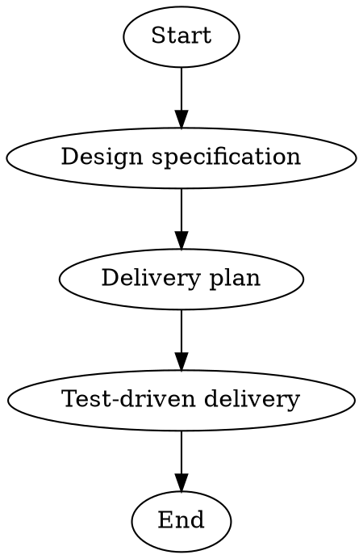

This workflow composes three child workflows into a sequential end-to-end pipeline for taking a software feature from idea to working code:

1. **Design** — runs `software-design-iterative` to draft and refine a design specification through agent review and human approval
2. **Plan** — runs `software-plan-iterative` to create and refine a delivery plan from the approved design through agent review and human approval
3. **Deliver** — runs `software-delivery-tdd` to execute the delivery plan slice-by-slice using Red-Green-Refactor TDD cycles with human sign-off after each slice

Each child workflow contains its own internal review and refinement loops, so this parent workflow focuses purely on orchestration. The user provides their feature idea once via `goal-hint`, and each composed workflow receives it as `$goal` via explicit `goal="$goal"` attributes. Later stages also receive the output of the preceding stage so that the design feeds into planning and the plan feeds into delivery.

