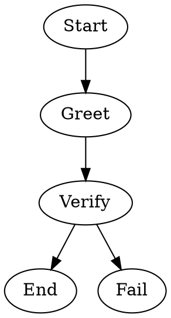

Tests the `agent=` node attribute, which references a named agent from the workspace or user agent registry. The workflow runner resolves the agent by name and delegates the LLM call to that agent's session. If no matching agent is found, the runner logs a warning and falls back to the default agent.

