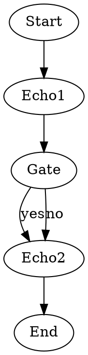

```dot
digraph Workflow {
  Start -> Echo1

  Echo1 [shell="echo before-gate"]
  Echo1 -> Gate

  Gate [ask="Approve child?"]
  Gate -> Echo2 [label="yes"]
  Gate -> Echo2 [label="no"]

  Echo2 [shell="echo after-gate"]
  Echo2 -> End
}
```
