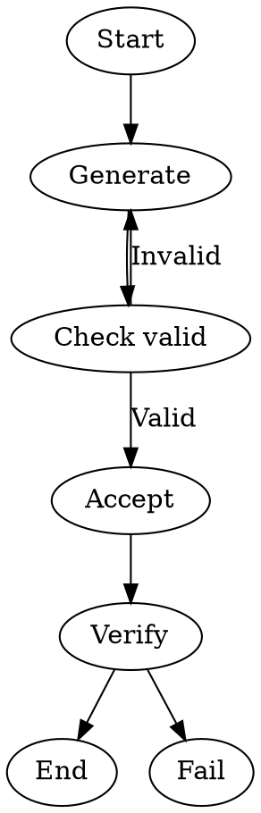

Tests conditional routing via a `Check*` node ID (sugar for `shape=diamond`). The `CheckValid` node is a no-op conditional that routes based on `outcome=success` / `outcome!=success` edge conditions. On failure, an edge loops back to retry generation.

