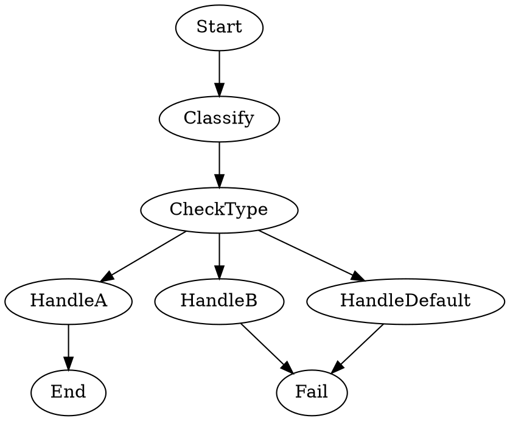

Tests multi-way conditional routing using `context.*` keys in edge conditions. The `Classify` shell node writes a known value to `context.shell.output`, and the `CheckType` conditional node routes to different handlers based on that value. Only the `HandleA` branch leads to `End`; all other branches lead to `Fail`, proving that incorrect routing is caught. Because every node uses deterministic shell commands, no LLM calls or API keys are required.

