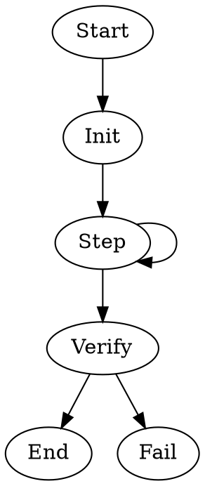

A test of looping with conditional branching and `$goal` expansion. The workflow starts at 1 and repeatedly increments until it reaches `$goal`.

```dot
digraph Workflow {
    Start -> Init -> Step
    Step -> Verify [condition="context.last_output=done"]
    Step -> Step   [condition="context.last_output!=done"]

    Init [prompt="Reply with just the number: 1"]
    Step [prompt="If $last_output equals $goal reply with ONLY the word done in lowercase. Otherwise add one to $last_output and reply with ONLY the new number, nothing else."]

    Verify [prompt="Does '$last_output' equal 'done'? Reply with ONLY yes or no in lowercase, nothing else."]
    Verify -> End  [condition="context.last_output=yes"]
    Verify -> Fail

    Fail
}
```
