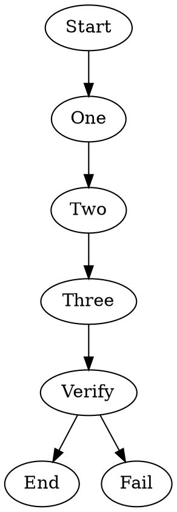

A simple test of $last_output and $last_stage expansion.

```dot
digraph CountToThree {
    graph [goal="Count from one to three"]

    Start -> One -> Two -> Three -> Verify
    Verify -> End  [condition="context.last_output=yes"]
    Verify -> Fail

    One    [agent="coder-a", prompt="Reply with just the number: 1"]
    Two    [agent="coder-o", prompt="Add one to $last_output and reply with just the result."]
    Three  [agent="coder-g", prompt="Add one to $last_output and reply with just the result."]

    Verify [prompt="Does $last_output equal 3? Reply with ONLY yes or no in lowercase, nothing else."]
    Fail
}
```
