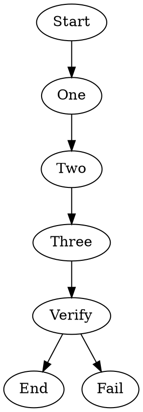

A simple test of `$last_output` and `$goal` expansion.

```dot
digraph Workflow {
  Start -> One

  One    [prompt="Reply with just the number: 1"]
  One -> Two

  Two    [prompt="Add one to $last_output and reply with just the result."]
  Two -> Three

  Three  [prompt="Add one to $last_output and reply with just the result."]
  Three -> Verify

  Verify [prompt="Does $last_output equal $goal? Reply with ONLY yes or no in lowercase, nothing else."]
  Verify -> End  [condition="context.last_output=yes"]
  Verify -> Fail
}
```
