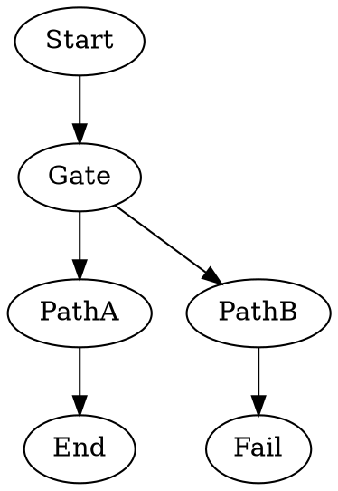

Tests that the engine selects the higher-weight edge when multiple unconditional edges leave a node. The `Gate` node has two outgoing edges with different weights; the edge with `weight=10` should always win over `weight=1`. If the engine correctly picks the heavier edge, `PathA` runs and the pipeline reaches `End`. If it incorrectly picks the lighter edge, `PathB` runs and the pipeline hits `Fail`.

