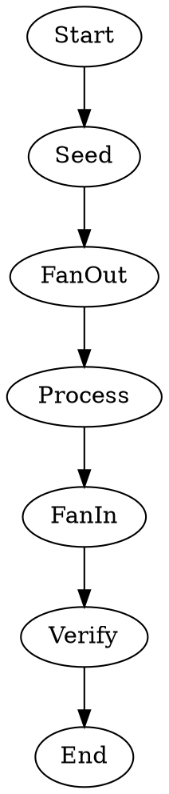

Tests the `fan_out` attribute for dynamic parallel fan-out. A shell node produces a JSON array and stores it in context using `store`/`store_as`. The fan-out node reads that array and spawns one branch per item. Each branch runs a shell node that echoes the item, verifying per-item context injection (`$fan_out.item`, `$fan_out.index`, `$fan_out.total`). The fan-in node collects results. A final shell node verifies that `$parallel.outputs` contains the expected values. No LLM calls or API keys are required.

