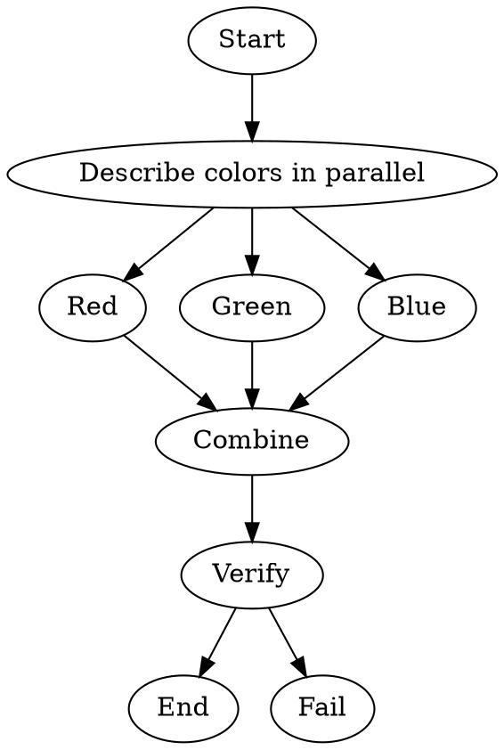

A simple test of parallel execution using `FanOut` node id for fan-out and a combine node for fan-in.

```dot
digraph FanOutFanIn {
    graph [goal="Describe three primary colors and combine them"]

    Start -> FanOut
    FanOut -> Red
    FanOut -> Green
    FanOut -> Blue
    Red -> Combine
    Green -> Combine
    Blue -> Combine
    Combine -> Verify
    Verify -> End  [condition="context.last_output=yes"]
    Verify -> Fail

    FanOut  [label="Describe colors in parallel"]
    Red     [prompt="Reply with ONLY one word: the name of the color with hex code #FF0000"]
    Green   [prompt="Reply with ONLY one word: the name of the color with hex code #00FF00"]
    Blue    [prompt="Reply with ONLY one word: the name of the color with hex code #0000FF"]

    Combine [prompt="List the three colors from the previous stages as a comma-separated list, e.g. pink, brown, orange. Reply with ONLY the list, nothing else."]

    Verify  [prompt="Does '$last_output' contain exactly three color names? Reply with ONLY yes or no in lowercase, nothing else."]

    Fail
}
```
