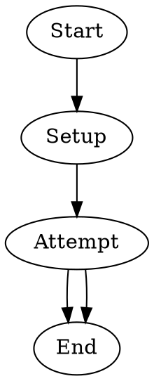

Tests that `goal_gate=true` prevents the pipeline from exiting until the gated node has succeeded. The `Attempt` shell node uses a counter file to fail deterministically on its first execution and succeed on its second. When `Attempt` fails, the fail edge routes to `End`, where the unsatisfied goal gate triggers a `retryTarget` loopback to `Attempt`. On the retry, the counter has been incremented so the command succeeds, satisfying the goal gate and completing the pipeline.

