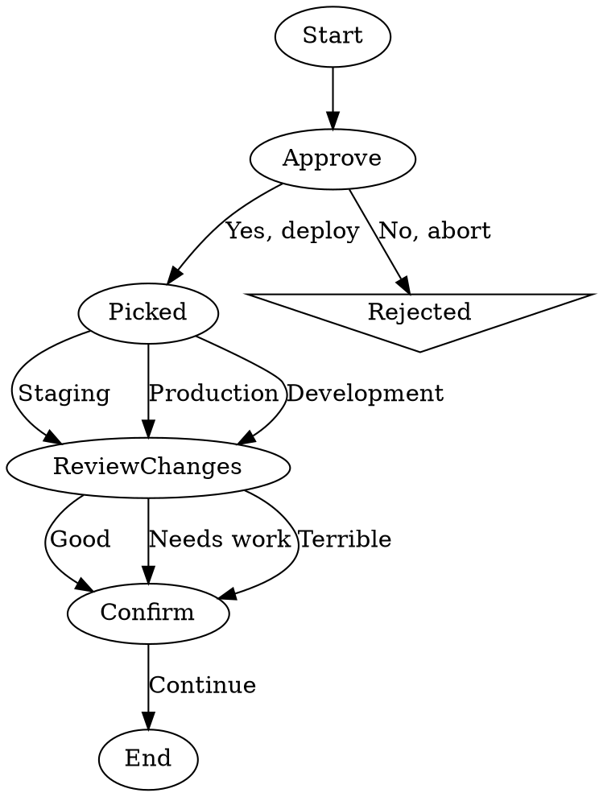

# Test Human Gates

This workflow exercises various `wait.human` gate patterns via the `CliInterviewer`. It has no LLM calls — every non-structural node is a human gate — so it can run instantly and offline.

