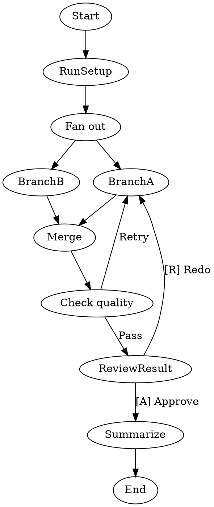

A "kitchen sink" integration test that combines multiple pipeline concepts in one workflow: shell command nodes, parallel fan-out/fan-in, conditional branching, human-in-the-loop gates, `max_retries`, `class=` with model stylesheet, edge conditions, and edge labels with accelerator keys. Targets the §11.12 parity matrix requirement that a 10+ node pipeline completes without errors.

