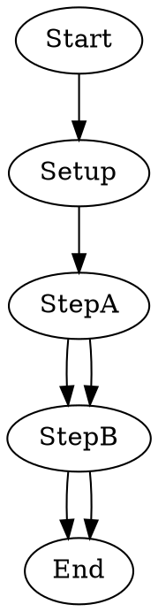

Tests the `max_retries` node attribute and `defaultMaxRetry` frontmatter using deterministic shell commands. Two nodes use counter files to fail on initial executions: `StepA` requires 2 visits (fails on 1st, succeeds on 2nd) and `StepB` requires 3 visits (fails on 1st and 2nd, succeeds on 3rd). Both have `goal_gate=true` so the pipeline loops back via `retryTarget` until both succeed. `StepA` inherits `defaultMaxRetry: 1` from frontmatter while `StepB` overrides with `max_retries=3`. This verifies that both the frontmatter default and per-node override are accepted by the engine's retry-policy builder without error, and that they coexist correctly with goal_gate retry loopbacks.

