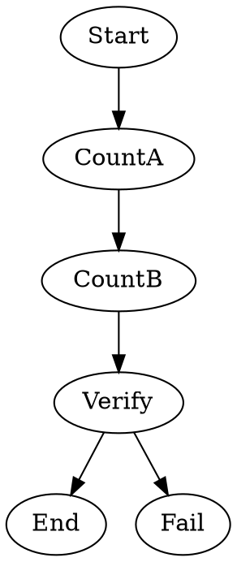

Tests that `modelStylesheet` frontmatter is merged into graph attributes and that universal (`*`), class (`.precise`), and ID (`#Verify`) selectors are applied to nodes. The `.precise` class is assigned via the `class=` node attribute.

