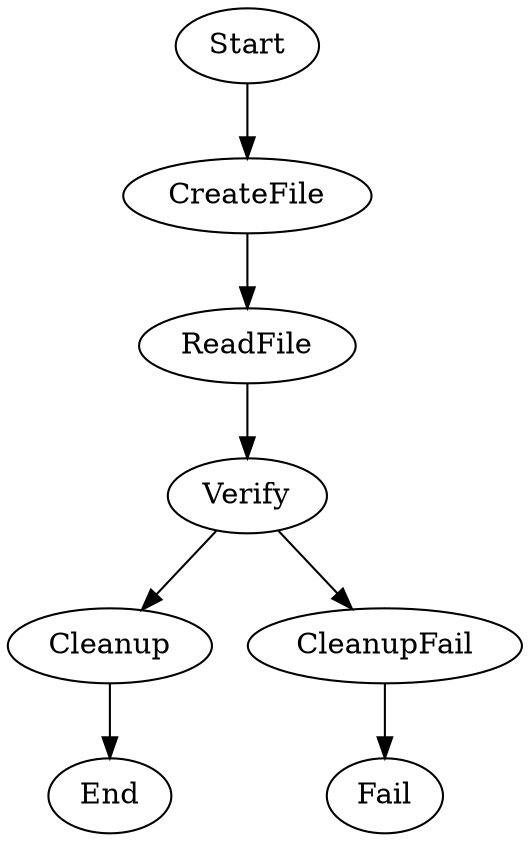

Tests the `shell=` property shortcut, which expand to `shape=parallelogram` and the `shell` handler type. This workflow has no LLM calls — every task node runs a shell command. The pipeline creates a temporary file, reads it back, and cleans up.

