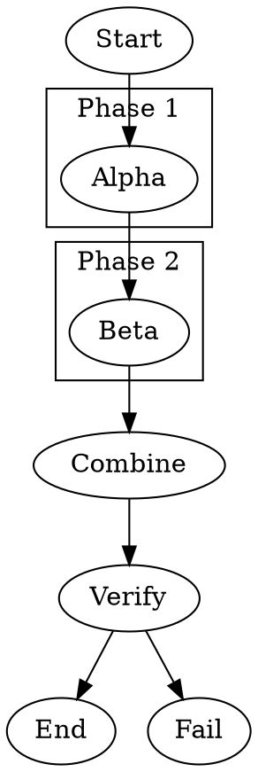

Tests that `subgraph` blocks scope `node [...]` default attributes (such as `class`) to nodes declared within them. Nodes inside each subgraph inherit the subgraph's defaults unless they explicitly override them.

