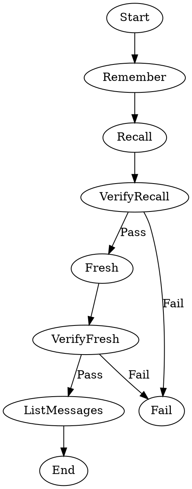

Tests that two agent nodes sharing the same `thread_id` with `fidelity=full` reuse a session, allowing the second node to recall context from the first. A third node without session reuse should not have that context.

