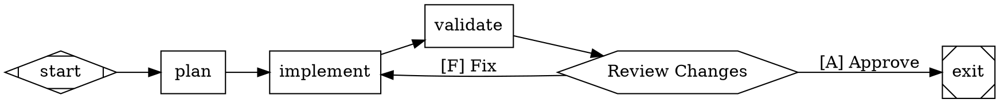

# Workflow Implementation Plan

## Overview

Workflows are multi-stage AI pipelines defined using Graphviz DOT syntax, following the [Attractor specification](rust/attractor/specs/attractor-spec.md). A workflow is represented as a `WORKFLOW.md` file with YAML frontmatter (metadata) and a Markdown body containing the pipeline definition in a ` ```dot ` code block.

Workflows live within **labs** — project-level groupings of agents and workflows that specialize in domain-specific activities. Workflows are typically shared (committed to a repository), while agents may be personal (user-level), allowing the same workflow to be executed with different agent configurations by different users.

## Design Decisions

### Schema type: `Workflow` (nick: `wfl`)

- Extends `CreativeWork` (same as `Agent`, `Skill`)
- **Required**: `name`, `description`
- **Core**: `frontmatter`, `content`, `pipeline`, `goal`
- **Optional**: `modelStylesheet`, `defaultMaxRetry`, `retryTarget`, `fallbackRetryTarget`, `defaultFidelity`
- Schema file: [`schema/Workflow.yaml`](schema/Workflow.yaml)

### Pipeline representation

The pipeline is stored as a **raw DOT string** (`pipeline: Option<String>`), not as structured node/edge types. Rationale:

- The `attractor` crate already provides typed `Graph`, `Node`, `Edge` types as the parsed/validated/executable representation. Duplicating these in the schema would create a parallel type system with maintenance burden and conversion overhead.
- DOT-as-string follows existing Stencila patterns: `CodeBlock.code`, `MathBlock.code`, `RawBlock.content` are all raw strings parsed by specialized engines.
- For programmatic construction, `attractor::Graph` has a clean builder API. For LLM-generated workflows, producing DOT text is natural.
- Structured schema types (e.g. `WorkflowNode`, `WorkflowEdge`) can be added later if a concrete need arises (e.g. visual workflow editor in TUI/web).

### Two construction paths

- **File-based** (`WORKFLOW.md`): content has the Markdown blocks including the `dot` code block → `pipeline` is extracted from the first `dot` code block during decode
- **In-memory/programmatic**: `pipeline` is set directly, `content` is `None`

### Agent linkage

- Nodes in the DOT graph reference agents by name via the `agent` attribute: `implement [agent="code-engineer"]`
- Agents are resolved from workspace `.stencila/agents/` and user-level `~/.config/stencila/agents/`
- Agent definitions provide defaults for model, provider, system instructions, and tools
- Precedence: agent defaults → model stylesheet → explicit node attributes
- No top-level `agents` list on the Workflow type — agent dependencies are implicit in DOT node attributes; the lab manages agent orchestration

### Discovery location

```
.stencila/
  labs/
    <lab-name>/
      workflows/
        <workflow-name>/
          WORKFLOW.md
```

Labs reference agents from normal discovery locations (not lab-specific agent directories).

### Example `WORKFLOW.md`

````markdown
---
name: code-review
description: Implements, tests, and reviews code changes
goal: "Implement and validate a feature"
modelStylesheet: |
  box { model = "claude-sonnet-4-5" }
  .critical { reasoning_effort = "high" }
---

# Code Review Pipeline

This workflow plans, implements, and validates code with human review.



The pipeline uses a human gate at the review stage.
````

## Completed Work

### Schema definition

- [x] `schema/Workflow.yaml` — type definition with all properties
- [x] `CreativeWorkType.yaml` already had `Workflow` variant

### Generated Rust types

- [x] `rust/schema/src/types/workflow.rs` — `Workflow` and `WorkflowOptions` structs
- [x] `Node::Workflow` variant in node enum
- [x] `CreativeWorkVariant::Workflow` variant
- [x] `NodeType::Workflow` in node-type crate

### Markdown codec — encode

- [x] `rust/schema/src/implem/workflow.rs` — `MarkdownCodec for Workflow` (frontmatter + optional content)
- [x] Registered in `rust/schema/src/implem/mod.rs`

### Markdown codec — decode

- [x] `rust/codec-markdown/src/decode/frontmatter.rs` — Workflow frontmatter deserialization (type injection, fallback sniffing, title/abstract handling)
- [x] `rust/codec-markdown/src/decode/mod.rs` — Workflow content handling with `extract_dot_pipeline()` for populating `pipeline` from first `dot` code block

### Match exhaustiveness

- [x] `rust/schema/src/implem/node.rs` — all four macros (`node_type`, `node_id`, `load_map`, `From<CreativeWorkVariant>`)
- [x] `rust/schema/src/implem/creative_work_type.rs` — `work_type()`, `doi()`, `title()`, `TryFrom<Node>`
- [x] `rust/node-stabilize/src/lib.rs` — `visit_node` variants

### Build status

- [x] Full workspace `cargo check` passes
- [x] `stencila-codec-markdown` tests pass
- [x] `stencila-schema` tests pass

## Next Steps

### 1. Tests for encode/decode round-trip

Validate the foundation before building on top.

- [x] Decode a `WORKFLOW.md` string with frontmatter + dot code block → verify `Workflow` fields (name, description, goal, pipeline, content)
- [x] Encode a `Workflow` back to markdown → verify frontmatter and content emitted correctly
- [x] Pipeline extraction: first `dot` code block found, non-dot blocks ignored, missing dot block → `pipeline: None`
- [x] Edge cases: frontmatter-only (no body), body with no dot block, multiple dot blocks (only first extracted)

Tests: `rust/codec-markdown/tests/workflows.rs` — 9 tests covering all the above cases plus type auto-detection from frontmatter, optional field decoding, and full decode→encode→decode roundtrip.

### 2. Workflow discovery & loading

Analogous to `rust/agents/src/agent_def.rs`. A `rust/workflows/` crate or module that:

- [ ] Discovers `WORKFLOW.md` files from `.stencila/labs/<lab>/workflows/<name>/`
- [ ] Provides `WorkflowInstance` wrapper (path, home dir, lab name, parsed `attractor::Graph`)
- [ ] Parses `pipeline` → `attractor::Graph` via `attractor::parse_dot()` on load
- [ ] Resolves and validates `agent=` references against discovered agents

### 3. Lab directory conventions

Lightweight additions to `rust/dirs/src/workspace.rs`:

- [ ] Add `LABS_DIR` constant
- [ ] Helper functions for listing labs and their contents
- [ ] No `Lab` schema type needed yet — a lab is just a directory convention

### 4. CLI commands

Mirror the agents CLI pattern:

- [ ] `stencila workflows list` — list workflows in current lab(s)
- [ ] `stencila workflows create` — scaffold a new `WORKFLOW.md` with template
- [ ] `stencila workflows validate` — decode + attractor parse + lint
- [ ] `stencila workflows run` — execute a workflow
- [ ] Possibly `stencila labs list` / `stencila labs create`

### 5. Execution integration

Wire `Workflow` + `attractor::Runner` + agent resolution:

- [ ] Convert `Workflow.pipeline` → `attractor::Graph` with workflow-level attributes (goal, modelStylesheet, etc.) merged into graph attributes
- [ ] Resolve `agent=` on nodes to `AgentInstance` definitions
- [ ] Implement `CodergenBackend` that delegates to Stencila's agent session system
- [ ] Wire up human-in-the-loop (interviewer) to TUI/web interaction
- [ ] Connect attractor event stream to Stencila's event/telemetry system
