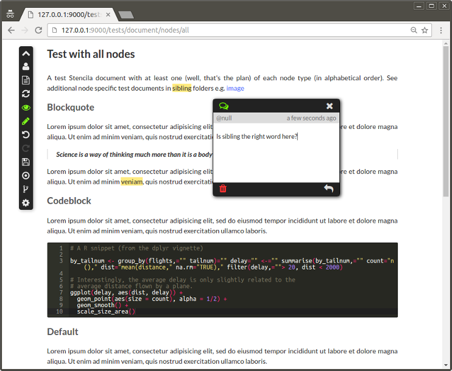

## `stencila/web` : Stencila in the browser

[](https://travis-ci.org/stencila/web)
[](https://codecov.io/gh/stencila/web)
[](https://david-dm.org/stencila/web)
[](https://gitter.im/stencila/stencila)

This repository is part of the Stencila platform. See our umbrella repository [stencila/stencila](https://github.com/stencila/stencila) for more details.

This repos provides in-browser, user interfaces for Stencila components. If you just want to use these interfaces see our packages for [R](https://github.com/stencila/r), [Python](https://github.com/stencila/py) and [Node.js](https://github.com/stencila/node). These interfaces talk to hosts in those packages to allow you to do things like evaluate expressions, execute blocks of code, save documents to disk, make Git commits etc. But, if you'd like to help out or have some feedback, read on!



### Install

Actually, this package isn't mean't to be installed as such. Normally, your browser will simply fetch the prebuilt Javascript and CSS bundles. But, if you want to help out with development (:thumbsup:) ...

```
npm install stencila/web
```

### Use

The browser based user interfaces in this repo don't do much by themselves. To use them, you'll want to connect to a Stencila host running in an R, Python or Node.js session. For example, to use the Stencila Document user interface in this repo you could install the [Python](https://github.com/stencila/py) package and then,

```py
from stencila import Document

document = Document()
document.view()
```

The `view` method ensures the host is serving and then opens up a browser at the URL of the newly created document. The browser in turn loads the [`document.js`](src/document/document.js) and [`document.scss`](src/document/document.scss) built from this repo.

### Discuss

We love feedback. Create a [new issue](https://github.com/stencila/web/issues/new), add to [existing issues](https://github.com/stencila/web/issues) or [chat](https://gitter.im/stencila/stencila) with members of the community.

### Develop

To get started with development...

```sh
# Install dependencies
npm install

# Build Javascript, CSS and other "static" files in the `build` folder 
npm run build

# Open one of the built test pages e.g.
open build/tests/document/nodes/image.html

# Hack on Javascript and SCSS and rebuild on changes
gulp watch
```

There is a folder for each Stencila component class (e.g. `Document`, `Sheet`, `Host`) with corresponsing Javascript and SASS entry points e.g. [`src/document/document.js`](src/document/document.js), [`src/document/document.scss`](src/document/document.scss). Each of those folders is essentially a single page application based on the [Substance](https://github.com/substance/substance) library.

There is also a development server which you can run using `npm start` and visit at [http://127.0.0.1:9000](http://127.0.0.1:9000) where there is more info and links to test pages. On these test pages, the Javascript and SCSS are bundled on the fly so that any changes you make are available with a browser refresh. The development server uses [`watchify`](https://github.com/substack/watchify) to do incremental builds - the first time you load a page the build will take some time (>10s), but subsequent page reloads will be much faster (<3s).

Most development tasks can be run directly using Javascript tooling (`npm` etc) or via `make` wrapper recipes.

Task                                                    | `npm`, `gulp` et al   | `make`          |
------------------------------------------------------- |-----------------------|-----------------|    
Install and setup dependencies                          | `npm install`         | `make setup`
Run the development server                              | `npm start`           | `make run`
Check code for lint                                     | `gulp lint`           | `make lint`
Run all tests                                           | `npm test`            | `make test`
Run unit tests only                                     | `npm run test-unit`   | `make test-unit`
Run functional tests only                               | `npm run test-fun`    | `make test-fun`
Run tests with coverage                                 | `npm run cover`       | `make cover`
Build                                                   | `npm run build`       | `make build`
Clean                                                   | `gulp clean`          | `make clean`


### Test

Unit tests (`*.test.js`) and functional tests (`*.fun.js`) live in the `tests` folder and are written using the [`tape`](https://github.com/substack/tape) test harness. The functional tests use [`nightmare`](https://github.com/segmentio/nightmare) to simulate user flows in the browser. They run more slowly, so you might not want to run them as often as the unit tests.

The script`tests/one.js` runs a single test file. Like `tests/unit.js` and `tests/functional.js` it runs `require('babel-register')` so that transpilation is done on the fly. You can run it using any of the following commands, providing the test file either as an absolute path, or as a path relative to the `tests` folder. e.g.

```
make test-one/collab/ChangeStore.test.js
node tests/one collab/ChangeStore.test.js
npm run test-one -- collab/ChangeStore.test.js
```

Tests are automatically run on [Travis](https://travis-ci.org/stencila/web) with code coverage statistics available at [Codecov](https://codecov.io/gh/stencila/web).
