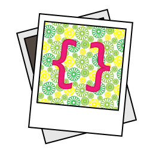

<div align="center">
	
</div>
<br>

## 👋 Introduction

Stencila is a platform for collaborating on, and publishing, dynamic, data-driven content. Our aim is to lower the barriers for creating data-driven documents and make it easier to create beautiful, interactive, and semantically rich, articles, web pages and applications from them.

## 📈 Status

This is `v2` of Stencila, a rewrite in Rust aimed at leveraging two relatively recent and impactful innovations:

- [Conflict-free replicated data types (CRDTs)](https://crdt.tech/), and specifically the production ready, Rust-based [Automerge `v2`](https://github.com/automerge/automerge), for de-centralized collaboration and version control.

- [Large language models (LLMs)](https://en.wikipedia.org/wiki/Large_language_model)for assisting in writing and editing, prose and code.

We are embarking on a rewrite because CRDTs will now be the foundational synchronization and storage layer for Stencila documents. This requires fundamental changes to most other parts of the platform (e.g. how changes are applied to dynamic documents). Furthermore, a rewrite allow us to bake in, rather than bolt on, mechanisms to mitigate the risks associated with using LLM assistants for authoring documents (e.g. recording the actor, human or LLM, that made the change to a document).

We're in the early stages of this rewrite, and this document will be updated with a roadmap and other details soon.

We are currently tagging releases using a `2.0.0-alpha.X` pattern (where we increment X on each release). The `v1` branch can be browsed [here](https://github.com/stencila/stencila/tree/v1).

## 📥 Install

Although `v2` is in early stages of development, and functionality may be limited or buggy, we are taking a continuous delivery approach and releasing binary builds of alpha versions of the Stencila CLI tool and language packages. Doing so allows us to get early feedback and monitor what impact the addition of features has on build times and distribution sizes.

### CLI tool

#### Windows

To install the latest release download `stencila-<version>-x86_64-pc-windows-msvc.zip` from the [latest release](https://github.com/stencila/stencila/releases/latest) and place it somewhere on your `PATH`.

#### MacOS

To install the latest release in `/usr/local/bin`,

```console
curl -L https://raw.githubusercontent.com/stencila/stencila/main/install.sh | bash
```

To install a specific version, append `-s vX.X.X`. Or, if you'd prefer to do it manually, download `stencila-<version>-x86_64-apple-darwin.tar.xz` from the one of the [releases](https://github.com/stencila/stencila/releases) and then,

```console
tar xvf stencila-*.tar.xz
sudo mv -f stencila /usr/local/bin # or wherever you prefer
```

#### Linux

To install the latest release in `~/.local/bin/`,

```console
curl -L https://raw.githubusercontent.com/stencila/stencila/main/install.sh | bash
```

To install a specific version, append `-s vX.X.X`. Or, if you'd prefer to do it manually, download `stencila-<version>-x86_64-unknown-linux-gnu.tar.xz` from the one of the [releases](https://github.com/stencila/stencila/releases) and then,

```console
tar xvf stencila-*.tar.xz
mv -f stencila ~/.local/bin/ # or wherever you prefer
```

#### Docker

The CLI is also available in a Docker image you can pull from the Github Container Registry,

```console
docker pull ghcr.io/stencila/stencila
```

and use locally like this for example,

```console
docker run -it --rm -v "$PWD":/work -w /work --network host ghcr.io/stencila/stencila --help
```

## 🛠️ Develop

This repository is organized into the following modules. Please see their respective READMEs for guides to contributing.

- [`schema`](schema): YAML files which define the Stencila Schema, an implementation of, and extensions to, https://schema.org, for documents.

- `json-ld` `🏗️ In progress`: A [JSON LD](https://json-ld.org/) `@context` for Stencila Schema generated from the files in `schema`.

- `json-schema` `🏗️ In progress`: A [JSON Schema](https://json-schema.org/) for Stencila Schema generated from the files in `schema`.

- [`rust`](rust): Several Rust crates implementing core functionality and a CLI for working with documents that adhere to that Stencila Schema.

- [`docs`](docs) `🏗️ In progress`: Documentation, including reference documentation generated from `schema` and the `rust` CLI interface.

- [`examples`](examples) `🏗️ In progress`: Example of documents conforming to Stencila Schema.

- `node` `🧭 Planned`: A Node.js package built on top of the Rust crates which provides interfaces to use Stencila from within Node.js.

- `python` `🧭 Planned`: A Python package built on top of the Rust crates which provides interfaces to use Stencila from within Python.

- `r` `🧭 Planned`: An R package built on top of the Rust crates which provides interfaces to use Stencila from within R.

## 💖 Supporters

We wouldn’t be doing this without the support of these generous, forward looking organizations.

<p align="center"><a href="https://sloan.org/"></img></a><p>
<p align="center"><a href="https://elifesciences.org/"></img></a><p>
<p align="center"><a href="https://www.mbie.govt.nz"></img></a><p>
<p align="center"><a href="https://coko.foundation/"></img></a><p>
<p align="center"><a href="https://www.codeforsociety.org/"></img></a><p>
<p align="center"><a href="https://www.callaghaninnovation.govt.nz/"></img></a><p>

## 🙏 Acknowledgements

Stencila is built on the shoulders of many open source projects. Our sincere thanks to all the maintainers and contributors of those projects for their vision, enthusiasm and dedication, but most of all for all their hard work! The following open source projects in particular have an important role in the current version of Stencila.

|                                                  | Link                                  | Summary                                                                                                                                 |
| ------------------------------------------------ | ------------------------------------- | --------------------------------------------------------------------------------------------------------------------------------------- |
|  | [Automerge](https://automerge.org/)   | A Rust library of data structures for building collaborative applications.                                                              |
|       | [Clap](https://crates.io/crates/clap) | A Command Line Argument Parser for Rust.                                                                                                |
|       | [Rust](https://www.rust-lang.org/)    | A multi-paradigm, high-level, general-purpose programming language which emphasizes performance, type safety, and concurrency.          |
|     | [Serde](https://serde.rs/)            | A framework for **ser**ializing and **de**serializing Rust data structures efficiently and generically.                                 |
|    | [Similar](https://insta.rs/similar/)  | A Rust library of diffing algorithms including Patience and Hunt–McIlroy / Hunt–Szymanski LCS.                                          |
|      | [Tokio](https://tokio.rs/)            | An asynchronous runtime for Rust which provides the building blocks needed for writing network applications without compromising speed. |
