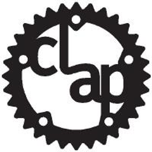
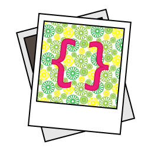

# 👋 Introduction

Stencila is a platform for creating and publishing, dynamic, data-driven content. Our aim is to lower the barriers for creating truly programmable documents, and to make it easier to publish them as beautiful, interactive, and semantically rich, articles and applications. Our roots are in scientific communication, but our tools are useful beyond.

This is `v2` of Stencila, a rewrite in Rust focused on the synergies between three recent and impactful innovations and trends:

- [Conflict-free replicated data types (CRDTs)](https://crdt.tech/) for de-centralized collaboration and version control.
- [Large language models (LLMs)](https://en.wikipedia.org/wiki/Large_language_model) for assisting in writing and editing, prose and code.
- The blurring of the lines between documents and applications as seen in tools such as [Notion](https://notion.com) and [Coda](https://coda.io/).

We are embarking on a rewrite because CRDTs will now be the foundational synchronization and storage layer for Stencila documents. This requires fundamental changes to most other parts of the platform. Furthermore, a rewrite allow us to bake in, rather than bolt on, new modes of interaction between authors and LLM assistants and add mechanisms to mitigate the risks associated with using LLMs (e.g. by recording the actor, human or LLM, that made the change to a document). Much of the code in the [`v1` branch](https://github.com/stencila/stencila/tree/v1) will be reused (after some tidy-ups and refactoring), so `v2` is not a _complete_ rewrite.

🚴 Roadmap

Our general strategy is to iterate horizontally across the feature set, rather than fully developing features sequentially. This will better enable early user testing of workflows and reduce the risk of finding ourselves painted into an architectural corner. So expect initial iterations to have limited functionality and be buggy.

We'll be making alpha and beta releases of `v2` early and often across all products (e.g. CLI, desktop, SDKs). We're aiming for a `2.0.0` release by the end of Q3 2024.

🟢 Stable • 🔶 Beta • ⚠️ Alpha • 🚧 Under development • 🧪 Experimental • 🧭 Planned • ❔ Maybe

### Schema

The Stencila Schema is the data model for Stencila documents (definition [here](https://github.com/stencila/stencila/tree/main/schema), generated reference documentation [here](https://github.com/stencila/stencila/tree/main/docs/reference/schema)). Most of the schema is well defined but some document node types are still marked as under development. A summary by category:

| Category | Description                                                                                                                                                                                                                                                                                                                           | Status                                            |
| :------- | :------------------------------------------------------------------------------------------------------------------------------------------------------------------------------------------------------------------------------------------------------------------------------------------------------------------------------------ | :------------------------------------------------ |
| Works    | Types of creative works (e.g. [`Article`](https://github.com/stencila/stencila/blob/main/docs/reference/schema/works/article.md), [`Figure`](https://github.com/stencila/stencila/blob/main/docs/reference/schema/works/figure.md), [`Review`](https://github.com/stencila/stencila/blob/main/docs/reference/schema/works/review.md)) | 🟢 Stable (mostly based on schema.org)             |
| Prose    | Types used in prose (e.g. [`Paragraph`](https://github.com/stencila/stencila/blob/main/docs/reference/schema/prose/paragraph.md), [`List`](https://github.com/stencila/stencila/blob/main/docs/reference/schema/prose/list.md), [`Heading`](https://github.com/stencila/stencila/blob/main/docs/reference/schema/prose/heading.md))   | 🟢 Stable (mostly based on HTML, JATS, Pandoc etc) |
| Code     | Types for executable (e.g. [`CodeChunk`](https://github.com/stencila/stencila/blob/main/docs/reference/schema/code/code-chunk.md)) and non-executable code (e.g. [`CodeBlock`](https://github.com/stencila/stencila/blob/main/docs/reference/schema/code/code-block.md))                                                              | 🔶 Beta (may change)                               |
| Math     | Types for math symbols and equations (e.g. [`MathBlock`](https://github.com/stencila/stencila/blob/main/docs/reference/schema/math/math-block.md))                                                                                                                                                                                    | 🔶 Beta (may change)                               |
| Data     | Fundamental data types (e.g. [`Number`](https://github.com/stencila/stencila/blob/main/docs/reference/schema/data/number.md)) and validators (e.g. [`NumberValidator`](https://github.com/stencila/stencila/blob/main/docs/reference/schema/data/number-validator.md))                                                                | 🔶 Beta (may change)                               |
| Flow     | Types for control flow within a document (e.g. [`If`](https://github.com/stencila/stencila/blob/main/docs/reference/schema/flow/if.md), [`For`](https://github.com/stencila/stencila/blob/main/docs/reference/schema/flow/for.md), [`Call`](https://github.com/stencila/stencila/blob/main/docs/reference/schema/flow/call.md))       | 🔶 Beta (may change)                               |
| Style    | Types for styling parts of a documents ([`Span`](https://github.com/stencila/stencila/blob/main/docs/reference/schema/style/span.md) and [`Division`](https://github.com/stencila/stencila/blob/main/docs/reference/schema/style/division.md))                                                                                        | 🔶 Beta (may change)                               |
| Edits    | Types related to editing a documents (e.g. [`InstructionBlock`](https://github.com/stencila/stencila/blob/main/docs/reference/schema/edits/instruction-block.md))                                                                                                                                                                     | 🔶 Beta (may change)                               |

Storage and synchronization

In `v2`, documents can be stored as [binary Automerge CRDT](https://automerge.org/automerge-binary-format-spec/) files, branched and merged, and with the ability to import and export the document in various formats. Collaboration, including real-time, is made possible by exchanging fine-grained changes to the CRDT over the network. In addition, we want to enable interoperability with a Git-based workflow.

| Functionality                | Description                                                                                                                                                 | Status    |
| :--------------------------- | :---------------------------------------------------------------------------------------------------------------------------------------------------------- | :-------- |
| Documents read/write-able    | Able to write a Stencila document to an Automerge binary file and read it back in                                                                           | ⚠️ Alpha  |
| Documents import/export-able | Able to import or export document as alternative formats, using tree diffing to generate CRDT changes                                                       | ⚠️ Alpha  |
| Documents fork/merge-able    | Able to create a fork of a document in another file and then later merge with the original                                                                  | 🧭 Planned |
| Documents diff-able          | Able to view a diff, in any of the supported formats, between versions of a document and between a document and another file                                | 🧭 Planned |
| Git merge driver             | CLI can act as a [custom Git merge driver](https://www.julianburr.de/til/custom-git-merge-drivers/)                                                         | 🧭 Planned |
| Relay server                 | Documents can be synchronized by exchanging changes via a relay server                                                                                      | 🧭 Planned |
| Rendezvous server            | Documents can be synchronized by exchanging changes peer-to-peer using TCP or UDP [hole punching](https://en.wikipedia.org/wiki/Hole_punching_(networking)) | ❔ Maybe   |

### Formats

Interoperability with existing formats has always been a key feature of Stencila. We are bringing over _codecs_ (a.k.a. converters) from the `v1` branch and porting other functionality from [`encoda`](https://github.com/stencila/encoda) to Rust.

| Format                                                                                              | Encoding | Decoding | Coverage | Notes                                                                                                                                                       |
| :-------------------------------------------------------------------------------------------------- | :------: | :------: | :------: | :---------------------------------------------------------------------------------------------------------------------------------------------------------- |
| [JSON](https://github.com/stencila/stencila/blob/main/docs/reference/formats/json.md)               |    🟢     |    🟢     |          |                                                                                                                                                             |
| [JSON5](https://github.com/stencila/stencila/blob/main/docs/reference/formats/json5.md)             |    🟢     |    🟢     |          |                                                                                                                                                             |
| [JSON-LD](https://github.com/stencila/stencila/blob/main/docs/reference/formats/jsonld.md)          |    🟢     |    🟢     |          |                                                                                                                                                             |
| [CBOR](https://github.com/stencila/stencila/blob/main/docs/reference/formats/cbor.md)               |    🟢     |    🟢     |          |                                                                                                                                                             |
| [CBOR+Zstandard](https://github.com/stencila/stencila/blob/main/docs/reference/formats/cborzstd.md) |    🟢     |    🟢     |          |                                                                                                                                                             |
| [YAML](https://github.com/stencila/stencila/blob/main/docs/reference/formats/yaml.md)               |    🟢     |    🟢     |          |                                                                                                                                                             |
| Plain text                                                                                          |    🔶     |    -     |          |                                                                                                                                                             |
| [HTML](https://github.com/stencila/stencila/blob/main/docs/reference/formats/html.md)               |    🚧     |    🧭     |          |                                                                                                                                                             |
| [JATS](https://github.com/stencila/stencila/blob/main/docs/reference/formats/jats.md)               |    🚧     |    🚧     |          | Planned for completion. Port decoding and tests from [`encoda`](https://github.com/stencila/encoda/).                                                       |
| [Markdown](https://github.com/stencila/stencila/blob/main/docs/reference/formats/markdown.md)       |    ⚠️    |    ⚠️    |          |                                                                                                                                                             |
| R Markdown                                                                                          |    🧭     |    🧭     |          | Relies on Markdown; [`v1`](https://github.com/stencila/stencila/tree/v1/rust/codec-rmd)                                                                     |
| Myst Markdown                                                                                       |    🚧     |    🚧     |          | In progress; [PR](https://github.com/stencila/stencila/pull/2219)                                                                                           |
| Jupyter Notebook                                                                                    |    🧭     |    🧭     |          | Relies on Markdown; [`v1`](https://github.com/stencila/stencila/tree/v1/rust/codec-ipynb)                                                                   |
| Scripts                                                                                             |    🧭     |    🧭     |          | Relies on Markdown; [`v1`](https://github.com/stencila/stencila/tree/v1/rust/codec-script)                                                                  |
| Pandoc                                                                                              |    🧭     |    🧭     |          | Planned. [`v1`](https://github.com/stencila/stencila/tree/v1/rust/codec-pandoc)                                                                             |
| LaTeX                                                                                               |    🧭     |    🧭     |          | Relies on Pandoc; [`v1`](https://github.com/stencila/stencila/tree/v1/rust/codec-latex); [discussion](https://github.com/stencila/stencila/discussions/858) |
| Org                                                                                                 |    🧭     |    🧭     |          | Relies on Pandoc; [PR](https://github.com/stencila/stencila/pull/1485)                                                                                      |
| Microsoft Word                                                                                      |    🧭     |    🧭     |          | Relies on Pandoc; [`v1`](https://github.com/stencila/stencila/tree/v1/rust/codec-docx)                                                                      |
| ODT                                                                                                 |    🧭     |    🧭     |          | Relies on Pandoc                                                                                                                                            |
| Google Docs                                                                                         |    🧭     |    🧭     |          | Planned [`v1`](https://github.com/stencila/stencila/tree/v1/rust/codec-gdoc)                                                                                |
| PDF                                                                                                 |    🧭     |    🧭     |          | Planned, relies on HTML; [`v1`](https://github.com/stencila/stencila/tree/v1/rust/codec-pdf)                                                                |

### Kernels

Kernels are what executes the code in Stencila `CodeChunk`s and `CodeExpression`s, as well as in control flow document nodes such as `ForBlock` and `IfBlock`. In addition, there are kernels for rendering math (e.g. `MathBlock`) and styling (e.g. `StyledInline`) nodes.

| Kernel                                                                     | Purpose                                                    | Status                                                                          |
| :------------------------------------------------------------------------- | :--------------------------------------------------------- | :------------------------------------------------------------------------------ |
| [Bash](https://gnu.org/software/bash/)                                     | Execute Bash code                                          | 🔶 Beta                                                                          |
| [Zsh](https://zsh.org/)                                                    | Execute Zsh code                                           | ❔ Maybe; [`v1`](https://github.com/stencila/stencila/tree/v1/rust/kernel-zsh)   |
| [Python](https://python.org/)                                              | Execute Python code                                        | 🔶 Beta                                                                          |
| [R](https://r-project.org/)                                                | Execute R code                                             | ⚠️ Alpha                                                                        |
| [QuickJs](https://bellard.org/quickjs/)                                    | Execute JavaScript in embedded sandbox                     | 🔶 Beta                                                                          |
| [Node.js](https://nodejs.org)                                              | Execute JavaScript in a Node.js env                        | 🔶 Beta                                                                          |
| [Deno](https://debo.com)                                                   | Execute TypeScript code                                    | ❔ Maybe; [`v1`](https://github.com/stencila/stencila/tree/v1/rust/kernel-deno)  |
| [SQLite](https://sqlite.org)                                               | Execute SQL code                                           | 🧭 Planned; [`v1`](https://github.com/stencila/stencila/tree/v1/rust/kernel-sql) |
| [Jupyter kernels](https://github.com/jupyter/jupyter/wiki/Jupyter-kernels) | Execute code in Jupyter kernels                            | 🚧 In progress; [PR](https://github.com/stencila/stencila/pull/1719)             |
| [Rhai](https://rhai.rs/)                                                   | Execute a sand boxed, embedded language                    | 🔶 Beta                                                                          |
| [AsciiMath](https://asciimath.org/)                                        | Render AsciiMath symbols and equations                     | 🔶 Beta                                                                          |
| [TeX](https://en.wikipedia.org/wiki/TeX)                                   | Render TeX math symbols and equations                      | 🔶 Beta                                                                          |
| [Graphviz](https://graphviz.org/)                                          | Render Graphviz DOT to SVG images                          | ⚠️ Beta                                                                         |
| [Jinja](https://jinja.palletsprojects.com/en/3.1.x/)                       | Interpolate document variables into styling and other code | ⚠️ Beta                                                                         |
| Style                                                                      | Transpile Tailwind and CSS for styling                     | 🔶 Beta                                                                          |
| HTTP                                                                       | Interact with RESTful APIs                                 | ❔ Maybe; [`v1`](https://github.com/stencila/stencila/tree/v1/rust/kernel-http)  |

Run `stencila kernels` (or `cargo run --bin stencila kernels` in development) for an up to date list of kernels.

### Tools

Tools are what we call the self-contained Stencila products you can download and use locally on your machine to interact with Stencila documents.

| Environments     | Purpose                                                                           | Status                                              |
| :--------------- | :-------------------------------------------------------------------------------- | :-------------------------------------------------- |
| CLI              | Manage documents from the command line and read and edit them using a web browser | ⚠️ Alpha                                            |
| Desktop          | Manage, read and edit documents from a desktop app                                | ⚠️ Alpha [repo](https://github.com/stencila/writer) |
| VSCode extension | Manage, read and edit documents from within VSCode                                | ⚠️ Alpha                                            |

### SDKs

Stencila's software development kits (SDKs) enable developers to build tools on top of Stencila's core functionality. At this stage we are planning to support Python, Node.js and R but more languages may be added if there is demand.

| Language   | Description                                                     | Status                                                        | Coverage |
| :--------- | :-------------------------------------------------------------- | :------------------------------------------------------------ | :------- |
| Python     | Types and function bindings for using Stencila from Python      | ⚠️ Alpha [PyPI](https://pypi.org/project/stencila/)           |          |
| TypeScript | JavaScript classes and TypeScript types for the Stencila Schema | ⚠️ Alpha [NPM](https://www.npmjs.com/package/@stencila/types) |          |
| Node.js    | Types and function bindings for using Stencila from Node.js     | ⚠️ Alpha [NPM](https://www.npmjs.com/package/@stencila/node)  |          |

Testing and auditing

Making sure Stencila `v2` is well tested, fast, secure, and accessible, is important. Here's what where doing towards that:

| What                     | Description                                                                                                                   | Status                                                                                                                                                                                     |
| :----------------------- | :---------------------------------------------------------------------------------------------------------------------------- | :----------------------------------------------------------------------------------------------------------------------------------------------------------------------------------------- |
| Property-based testing   | Establish property-based (a.k.a generative) testing for Stencila documents                                                    | 🟢 Done                                                                                                                                                                                     |
| Round-trip testing       | Establish property-based tests of round-trip conversion to/from supported formats and reading/writing from/to Automerge CRDTs | 🟢 Done [here](https://github.com/stencila/stencila/blob/main/rust/codecs/tests/proptests.rs) and [here](https://github.com/stencila/stencila/blob/main/rust/node-store/tests/proptests.rs) |
| Coverage reporting       | Report coverage by feature (e.g. by codec) to give developers better insight into the status of each                          | 🟢 Done [Codecov](https://app.codecov.io/gh/stencila/stencila)                                                                                                                              |
| Dependency audits        | Add dependency audits to continuous integration workflow.                                                                     | 🟢 Done                                                                                                                                                                                     |
| Accessibility testing    | Add accessibility testing to continuous integration workflow.                                                                 | 🟢 Done [here](https://github.com/stencila/stencila/blob/main/rust/codecs/tests/accessibility.js)                                                                                           |
| Performance monitoring   | Establish continuous benchmarking                                                                                             | 🟢 Done [here](https://stencila.dev/develop/benchmarks/)                                                                                                                                    |
| CLI help example testing | Validate that all CLI help example commands parse correctly                                                                   | 🟢 Done [here](https://github.com/stencila/stencila/blob/main/rust/cli/src/lib.rs)                                                                                                          |
| Security audit           | External security audit sponsored by NLNet.                                                                                   | 🧭 Planned Q2 2023 (after most `v2` functionality added and before public beta)                                                                                                             |
| Accessibility audit      | External accessibility audit sponsored by NLNet.                                                                              | 🧭 Planned Q3 2023 (before `v2.0.0` release)                                                                                                                                                |

📜 Documentation

At this stage, documentation for `v2` is mainly reference material, much of it generated:

- [Schema](https://github.com/stencila/stencila/tree/main/docs/reference/schema)
- [Formats](https://github.com/stencila/stencila/tree/main/docs/reference/formats)
- [CLI](https://github.com/stencila/stencila/tree/main/docs/reference/cli.md)

More reference docs as well as guides and tutorial will be added over the coming months. We will be bootstrapping the publishing of all docs (i.e. to use Stencila itself to publish HTML pages) and expect to have an initial published set in.

📥 Install

Although `v2` is in early stages of development, and functionality may be limited or buggy, we are releasing alpha versions of the Stencila CLI and SDKs. Doing so allows us to get early feedback and monitor what impact the addition of features has on build times and distribution sizes.

### CLI

### SDKs

🛠️ Develop

Code organization

This repository is organized into the following modules. Please see their respective READMEs, where available, for guides to contributing to each.

- [`schema`](http://schema): YAML files which define the Stencila Schema, an implementation of, and extensions to, [schema.org](https://schema.org), for programmable documents.
- [`json`](http://json): A [JSON Schema](https://json-schema.org/) and [JSON LD](https://json-ld.org/)`@context`, generated from Stencila Schema, which can be used to validate Stencila documents and transform them to other vocabularies
- [`rust`](http://rust): Several Rust crates implementing core functionality and a CLI for working with Stencila documents.
- [`python`](http://python): A Python package, with classes generated from Stencila Schema and bindings to Rust functions, so you can work with Stencila documents from within Python.
- [`ts`](http://ts): A package of TypeScript types generated from Stencila Schema so you can create type-safe Stencila documents in the browser, Node.js, Deno etc.
- [`node`](http://node): A Node.js package, using the generated TypeScript types and bindings to Rust functions, so you can work with Stencila documents from within Node.js.
- [`prompts`](http://prompts): Prompts used to instruct generative AI models in different contexts and for different purposes.
- [`docs`](http://docs): Documentation, including reference documentation generated from `schema` and CLI tool.
- [`examples`](http://examples): Examples of documents conforming to Stencila Schema, mostly for testing purposes.
- [`scripts`](http://scripts): Scripts used for making releases and during continuous integration.

Continuous integration and deployment

Several Github Action workflows are used for testing and releases. All products (i.e CLI, Docker image, SKDs) are released at the same time with the same version number. To create and release a new version:

```console
bash scripts/bump-version.sh <VERSION>
git push && git push --tags
```

| Workflow                                              | Purpose                                                                                                           | Status |
| :---------------------------------------------------- | :---------------------------------------------------------------------------------------------------------------- | :----- |
| [`test.yml`](http://.github/workflows/test.yml)       | Run linting, tests and other checks. Commit changes to any generated files.                                       |        |
| [`version.yml`](http://.github/workflows/version.yml) | Trigger the `release.yml` workflow when a version tag is created.                                                 |        |
| [`release.yml`](http://.github/workflows/release.yml) | Create a release, including building and publishing CLI, Docker image and SDKs.                                   |        |
| [`install.yml`](http://.github/workflows/install.yml) | Test installation and usage of CLI, Docker image and SDKs across various operating systems and language versions. |        |

# 🙏 Acknowledgements

Stencila is built on the shoulders of many open source projects. Our sincere thanks to all the maintainers and contributors of those projects for their vision, enthusiasm and dedication. But most of all for all their hard work! The following open source projects in particular have an important role in the current version of Stencila. We sponsor these projects where, and to an extent, possible through [GitHub Sponsors](https://github.com/orgs/stencila/sponsoring) and [Open Collective](https://opencollective.com/stencila).

|                                        | Link                                  | Summary                                                                                                                                 |
| :------------------------------------- | :------------------------------------ | :-------------------------------------------------------------------------------------------------------------------------------------- |
|   | [Automerge](https://automerge.org/)   | A Rust library of data structures for building collaborative applications.                                                              |
|  | [Clap](https://crates.io/crates/clap) | A Command Line Argument Parser for Rust.                                                                                                |
|  | [NAPI-RS](https://napi.rs)            | A framework for building pre-compiled Node.js addons in Rust.                                                                           |
|  | [PyO~3~](https://pyo3.rs)             | Rust bindings for Python, including tools for creating native Python extension modules.                                                 |
|  | [Rust](https://www.rust-lang.org/)    | A multi-paradigm, high-level, general-purpose programming language which emphasizes performance, type safety, and concurrency.          |
|  | [Serde](https://serde.rs/)            | A framework for **ser**ializing and **de**serializing Rust data structures efficiently and generically.                                 |
|  | [Similar](https://insta.rs/similar/)  | A Rust library of diffing algorithms including Patience and Hunt–McIlroy / Hunt–Szymanski LCS.                                          |
|   | [Tokio](https://tokio.rs/)            | An asynchronous runtime for Rust which provides the building blocks needed for writing network applications without compromising speed. |

💖 Supporters

We wouldn’t be doing this without the support of these forward looking organizations.

# 🙌 Contributors

Thank you to _all_ our contributors (not just the ones that submitted code!). If you made a contribution but are not listed here please create an issue, or PR, [like this](https://allcontributors.org/docs/en/bot/usage#all-contributors-add).
