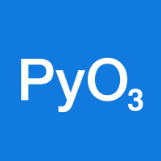

<div align="center">
  
</div>
<br>

<p align="center">
	<strong>Programmable, reproducible, interactive documents</strong>
</p>

<p align="center">
  <a href="#-introduction">
    👋 Intro
  </a> •
  <a href="#-roadmap">
    🚴 Roadmap
  </a> •
  <a href="#-documentation">
    📜 Docs
  </a> •
  <a href="#-install">
    📥 Install
  </a> •
  <a href="#%EF%B8%8F-develop">
    🛠️ Develop
  </a>
</p>
<p align="center">
  <a href="#-acknowledgements">
    🙏 Acknowledgements
  </a> •
  <a href="#-supporters">
    💖 Supporters
  </a> •
  <a href="#-contributors">
    🙌 Contributors
  </a>
</p>
<br>

<div align="center">
  <a href="#-contributors">
    
  </a>
  <a href="https://discord.gg/GADr6Jv">
    
  </a>
  <a href="https://github.com/stencila/stencila/releases">
    
  </a>
  <a href="https://hub.docker.com/r/stencila/stencila">
    
  </a>
  <a href="https://pypi.org/project/stencila/">
    
  </a>
  <a href="https://www.npmjs.com/package/@stencila/node">
    
  </a>
  <a href="https://www.npmjs.com/package/@stencila/types">
    
  </a>
</div>
<br>

## 👋 Introduction

Stencila is a platform for creating and publishing, dynamic, data-driven content. Our aim is to lower the barriers for creating truly programmable documents, and to make it easier to publish them as beautiful, interactive, and semantically rich, articles and applications. Our roots are in scientific communication, but our tools are useful beyond.

This is `v2` of Stencila, a rewrite in Rust focussed on the synergies between three recent and impactful innovations and trends:

- [Conflict-free replicated data types (CRDTs)](https://crdt.tech/) for de-centralized collaboration and version control.

- [Large language models (LLMs)](https://en.wikipedia.org/wiki/Large_language_model) for assisting in writing and editing, prose and code.

- The blurring of the lines between documents and applications as seen in tools such as [Notion](https://notion.com) and [Coda](https://coda.io/).

We are embarking on a rewrite because CRDTs will now be the foundational synchronization and storage layer for Stencila documents. This requires fundamental changes to most other parts of the platform (e.g. how changes are applied to dynamic documents). Furthermore, a rewrite allow us to bake in, rather than bolt on, new modes of interaction between authors and LLM assistants and add mechanisms to mitigate the risks associated with using LLMs (e.g. by recording the actor, human or LLM, that made the change to a document). Much of the code in the [`v1` branch](https://github.com/stencila/stencila/tree/v1) will be reused (after some tidy-ups and refactoring), so `v2` is not a _complete_ rewrite.

## 🎥 Showcase

**Simultaneously editing the same document in different formats**

Here, a Stencila `Article` has previously been saved to disk as a CRDT in `main.sta`. Then, the `sync` command of the `stencila` CLI is used to simultaneously synchronize the CRDT with three files, in three different formats currently supported in `v2`: [JATS XML](https://github.com/stencila/stencila/blob/main/docs/reference/formats/jats.md), [JSON](https://github.com/stencila/stencila/blob/main/docs/reference/formats/json.md), and [Markdown](https://github.com/stencila/stencila/blob/main/docs/reference/formats/markdown.md). Changes made in one file (here, in VSCode) are merged into the in-memory CRDT and written to the other files.

You'd probably never want to do this just by yourself. But this demo illustrates how Stencila `v2` will be enable collaboration _across formats_ on the same document. Any particular format (e.g. Markdown, LaTeX, Word) is just one of the potential user interfaces to a document.

https://github.com/stencila/stencila/assets/1152336/48cd3716-a3c2-49d1-ab11-e3f61868c3c4

## 🚴 Roadmap

Our general strategy is to iterate horizontally across the feature set, rather than fully developing features sequentially. This will better enable early user testing of workflows and reduce the risk of finding ourselves painted into an architectural corner. So expect initial iterations to have limited functionality and be buggy.

We'll be making alpha and beta releases of `v2` early and often across all products (e.g. CLI, desktop, SDKs). We're aiming for a `2.0.0` release by the end of Q3 2024.

🟢 Stable • 🔶 Beta • ⚠️ Alpha • 🚧 Under development • 🧪 Experimental • 🧭 Planned • ❔ Maybe

### Schema

The Stencila Schema is the data model for Stencila documents (definition [here](https://github.com/stencila/stencila/tree/main/schema), generated reference documentation [here](https://github.com/stencila/stencila/tree/main/docs/reference/schema)). Most of the schema is well defined but some document node types are still marked as under development. A summary by category:

| Category | Description                                                                                                                                                                                                                                                                                                                           | Status                                             |
| -------- | ------------------------------------------------------------------------------------------------------------------------------------------------------------------------------------------------------------------------------------------------------------------------------------------------------------------------------------- | -------------------------------------------------- |
| Works    | Types of creative works (e.g. [`Article`](https://github.com/stencila/stencila/blob/main/docs/reference/schema/works/article.md), [`Figure`](https://github.com/stencila/stencila/blob/main/docs/reference/schema/works/figure.md), [`Review`](https://github.com/stencila/stencila/blob/main/docs/reference/schema/works/review.md)) | 🟢 Stable (mostly based on schema.org)             |
| Prose    | Types used in prose (e.g. [`Paragraph`](https://github.com/stencila/stencila/blob/main/docs/reference/schema/prose/paragraph.md), [`List`](https://github.com/stencila/stencila/blob/main/docs/reference/schema/prose/list.md), [`Heading`](https://github.com/stencila/stencila/blob/main/docs/reference/schema/prose/heading.md))   | 🟢 Stable (mostly based on HTML, JATS, Pandoc etc) |
| Code     | Types for executable (e.g. [`CodeChunk`](https://github.com/stencila/stencila/blob/main/docs/reference/schema/code/code-chunk.md)) and non-executable code (e.g. [`CodeBlock`](https://github.com/stencila/stencila/blob/main/docs/reference/schema/code/code-block.md))                                                              | 🔶 Beta (may change)                               |
| Math     | Types for math symbols and equations (e.g. [`MathBlock`](https://github.com/stencila/stencila/blob/main/docs/reference/schema/math/math-block.md))                                                                                                                                                                                    | 🔶 Beta (may change)                               |
| Data     | Fundamental data types (e.g. [`Number`](https://github.com/stencila/stencila/blob/main/docs/reference/schema/data/number.md)) and validators (e.g. [`NumberValidator`](https://github.com/stencila/stencila/blob/main/docs/reference/schema/data/number-validator.md))                                                                | 🔶 Beta (may change)                               |
| Flow     | Types for control flow within a document (e.g. [`If`](https://github.com/stencila/stencila/blob/main/docs/reference/schema/flow/if.md), [`For`](https://github.com/stencila/stencila/blob/main/docs/reference/schema/flow/for.md), [`Call`](https://github.com/stencila/stencila/blob/main/docs/reference/schema/flow/call.md))       | 🚧 Under development (likely to change)            |
| Style    | Types for styling parts of a documents ([`Span`](https://github.com/stencila/stencila/blob/main/docs/reference/schema/style/span.md) and [`Division`](https://github.com/stencila/stencila/blob/main/docs/reference/schema/style/division.md))                                                                                        | 🚧 Under development (likely to change)            |
| Edits    | Types related to editing a documents (e.g. [`InstructionBlock`](https://github.com/stencila/stencila/blob/main/docs/reference/schema/edits/instruction-block.md), [`DeleteInline`](https://github.com/stencila/stencila/blob/main/docs/reference/schema/edits/delete-inline.md))                                                      | 🚧 Under development (likely to change)            |

### Storage and synchronization

In `v2`, documents can be stored as [binary Automerge CRDT](https://automerge.org/automerge-binary-format-spec/) files, branched and merged, and with the ability to import and export the document in various formats. Collaboration, including real-time, is made possible by exchanging fine-grained changes to the CRDT over the network. In addition, we want to enable interoperability with a Git-based workflow.

| Functionality                | Description                                                                                                                                                   | Status             |
| ---------------------------- | ------------------------------------------------------------------------------------------------------------------------------------------------------------- | ------------------ |
| Documents read/write-able    | Able to write a Stencila document to an Automerge binary file and read it back in                                                                             | ⚠️ Alpha           |
| Documents import/export-able | Able to import or export document as alternative formats, using tree diffing to generate CRDT changes                                                         | ⚠️ Alpha           |
| Documents fork/merge-able    | Able to create a fork of a document in another file and then later merge with the original                                                                    | 🧭 Planned Q4 2023 |
| Documents diff-able          | Able to view a diff, in any of the supported formats, between versions of a document and between a document and another file                                  | 🧭 Planned Q4 2023 |
| Git merge driver             | CLI can act as a [custom Git merge driver](https://www.julianburr.de/til/custom-git-merge-drivers/)                                                           | 🧭 Planned Q4 2023 |
| Relay server                 | Documents can be synchronized by exchanging changes via a relay server                                                                                        | 🧭 Planned Q4 2023 |
| Rendezvous server            | Documents can be synchronized by exchanging changes peer-to-peer using TCP or UDP [hole punching](<https://en.wikipedia.org/wiki/Hole_punching_(networking)>) | ❔ Maybe           |

### Formats

Interoperability with existing formats has always been a key feature of Stencila. We are bringing over _codecs_ (a.k.a. converters) from the `v1` branch and porting other functionality from [`encoda`](https://github.com/stencila/encoda) to Rust.

| Format                                                                                              | Encoding | Decoding |                                                                                     Coverage                                                                                     | Notes                                                                                                                                                       |
| --------------------------------------------------------------------------------------------------- | :------: | :------: | :------------------------------------------------------------------------------------------------------------------------------------------------------------------------------: | ----------------------------------------------------------------------------------------------------------------------------------------------------------- |
| [JSON](https://github.com/stencila/stencila/blob/main/docs/reference/formats/json.md)               |    🟢    |    🟢    |   [](https://app.codecov.io/gh/stencila/stencila/tree/main/rust)   |                                                                                                                                                             |
| [JSON5](https://github.com/stencila/stencila/blob/main/docs/reference/formats/json5.md)             |    🟢    |    🟢    |  [](https://app.codecov.io/gh/stencila/stencila/tree/main/rust)   |                                                                                                                                                             |
| [JSON-LD](https://github.com/stencila/stencila/blob/main/docs/reference/formats/jsonld.md)          |    🔶    |    🔶    |  [](https://app.codecov.io/gh/stencila/stencila/tree/main/rust)  |                                                                                                                                                             |
| [CBOR](https://github.com/stencila/stencila/blob/main/docs/reference/formats/cbor.md)               |    🟢    |    🟢    |   [](https://app.codecov.io/gh/stencila/stencila/tree/main/rust)   |                                                                                                                                                             |
| [CBOR+Zstandard](https://github.com/stencila/stencila/blob/main/docs/reference/formats/cborzstd.md) |    🟢    |    🟢    |   [](https://app.codecov.io/gh/stencila/stencila/tree/main/rust)   |                                                                                                                                                             |
| [YAML](https://github.com/stencila/stencila/blob/main/docs/reference/formats/yaml.md)               |    🟢    |    🟢    |   [](https://app.codecov.io/gh/stencila/stencila/tree/main/rust)   |                                                                                                                                                             |
| Plain text                                                                                          |    🔶    |    -     |   [](https://app.codecov.io/gh/stencila/stencila/tree/main/rust)   |                                                                                                                                                             |
| [HTML](https://github.com/stencila/stencila/blob/main/docs/reference/formats/html.md)               |    🚧    |    🧭    |   [](https://app.codecov.io/gh/stencila/stencila/tree/main/rust)   |                                                                                                                                                             |
| [JATS](https://github.com/stencila/stencila/blob/main/docs/reference/formats/jats.md)               |    🚧    |    🚧    |   [](https://app.codecov.io/gh/stencila/stencila/tree/main/rust)   | Planned for completion Q4 2023. Port decoding and tests from [`encoda`](https://github.com/stencila/encoda/).                                               |
| [Markdown](https://github.com/stencila/stencila/blob/main/docs/reference/formats/markdown.md)       |    ⚠️    |    ⚠️    | [](https://app.codecov.io/gh/stencila/stencila/tree/main/rust) |                                                                                                                                                             |
| R Markdown                                                                                          |    🧭    |    🧭    |                                                                                                                                                                                  | Relies on Markdown; [`v1`](https://github.com/stencila/stencila/tree/v1/rust/codec-rmd)                                                                     |
| Jupyter Notebook                                                                                    |    🧭    |    🧭    |                                                                                                                                                                                  | Relies on Markdown; [`v1`](https://github.com/stencila/stencila/tree/v1/rust/codec-ipynb)                                                                   |
| Scripts                                                                                             |    🧭    |    🧭    |                                                                                                                                                                                  | Relies on Markdown; [`v1`](https://github.com/stencila/stencila/tree/v1/rust/codec-script)                                                                  |
| Pandoc                                                                                              |    🧭    |    🧭    |                                                                                                                                                                                  | Planned Q4 2023. [`v1`](https://github.com/stencila/stencila/tree/v1/rust/codec-pandoc)                                                                     |
| LaTeX                                                                                               |    🧭    |    🧭    |                                                                                                                                                                                  | Relies on Pandoc; [`v1`](https://github.com/stencila/stencila/tree/v1/rust/codec-latex); [discussion](https://github.com/stencila/stencila/discussions/858) |
| Org                                                                                                 |    🧭    |    🧭    |                                                                                                                                                                                  | Relies on Pandoc; [PR](https://github.com/stencila/stencila/pull/1485)                                                                                      |
| Microsoft Word                                                                                      |    🧭    |    🧭    |                                                                                                                                                                                  | Relies on Pandoc; [`v1`](https://github.com/stencila/stencila/tree/v1/rust/codec-docx)                                                                      |
| ODT                                                                                                 |    🧭    |    🧭    |                                                                                                                                                                                  | Relies on Pandoc                                                                                                                                            |
| Google Docs                                                                                         |    🧭    |    🧭    |                                                                                                                                                                                  | Planned Q1 2024 [`v1`](https://github.com/stencila/stencila/tree/v1/rust/codec-gdoc)                                                                        |
| PDF                                                                                                 |    🧭    |    🧭    |                                                                                                                                                                                  | Planned Q1 2024, relies on HTML; [`v1`](https://github.com/stencila/stencila/tree/v1/rust/codec-pdf)                                                        |
| Codec Plugin API                                                                                    |    🧭    |    🧭    |                                                                                                                                                                                  | An API allowing codecs to be developed as plugins in Python, Node.js, and other languages                                                                   |

### Kernels

Kernels are what executes the code in Stencila `CodeChunk`s and `CodeExpression`s, as well as in control flow document nodes such as `IfClause` and `For`. In addition to supporting interoperability with existing Jupyter kernels, we will bring over _microkernels_ from `v1`. Microkernels are lightweight kernels for executing code which do not require separate installation and allow for parallel execution. We'll also implement at least one kernel for an embedded scripting language so that it is possible to author a Stencila document which does not rely on any other external binary.

| Kernel                                                                     | Purpose                                | Status                                                                                   |
| -------------------------------------------------------------------------- | -------------------------------------- | ---------------------------------------------------------------------------------------- |
| [Rhai](https://rhai.rs/)                                                   | Execute a sandboxed, embedded language | ⚠️ Alpha                                                                                 |
| [Bash](https://gnu.org/software/bash/)                                     | Execute Bash code                      | ⚠️ Alpha                                                                                 |
| [Zsh] (https://zsh.org/)                                                   | Execute Zsh code                       | ❔ Maybe; [`v1`](https://github.com/stencila/stencila/tree/v1/rust/kernel-zsh)           |
| [Python](https://python.org/)                                              | Execute Python code                    | ⚠️ Alpha                                                                                 |
| [R](https://r-project.org/)                                                | Execute R code                         | 🚧 In progress; [`v1`](https://github.com/stencila/stencila/tree/v1/rust/kernel-r)       |
| [Node.js](https://nodejs.org)                                              | Execute JavaScript code                | ⚠️ Alpha                                                                                 |
| [Deno](https://debo.com)                                                   | Execute TypeScript code                | ❔ Maybe; [`v1`](https://github.com/stencila/stencila/tree/v1/rust/kernel-deno)          |
| [SQLite](https://sqlite.org)                                               | Execute SQL code                       | 🧭 Planned Q1 2024; [`v1`](https://github.com/stencila/stencila/tree/v1/rust/kernel-sql) |
| [Jupyter kernels](https://github.com/jupyter/jupyter/wiki/Jupyter-kernels) | Execute code in Jupyter kernels        | 🚧 In progress; [PR](https://github.com/stencila/stencila/pull/1719)                     |
| HTTP                                                                       | Interact with RESTful APIs             | ❔ Maybe; [`v1`](https://github.com/stencila/stencila/tree/v1/rust/kernel-http)          |

### Actors

In Stencila `v2`, non-human changes to the document will be performed, concurrently, by various _actors_. Actors will listen for changes to document and react accordingly. For example, a LLM actor might listen for the insertion of a paragraph starting with "!add a code chunk to read in and summarize mydata.csv" and do just that. We'll be starting by implementing relatively simply actors but to avoid being painted into a corner will probably implement one LLM-base actor relatively early on.

| Actor            | Purpose                                                                                                                                                                                                                                              | Status                                                                                       |
| ---------------- | ---------------------------------------------------------------------------------------------------------------------------------------------------------------------------------------------------------------------------------------------------- | -------------------------------------------------------------------------------------------- |
| `MathML`         | Update the `mathml` property of [`Math`](https://github.com/stencila/stencila/blob/main/docs/reference/schema/math/math.md) nodes when the `code` property changes                                                                                   | 🧭 Planned Q4 2023                                                                           |
| `Tailwind`       | Update the `classes` property of [`Styled`](https://github.com/stencila/stencila/blob/main/docs/reference/schema/style/styled.md) nodes when the `code` property changes                                                                             | 🧭 Planned Q4 2023 [`v1`](https://github.com/stencila/stencila/tree/v1/rust/parser-tailwind) |
| `Compiler`       | Update `compileDigest` and other properties of [`Executable`](https://github.com/stencila/stencila/blob/main/docs/reference/schema/code/code-executable.md) nodes e.g. when the `code` or `programmingLanguage` properties change                    | 🚧 In progress                                                                               |
| `Executor`       | Execute nodes when their `executionRequired` property changes and update their `executionStatus`, `output`, etc properties                                                                                                                           | 🧭 Planned Q4 2023                                                                           |
| Actor Plugin API | An API allowing actors to be developed as plugins in Python, Node.js, and other languages                                                                                                                                                            | 🧭 Planned Q1 2024 to allow prototypes of `Coder` and `Writer` actors as plugins             |
| `Coder`          | An LLM actor that creates and edits [`CodeExecutable`](https://github.com/stencila/stencila/blob/main/docs/reference/schema/code/code-executable.md) nodes                                                                                           | 🧭 Planned Q1 2024                                                                           |
| `Writer`         | An LLM actor that creates and edits [prose](https://github.com/stencila/stencila/blob/main/docs/reference/schema/prose) nodes                                                                                                                        | 🧭 Planned Q1 2024                                                                           |
| `CitationIntent` | An AI actor that suggests a [`CitationIntent`](https://github.com/stencila/stencila/blob/main/docs/reference/schema/prose/citation-intent.md) for [`Cite`](https://github.com/stencila/stencila/blob/main/docs/reference/schema/prose/cite.md) nodes | ❔ Maybe                                                                                     |

### Editors

Editors allow users to edit Stencila documents, either directly, or via an intermediate format.

| Interface     | Purpose                                                                                                 | Status         |
| ------------- | ------------------------------------------------------------------------------------------------------- | -------------- |
| File watcher  | Edit documents via other formats and tools (e.g. code editors, Microsoft Word) and react on file change | ⚠️ Alpha       |
| Code editor   | Edit documents via other formats using a built-in code editor and react on key presses                  | 🚧 In progress |
| Visual editor | Edit documents using a built-in visual editor and react on key presses and widget interactions          | 🚧 In progress |

### Tools

Tools are what we call the self-contained Stencila products you can download and use locally on your machine to interact with Stencila documents.

| Tool             | Purpose                                                                           | Status                                                       |
| ---------------- | --------------------------------------------------------------------------------- | ------------------------------------------------------------ |
| CLI              | Manage documents from the command line and read and edit them using a web browser | ⚠️ Alpha                                                     |
| Desktop          | Manage, read and edit documents from a desktop app                                | 🧭 Planned Q1 2024, likely using [Tauri](https://tauri.app/) |
| VSCode extension | Manage, read and edit documents from within VSCode                                | ❔ Maybe                                                     |

### SDKs

Stencila's software development kits (SDKs) enable developers to create plugins to extend Stencila's core functionality or to build other tools on top of. At this stage we are planning to support Python, Node.js and R but more languages may be added if there is demand.

| Language   | Description                                                     | Status                                                        | Coverage                                                                                                                                                      |
| ---------- | --------------------------------------------------------------- | ------------------------------------------------------------- | ------------------------------------------------------------------------------------------------------------------------------------------------------------- |
| Python     | Types and function bindings for using Stencila from Python      | ⚠️ Alpha [PyPI](https://pypi.org/project/stencila/)           | [](https://app.codecov.io/gh/stencila/stencila/tree/main/python) |
| TypeScript | JavaScript classes and TypeScript types for the Stencila Schema | ⚠️ Alpha [NPM](https://www.npmjs.com/package/@stencila/types) |                                                                                                                                                               |
| Node.js    | Types and function bindings for using Stencila from Node.js     | ⚠️ Alpha [NPM](https://www.npmjs.com/package/@stencila/node)  | [](https://app.codecov.io/gh/stencila/stencila/tree/main/node/stencila-node)     |
| R          | Types and function bindings for using Stencila from R           | ❔ Maybe                                                      |                                                                                                                                                               |

### Testing and auditing

Making sure Stencila `v2` is well tested, fast, secure, and accessible, is important. Here's what where doing towards that:

| What                   | Description                                                                                                                   | Status                                                                                                                                                                                      |
| ---------------------- | ----------------------------------------------------------------------------------------------------------------------------- | ------------------------------------------------------------------------------------------------------------------------------------------------------------------------------------------- |
| Property-based testing | Establish property-based (a.k.a generative) testing for Stencila documents                                                    | 🟢 Done                                                                                                                                                                                     |
| Round-trip testing     | Establish property-based tests of round-trip conversion to/from supported formats and reading/writing from/to Automerge CRDTs | 🟢 Done [here](https://github.com/stencila/stencila/blob/main/rust/codecs/tests/proptests.rs) and [here](https://github.com/stencila/stencila/blob/main/rust/node-store/tests/proptests.rs) |
| Coverage reporting     | Report coverage by feature (e.g. by codec) to give developers better insight into the status of each                          | 🟢 Done [Codecov](https://app.codecov.io/gh/stencila/stencila)                                                                                                                              |
| Dependency audits      | Add dependency audits to continuous integration workflow.                                                                     | 🟢 Done                                                                                                                                                                                     |
| Accessibility testing  | Add accessibility testing to continuous integration workflow.                                                                 | 🟢 Done [here](https://github.com/stencila/stencila/blob/main/rust/codecs/src/tests/accessibility.js)                                                                                       |
| Performance monitoring | Establish continuous benchmarking                                                                                             | 🟢 Done [here](https://stencila.dev/develop/benchmarks/)                                                                                                                                    |
| Security audit         | External security audit sponsored by NLNet.                                                                                   | 🧭 Planned Q2 2023 (after most `v2` functionality added and before public beta)                                                                                                             |
| Accessibility audit    | External accessibility audit sponsored by NLNet.                                                                              | 🧭 Planned Q3 2023 (before `v2.0.0` release)                                                                                                                                                |

## 📜 Documentation

At this stage, documentation for `v2` is mainly reference material, much of it generated:

- [Schema](https://github.com/stencila/stencila/tree/main/docs/reference/schema)
- [Formats](https://github.com/stencila/stencila/tree/main/docs/reference/formats)
- [CLI](https://github.com/stencila/stencila/tree/main/docs/reference/cli.md)

More reference docs as well as guides and tutorial will be added over the coming months. We will be bootstrapping the publishing of all docs (i.e. to use Stencila itself to publish HTML pages) and expect to have an initial published set in Q4 2023.

## 📥 Install

Although `v2` is in early stages of development, and functionality may be limited or buggy, we are releasing alpha versions of the Stencila CLI and SDKs. Doing so allows us to get early feedback and monitor what impact the addition of features has on build times and distribution sizes.

### CLI

<details>
<summary><strong>Windows</strong></summary>

To install the latest release download `stencila-<version>-x86_64-pc-windows-msvc.zip` from the [latest release](https://github.com/stencila/stencila/releases/latest) and place it somewhere on your `PATH`.

</details>

<details>
<summary><strong>MacOS</strong></summary>

To install the latest release in `/usr/local/bin`,

```console
curl --proto '=https' --tlsv1.2 -sSf https://stencila.dev/install.sh | sh
```

To install a specific version, append `-s vX.X.X`. Or, if you'd prefer to do it manually, download `stencila-<version>-x86_64-apple-darwin.tar.xz` from the one of the [releases](https://github.com/stencila/stencila/releases) and then,

```console
tar xvf stencila-*.tar.xz
cd stencila-*/
sudo mv -f stencila /usr/local/bin # or wherever you prefer
```

</details>

<details>
<summary><strong>Linux</strong></summary>

To install the latest release in `~/.local/bin/`,

```console
curl --proto '=https' --tlsv1.2 -sSf https://stencila.dev/install.sh | sh
```

To install a specific version, append `-s vX.X.X`. Or, if you'd prefer to do it manually, download `stencila-<version>-x86_64-unknown-linux-gnu.tar.xz` from the one of the [releases](https://github.com/stencila/stencila/releases) and then,

```console
tar xvf stencila-*.tar.xz
mv -f stencila ~/.local/bin/ # or wherever you prefer
```

</details>

<details>
<summary><strong>Docker</strong></summary>

The CLI is also available in a Docker image you can pull from the Github Container Registry,

```console
docker pull stencila/stencila
```

and use locally like this for example,

```console
docker run -it --rm -v "$PWD":/work -w /work --network host stencila/stencila --help
```

The same image is also published to the Github Container Registry if you'd prefer to use that,

```console
docker pull ghcr.io/stencila/stencila
```

</details>

### SDKs

<details>
<summary><strong>Python</strong></summary>

Use your favorite package manager to install Stencila's [SDK for Python](https://pypi.org/project/stencila/):

```console
python -m pip install stencila
```

> [!NOTE]
> If you encounter problems with the above command, you may need to upgrade Pip using `pip install --upgrade pip`.

```console
poetry add stencila
```

</details>

<details>
<summary><strong>Node</strong></summary>

Use your favorite package manager to install [`@stencila/node`](https://www.npmjs.com/package/@stencila/node):

```console
npm install @stencila/node
```

```console
yarn add @stencila/node
```

```console
pnpm add @stencila/node
```

</details>

<details>
<summary><strong>TypeScript</strong></summary>

Use your favorite package manager to install [`@stencila/types`](https://www.npmjs.com/package/@stencila/types):

```console
npm install @stencila/types
```

```console
yarn add @stencila/types
```

```console
pnpm add @stencila/types
```

</details>

## 🛠️ Develop

### Code organization

This repository is organized into the following modules. Please see their respective READMEs, where available, for guides to contributing to each.

- [`schema`](schema): YAML files which define the Stencila Schema, an implementation of, and extensions to, [schema.org](https://schema.org), for programmable documents.

- [`json`](json): A [JSON Schema](https://json-schema.org/) and [JSON LD](https://json-ld.org/) `@context`, generated from Stencila Schema, which can be used to validate Stencila documents and transform them to other vocabularies

- [`rust`](rust): Several Rust crates implementing core functionality and a CLI for working with Stencila documents.

- [`python`](python): A Python package, with classes generated from Stencila Schema and bindings to Rust functions, so you can work with Stencila documents from within Python.

- [`ts`](ts): A package of TypeScript types generated from Stencila Schema so you can create type-safe Stencila documents in the browser, Node.js, Deno etc.

- [`node`](node): A Node.js package, using the generated TypeScript types and bindings to Rust functions, so you can work with Stencila documents from within Node.js.

- [`prompts`](prompts): Prompts for used to instruct AI assistants in different contexts and for different purposes.

- [`docs`](docs): Documentation, including reference documentation generated from `schema` and CLI tool.

- [`examples`](examples): Examples of documents conforming to Stencila Schema, mostly for testing purposes.

- [`scripts`](scripts): Scripts used for making releases and during continuous integration.

### Continuous integration and deployment

Several Github Action workflows are used for testing and releases. All products (i.e CLI, Docker image, SKDs) are released at the same time with the same version number. To create and release a new version:

```console
bash scripts/bump-version.sh <VERSION>
git push && git push --tags
```

| Workflow                                       | Purpose                                                                                                           | Status                                                                                                                                                                |
| ---------------------------------------------- | ----------------------------------------------------------------------------------------------------------------- | --------------------------------------------------------------------------------------------------------------------------------------------------------------------- |
| [`test.yml`](.github/workflows/test.yml)       | Run linting, tests and other checks. Commit changes to any generated files.                                       | [](https://github.com/stencila/stencila/actions/workflows/test.yml)       |
| [`pages.yml`](.github/workflows/pages.yml)     | Publish docs, JSON-LD, JSON Schema, etc to https://stencila.dev hosted on GitHub Pages                            | [](https://github.com/stencila/stencila/actions/workflows/pages.yml)     |
| [`version.yml`](.github/workflows/version.yml) | Trigger the `release.yml` workflow when a version tag is created.                                                 | [](https://github.com/stencila/stencila/actions/workflows/version.yml) |
| [`release.yml`](.github/workflows/release.yml) | Create a release, including building and publishing CLI, Docker image and SDKs.                                   | [](https://github.com/stencila/stencila/actions/workflows/release.yml) |
| [`install.yml`](.github/workflows/install.yml) | Test installation and usage of CLI, Docker image and SDKs across various operating systems and language versions. | [](https://github.com/stencila/stencila/actions/workflows/install.yml) |

## 🙏 Acknowledgements

Stencila is built on the shoulders of many open source projects. Our sincere thanks to all the maintainers and contributors of those projects for their vision, enthusiasm and dedication. But most of all for all their hard work! The following open source projects in particular have an important role in the current version of Stencila. We sponsor these projects where, and to an extent, possible through [GitHub Sponsors](https://github.com/orgs/stencila/sponsoring) and [Open Collective](https://opencollective.com/stencila).

|                                                  | Link                                  | Summary                                                                                                                                 |
| ------------------------------------------------ | ------------------------------------- | --------------------------------------------------------------------------------------------------------------------------------------- |
|  | [Automerge](https://automerge.org/)   | A Rust library of data structures for building collaborative applications.                                                              |
|       | [Clap](https://crates.io/crates/clap) | A Command Line Argument Parser for Rust.                                                                                                |
|       | [NAPI-RS](https://napi.rs)            | A framework for building pre-compiled Node.js addons in Rust.                                                                           |
|       | [PyO<sub>3</sub>](https://pyo3.rs)    | Rust bindings for Python, including tools for creating native Python extension modules.                                                 |
|       | [Rust](https://www.rust-lang.org/)    | A multi-paradigm, high-level, general-purpose programming language which emphasizes performance, type safety, and concurrency.          |
|     | [Serde](https://serde.rs/)            | A framework for **ser**ializing and **de**serializing Rust data structures efficiently and generically.                                 |
|    | [Similar](https://insta.rs/similar/)  | A Rust library of diffing algorithms including Patience and Hunt–McIlroy / Hunt–Szymanski LCS.                                          |
|      | [Tokio](https://tokio.rs/)            | An asynchronous runtime for Rust which provides the building blocks needed for writing network applications without compromising speed. |

## 💖 Supporters

We wouldn’t be doing this without the support of these forward looking organizations.

<p align="center"><a href="https://sloan.org/"></img></a><p>
<p align="center"><a href="https://elifesciences.org/"></img></a><p>
<p align="center"><a href="https://www.mbie.govt.nz"></img></a><p>
<p align="center"><a href="https://nlnet.nl/"></img></a><p>
<p align="center"><a href="https://coko.foundation/"></img></a><p>
<p align="center"><a href="https://www.codeforsociety.org/"></img></a><p>
<p align="center"><a href="https://www.callaghaninnovation.govt.nz/"></img></a><p>

## 🙌 Contributors

Thank you to _all_ our contributors (not just the ones that submitted code!). If you made a contribution but are not listed here please create an issue, or PR, [like this](https://allcontributors.org/docs/en/bot/usage#all-contributors-add).

<!-- ALL-CONTRIBUTORS-LIST:START - Do not remove or modify this section -->
<!-- prettier-ignore-start -->
<!-- markdownlint-disable -->
<table>
  <tbody>
    <tr>
      <td align="center" valign="top" width="14.28%"><a href="https://ackerleytng.github.io/blog/"></a></td>
      <td align="center" valign="top" width="14.28%"><a href="https://github.com/apawlik"></a></td>
      <td align="center" valign="top" width="14.28%"><a href="http://ketch.me"></a></td>
      <td align="center" valign="top" width="14.28%"><a href="https://github.com/beneboy"></a></td>
      <td align="center" valign="top" width="14.28%"><a href="https://github.com/colettedoughty"></a></td>
      <td align="center" valign="top" width="14.28%"><a href="https://github.com/Integral"></a></td>
      <td align="center" valign="top" width="14.28%"><a href="https://uk.linkedin.com/in/daniel-ecer"></a></td>
    </tr>
    <tr>
      <td align="center" valign="top" width="14.28%"><a href="https://orcid.org/0000-0001-9488-1870"></a></td>
      <td align="center" valign="top" width="14.28%"><a href="https://nordholmen.net/"></a></td>
      <td align="center" valign="top" width="14.28%"><a href="https://github.com/daniellecrobinson"></a></td>
      <td align="center" valign="top" width="14.28%"><a href="https://github.com/discodavey"></a></td>
      <td align="center" valign="top" width="14.28%"><a href="https://github.com/davidcmoulton"></a></td>
      <td align="center" valign="top" width="14.28%"><a href="https://github.com/finlay"></a></td>
      <td align="center" valign="top" width="14.28%"><a href="https://github.com/fkmendes"></a></td>
    </tr>
    <tr>
      <td align="center" valign="top" width="14.28%"><a href="https://github.com/kayakr"></a></td>
      <td align="center" valign="top" width="14.28%"><a href="http://toki.io"></a></td>
      <td align="center" valign="top" width="14.28%"><a href="https://github.com/jamestwebber"></a></td>
      <td align="center" valign="top" width="14.28%"><a href="https://juretriglav.si/"></a></td>
      <td align="center" valign="top" width="14.28%"><a href="https://larsgw.github.io/"></a></td>
      <td align="center" valign="top" width="14.28%"><a href="http://has100ideas.com"></a></td>
      <td align="center" valign="top" width="14.28%"><a href="https://github.com/elfring"></a></td>
    </tr>
    <tr>
      <td align="center" valign="top" width="14.28%"><a href="https://github.com/michael"></a></td>
      <td align="center" valign="top" width="14.28%"><a href="https://moranegg.github.io/"></a></td>
      <td align="center" valign="top" width="14.28%"><a href="https://github.com/MorphicResonance"></a></td>
      <td align="center" valign="top" width="14.28%"><a href="https://github.com/Cumol"></a></td>
      <td align="center" valign="top" width="14.28%"><a href="https://github.com/nokome"></a></td>
      <td align="center" valign="top" width="14.28%"><a href="https://github.com/obuchtala"></a></td>
      <td align="center" valign="top" width="14.28%"><a href="https://github.com/rgaiacs"></a></td>
    </tr>
    <tr>
      <td align="center" valign="top" width="14.28%"><a href="https://remi.rampin.org/"></a></td>
      <td align="center" valign="top" width="14.28%"><a href="https://github.com/richlysakowski"></a></td>
      <td align="center" valign="top" width="14.28%"><a href="https://github.com/rgieseke"></a></td>
      <td align="center" valign="top" width="14.28%"><a href="https://sethvincent.com/"></a></td>
      <td align="center" valign="top" width="14.28%"><a href="https://github.com/stefanfritsch"></a></td>
      <td align="center" valign="top" width="14.28%"><a href="http://sirinath.com/"></a></td>
      <td align="center" valign="top" width="14.28%"><a href="https://tim.mcnamara.nz/"></a></td>
    </tr>
    <tr>
      <td align="center" valign="top" width="14.28%"><a href="https://github.com/wooorm"></a></td>
      <td align="center" valign="top" width="14.28%"><a href="http://blog.ouseful.info/"></a></td>
      <td align="center" valign="top" width="14.28%"><a href="https://github.com/ouboub"></a></td>
      <td align="center" valign="top" width="14.28%"><a href="https://vsoch.github.io"></a></td>
      <td align="center" valign="top" width="14.28%"><a href="https://neurathsboat.blog/"></a></td>
      <td align="center" valign="top" width="14.28%"><a href="https://github.com/alexandr-sisiuc"></a></td>
      <td align="center" valign="top" width="14.28%"><a href="https://github.com/asisiuc"></a></td>
    </tr>
    <tr>
      <td align="center" valign="top" width="14.28%"><a href="https://github.com/campbellyamane"></a></td>
      <td align="center" valign="top" width="14.28%"><a href="https://github.com/ern0"></a></td>
      <td align="center" valign="top" width="14.28%"><a href="https://github.com/grayflow"></a></td>
      <td align="center" valign="top" width="14.28%"><a href="https://github.com/happydentist"></a></td>
      <td align="center" valign="top" width="14.28%"><a href="https://github.com/huang12zheng"></a></td>
      <td align="center" valign="top" width="14.28%"><a href="https://github.com/ignatiusm"></a></td>
      <td align="center" valign="top" width="14.28%"><a href="https://github.com/jm-observer"></a></td>
    </tr>
    <tr>
      <td align="center" valign="top" width="14.28%"><a href="https://jonrichter.de/"></a></td>
      <td align="center" valign="top" width="14.28%"><a href="https://nyanpasu64.gitlab.io/"></a></td>
      <td align="center" valign="top" width="14.28%"><a href="https://github.com/solsson"></a></td>
      <td align="center" valign="top" width="14.28%"><a href="http://www.danbeekim.org/"></a></td>
      <td align="center" valign="top" width="14.28%"><a href="https://github.com/yasirs"></a></td>
    </tr>
  </tbody>
</table>

<!-- markdownlint-restore -->
<!-- prettier-ignore-end -->

<!-- ALL-CONTRIBUTORS-LIST:END -->
