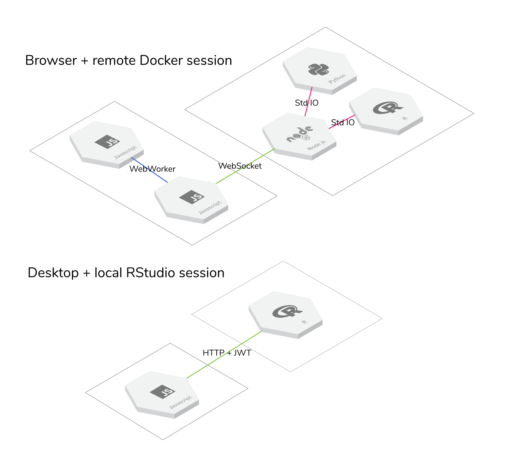

# Stencila schemas, protocols and other specs


[](https://travis-ci.org/stencila/schema)
[](https://codecov.io/gh/stencila/schema)
[](https://www.npmjs.com/package/@stencila/schema)
[](https://stencila.github.io/schema/)
[](https://community.stenci.la)
[](https://gitter.im/stencila/stencila)

> :sparkles:
> This is a **work in progress**. But comments, suggestions, and pull requests are very much appreciated
> :sparkles:

<!-- Automatically generated TOC. Don't edit, `make docs` instead>

<!-- toc -->

- [Introduction](#introduction)
- [Types](#types)
  - [Semantics](#semantics)
  - [Validation](#validation)
  - [Extensions](#extensions)
    - [`SoftwareSourceCell` extends `SoftwareSourceCode`](#softwaresourcecell-extends-softwaresourcecode)
    - [`SoftwareFunction` extends `SoftwareSourceCode`](#softwarefunction-extends-softwaresourcecode)
    - [`SoftwareFunctionCall`](#softwarefunctioncall)
- [Processors](#processors)
- [Communications](#communications)
  - [Message protocol](#message-protocol)
  - [Serialization formats](#serialization-formats)
  - [Transport protocols](#transport-protocols)
    - [Summary](#summary)
  - [Handshake](#handshake)
    - [Examples](#examples)

<!-- tocstop -->

## Introduction

This repository aims to document, and provide reference implementations for, the schemas, protocols and other specifications used in Stencila.

As much as possible, we use existing specifications, and avoid defining any new ones. External specifications that we currently use, or plan to use, include [Apache Avro], [JSON-LD], [JSON-RPC], [JSON-Schema], [Schema.org], [BioSchemas], [CodeMeta] and [OpenSchemas]. In many ways, this repository simply documents how these existing standards are utilised within Stencila.

## Types

Several types and properties defined in [Schema.org] and [CodeMeta] are implemented in TypeScript. Currently, only types and properties required for other repos (e.g Dockter) are implemented.

API documentation is available at https://stencila.github.io/schema/.

### Semantics

A JSON-LD context is generated from the TypeScript sources and is available at https://stencila.github.io/schema/context.jsonld

### Validation

Schema.org, BioSchemas etc provide a shared volcabulary for types and their properties. JSON-LD provides a format for defining these vocabularies. However, they do not provide for validation (in this sense the name _schema_ is somewhat of a misnomer). Although BioShemas and OpenSchemas do specificy some structural validation by definfing _marginality_ (required or not) and _cardinality_ (one or many) of properties.

For validation it is proposed to generate [JSON-Schema] documents from Typescript sources.

### Extensions

We have tried to resuse existing type and property definitions from other schemas and define as few as possible extensions. The following are extensions that are currently planned.

#### `SoftwareSourceCell` extends `SoftwareSourceCode`

A type representing a source code cell withing an executable document.

A draft JSON-Schema for `SoftwareSourceCell` is defined in [`src/Cell.yaml`](src/Cell.yaml). This will be ported to the Typescript, and thus the JSON-LD context, in the near future.

#### `SoftwareFunction` extends `SoftwareSourceCode`

A type representing a function.

#### `SoftwareFunctionCall`

A type representing a call of a `SoftwareFunction`.

## Processors

> 🕒 `Processors` combine and supersede, `Hosts` and execution `Contexts` in `v0`. By combining these two classes we aim to reduce the complexity of the API which used to involve requesting a host to create a context, and then requesting that context to execute a code cell.
> A draft [OpenAPI specification](https://github.com/OAI/OpenAPI-Specification) for `Hosts` is defined in [`src/Host.yaml`](src/Host.yaml) and is available as more reader-friendly, browserable HTML [here](https://stencila.github.io/schema/host.html).
>
> That API is implemented (to varying degress) in the following packages:
>
> - [stencila/py](https://github.com/stencila/py)
> - [stencila/r](https://github.com/stencila/r)
> - [stencila/js](https://github.com/stencila/js)
> - [stencila/node](https://github.com/stencila/node)
> - [stencila/cloud](https://github.com/stencila/cloud)

The following provides an overview of the methods. For further details, please refer to the canonical documentation [here](https://stencila.github.io/schema/classes/processor.html).

### `import`

> 🔧 TODO

> Note that in Python, because `import` is a keyword, this method is named `import_` in the code, but still referred to using `"method":"import"` in JSON-RPC requests (see below).

### `export`

> 🔧 TODO

### `compile`

> 🔧 TODO

### `build`

> 🔧 TODO

### `execute`

Several classes of processor (e.g. `SQLProcessor`) store values resulting from execution in a cache and return those values to the caller as a "pointer". A pointer simply says, "This value is large, so to save time and bandwidth, instead of sending it to you now, here is an identifier you can use to get it from me later".

For example, consider executing a call to function that returns a very large data frame:

```json5
execute({
  // This is a call to function...
  type: 'Call',
  function: {
    type: 'Function',
    id: 'http://example.org/functions#a-function-that-returns-a-huge-dataframe'
  }
})
```

This would return the `Call` instance with the `result` property added:

```json5
{
    ...
    "result": {
        "value": {
            "type": "DataFrame",
            "id": "#9e4d8a263bdddaf0340344096de600023bc592a1d1988281c6cd9041c5e1d8d9"
        }
    }
}
```

The unique `id` for the result value allows the processor that made the call, to fetch all, or part of, the data frame at a later time (see the `get` method below). Or to pass that pointer on to another peer processor. When a processor receives an `id` starting with a hash `#`, it prepends the URL of the originating peer processor. For example, the above `id` could be transformed to `https://10.1.20.0/#9e4d8a26...`. This allow this pointer to be passed to other

As another example, imagine this call to a `PostgresProcessor`:

```json5
execute({
  // This is a Structured Query Language (SQL) code cell...
  type: 'Cell',
  programmingLanguage: 'SQL',
  // This is the id of the database context that this cell is to be executed in...
  context: 'http://...',
  // This is the SQL code to be executed in that database context...
  text: 'SELECT * FROM huge_table'
})
```

Because this query is for all the data in `huge_table`, the result of this call would include two pointers, one for `huge_table` and one for the result:

```json5
{
  // The existing properties of the cell plus...
  // A list of inputs variable that the cell requires...
  inputs: [
    {
      type: 'Variable',
      name: 'huge_table',
      value: {
        type: 'DataFrame',
        id: '#huge_table'
      }
    }
  ],
  // A list of output values
  outputs: [
    {
      type: 'DataFrame',
      id: '#temp_7'
    }
  ]
}
```

### `get`

The `get` method is used to fetch all, or part of, a stored value.

### `hello` and `goodbye`

The `hello` method is called by a peer processor when it established a connection to the current processor. It is used to exchange a a manifest of each processors capabilities. This is used to `goodbye` method is called by a peer processor when it closes it's connection to the current peer.

These methods may also be intercepted by server to upgrade the communication protocols used. See the section on communications below.

### Implementations

This repository contains base `Processor` classes for several languages:

- Typescript: [`src/Processor.ts`](src/Processor.ts)
- Python: [`src/Processor.py`](src/Processor.py)
- R: 🦄 [`src/Processor.R`](src/Processor.R)

These base classes do very little but provide a template for implementing derived processor classes. The processors that are implemented or planned are available in other repositories:

- 🦄 `FormatsProcessor` in combine format converters in [`stencila/convert`](https://github.com/stencila/convert)
- 🦄 `DockerProcessor` in [`stencila/dockter`](https://github.com/stencila/dockter) to combine and replace `DockerParser`, `DockerGenerator` etc
- 🦄 `JavascriptProcessor`in [`stencila/js`](https://github.com/stencila/js) to replace `JavascriptContext`
- 🦄 `JupyterProcessor` in `stencila/jupyter-node` to replace `JupyterContext` in `stencila/node`
- 🦄 `PythonProcessor` in [`stencila/py`](https://github.com/stencila/py) to replace `PythonContext`
- 🦄 `RProcessor` in [`stencila/r`](https://github.com/stencila/r) to replace `RContext`
- 🦄 `SqliteProcessor` in `stencila/sql-node` to replace `SqliteContext` in `stencila/node`

## Communications

### Message protocol

Messages are sent between `Processors` using [JSON-RPC] 2.0, a stateless, light-weight remote procedure call protocol.

For example, a request to `execute` a R code cell is made to a `Processor` using a JSON-RPC request object like this:

```json5
{
  jsonrpc: '2.0',
  // A string or number to identify this request
  id: 28758975,
  // The name of the method to call
  method: 'execute',
  // The parameter values to call the method with
  params: {
    thing: {
      type: 'SoftwareSourceCell',
      programmingLanguage: 'R',
      text: 'answer <- 6 * 7'
    }
  }
}
```

The processor responds with a JSON-RPC response object with a `result` property:

```json5
{
  jsonrpc: '2.0',
  // The same id as in the request (to allow matching responses with requests)
  id: 28758975,
  // The result of the method call
  result: {
    type: 'SoftwareSourceCell',
    programmingLanguage: 'R',
    text: 'answer <- 6 * 7',
    outputs: [
      {
        type: 'SoftwareSourceVariable',
        name: 'answer',
        value: 42
      }
    ]
  }
}
```

If there is an error executing the cell there will be no `result`, but an `error` property instead:

```json5
{
    "jsonrpc": "2.0",
    "id": 28758975,
    "error": {
        // A number indication the type of error
        "code": 1,
        // A short description of the error
        "message": "The variable 'x' does not exist.",
        // Additional data about the error
        "data": {
            "trace": ...
        }
    }
}
```

### Message formats

[`Content-Type`](https://tools.ietf.org/html/rfc2616#section-14.17)

- `application/json`
- `application/avro+json`
- `application/avro+binary`

[`Content-Encoding`](https://tools.ietf.org/html/rfc2616#section-14.11)

- currently `gzip` but see the [HTTP RFC 2616](https://tools.ietf.org/html/rfc2616#section-3.5) for

Compression can dramatically reduce the size of JSON and thus provide faster communication between the client and the server.

```json5
"messages": [{
    "contentType": "application/json",
    "contentEncoding": "gzip"
}]
```

We are also considering using [Apache Avro] given that

```json5
"messages": [{
    "contentType": "application/avro+binary"
}]
```

There other formats that could be used, such as [MessagePack](https://msgpack.org/), but there may [no, or little, gain in compression over JSON+gzip](https://www.peterbe.com/plog/msgpack-vs-json-with-gzip). Furthermore, functions for parsing and generating JSON are often highly optimized. So there may be no serialization/deserialization speed gains from using these altenative formats.

### Handshake methods

For most method calls, a `Server` will simply call the corresponding `Processor` method and return the result to the `Client`. There are two special handshake methods where the server may do additional handling: `hello` and `goodbye`. Neither of these handshake calls is required but doing so allows the communication protocols between the client and server to be upgraded from the default plain JSON-RPC.

The `hello` method establish the protocols to be used for communication between the `Client` and the `Server`. The `Server` may intercept these calls to keep a record for each client so it know how to handle subsequent requests from the client.

The simplest handshake, and the one implied if the `Client` does not make a handshake requests, establishes plain JSON-RPC communication:

```json5
{
  jsonrpc: '2.0',
  id: 1,
  method: 'hello',
  params: {
    // The client tells the server the handshake version...
    version: '1.0',
    // The client tells the server it can only handle JSON messages...
    formats: [
      {
        contentType: 'application/json'
      }
    ]
  }
}
```

The server would then respond with,

```json5
{
    "jsonrpc": "2.0",
    "id": 1,
    "result": {
        // The server confirms the handshake version...
        "version": "1.0"
        // The server tells the client which message format to use...
        "messages": {
            "contentType": "application/json"
        },
        // The server tells the client that is provides these methods...
        "methods": {
            "execute": [
                // JSON schema
            ]
        }
    }
}
```

### Transport protocols

Messages can be sent between `Processors` using one of four transport protocols: [`WebWorkers`](#webworkers), [`HTTP`](#http), [`WebSockets`](#websockets), or [`StdIO`](#stdio). Each transprort protocol has its advantages and environments it can work within. By allowing for different transport protocols allows develops to take advantage of these. For example, the `StandardIO` protocol is very lightweight in that is uses standard POSIX input and output pipes available in many environments instead of requiring heavier protocols such as Websockets to be implemented for all languages.



Implementations of these protocols for several languages are available in the [`src/comms`](src/comms) folder. The naming conventions and often implementations are often very similar across languages e.g. [`StdioServer.ts`](src/comms/StdioServer.ts) and [`StdioServer.py`](src/comms/StdioServer.py)

#### Summary

The following table summarises the serialization format/s used by each protocol and the implementation status of clients and servers for alternative environments.

|                   | WebWorkers | HTTP    | WebSockets | StdIO   |
| ----------------- | ---------- | ------- | ---------- | ------- |
| **Serialization** | None       | JSON[1] | JSON[2]    | JSON[2] |
| **Client**        |            |         |            |         |
| Browser JS        | 🗸          | 🗸       | 🗸          | -       |
| Node.js           | x[3]       | 🗸       | 🗸          | 🗸       |
| Python            | -          | x       | x          | x       |
| R                 | -          | x       | x          | x       |
| **Server**        |            |         |            |         |
| Browser JS        | 🗸          | -       | -          | -       |
| Node.js           | x[3]       | 🗸       | 🗸          | 🗸       |
| Python            | -          | x       | x          | x[4]    |
| R                 | -          | x       | x          | x[4]    |

**Notes**

> 🔧 Some of the following notes are stale / superseded

1. 🗸 means that an implementation is available, x means that an implementation is possible, but not available, - means that implementation is not-applicable / possible

2. It is proposed that the HTTP protocol support several serialization formats, by using content negotiation headers `Accept` and `Content-Type`, including Avro-JSON, and zipped JSON and Avro-JSON.

3. Currently the WebSocket and Stdio protocol uses JSON. It is proposed that they both use Avro-Binary instead to optimize performance.

4. There is a, currently experimental, [`worker_threads`](https://nodejs.org/api/worker_threads.html) module for Node.js which may allow implementation of `WebWorker` like functionality.

5. A `StdioServer` for R and Python is currently the highest priority for these languages as it will allow `Processors` to be implemented for executing code cells and function calls in these languages.

### Testing

#### Python

You can run inidividual Python tests by passing additional `pytest` arguments via `tox`:

```bash
tox -- tests/comms/StdioClientServerTest.py
```

You can also run tests for only one test environmment e.g. Python 3.7 using the `-e` option:

```bash
tox -e py37 -- tests/comms/StdioClientServerTest.py
```

[apache avro]: (https://avro.apache.org)
[bioschemas]: (https://bioschemas.org)
[codemeta]: (https://codemeta.github.io)
[json-ld]: (https://json-ld.org)
[json-rpc]: (https://www.jsonrpc.org)
[json-schema]: (https://json-schema.org)
[openschemas]: (https://openschemas.github.io)
[schema.org]: (https://schema.org)
