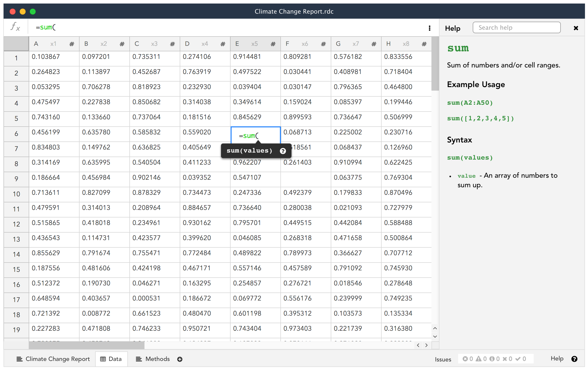

# Projects

With Stencila users are able to manipulate a collection of documents as a single project.

The following goals should be met:

- Ability to switch between multiple documents using tabs
- Create a new sheet or document
- Reference a sheet cell from a document and vice versa

## Implementation

- [Iteration I](0006-projects-it1.md)
