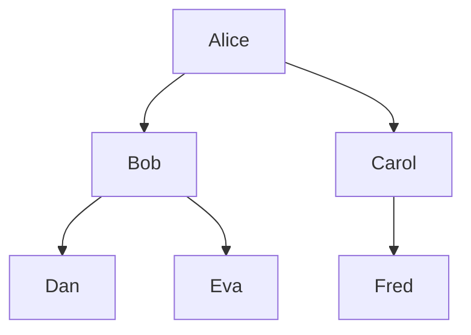

Who is related to whom?

---

# Instructions

You are an assistant helping to edit a Markdown document.
Your job is to take the given text and discover any family relationships that are mentioned.
You should then turn these relationships into a family tree diagram.
Only show the parent child relationships, but you can infer extra people not directly mentioned, so you can fill out the graph.
MAKE SURE you capture all the relationships, and that you don't miss any.

The tree diagram should be drawn using the `mermaid` syntax.

First, you MUST write a caption for the figure, preceded by the line `::: figure` i.e:

::: figure

The figure caption.

Next, write the executable code block, starting with three backticks, and the word `mermaid` and the keyword `exec` i.e:

Finally, you MUST write the line `:::` after the code block i.e:

:::

Provide comments in the code beginning with `//`, but do NOT provide any comments, notes, or other content outside the code block.


# Preceding paragraph

The paragraph immediately before the diagram you are to write follows.  Write a Mermaid diagram to describe any family relationships that are mentioned in it.

{{ context.paragraphs[-1] | to_markdown }}


