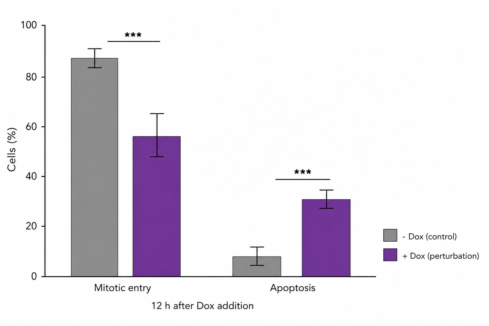

# Introduction

Auxin-inducible degron systems allow rapid depletion of tagged proteins, but the
timing of downstream cell-cycle outcomes can vary across cellular populations.
Here we used a live-cell imaging assay to quantify mitotic entry and apoptosis
after doxycycline-induced perturbation of a tagged target protein. In this fake
study, perturbation delayed the median time to mitotic entry from 4.6 h in
control cells to 8.6 h after Dox treatment. At 12 h, perturbed populations showed
fewer mitotic entries and more apoptotic cells than controls.

# Methods

Cells carrying an endogenous AID degron-tagged target protein were imaged every
2 h for 12 h after Dox addition. Individual cells were scored for mitotic entry
or apoptosis using time-lapse morphology. Population outcomes were summarized as
the percentage of cells entering mitosis or undergoing apoptosis by 12 h.

# Results

Control cells entered mitosis rapidly, with approximately half of the population
reaching mitotic entry by 4.6 h. Dox-treated cells showed a delayed cumulative
mitotic-entry curve, reaching the same threshold at 8.6 h. By the 12 h endpoint,
mitotic entry was reduced from about 88% in controls to about 55% after
perturbation, while apoptosis increased from about 6% to about 31%.

Figure 1. Live-cell analysis of degron-mediated target protein perturbation. Endpoint outcomes at 12 h showing reduced mitotic entry and increased apoptosis after perturbation. Error bars indicate replicate variation; asterisks indicate significant differences between conditions.

# Conclusion

These fictional data suggest that inducible depletion of the target protein slows
progression into mitosis and shifts a subset of cells toward apoptosis. The assay
provides a simple population-level readout for separating timing defects from
terminal cell-fate changes after acute protein perturbation.
