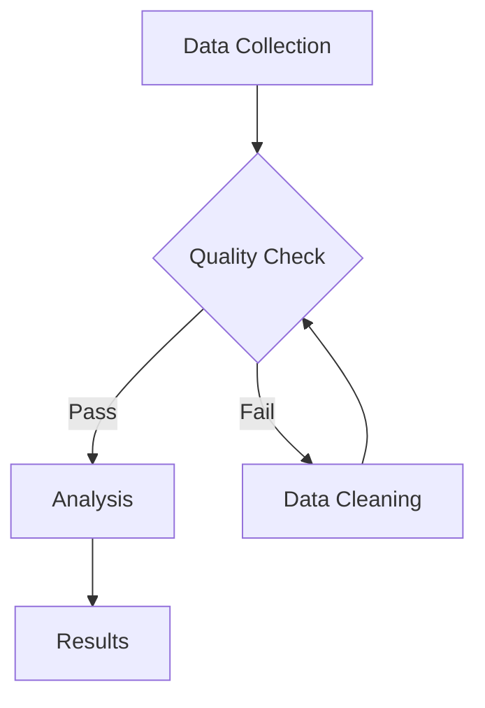
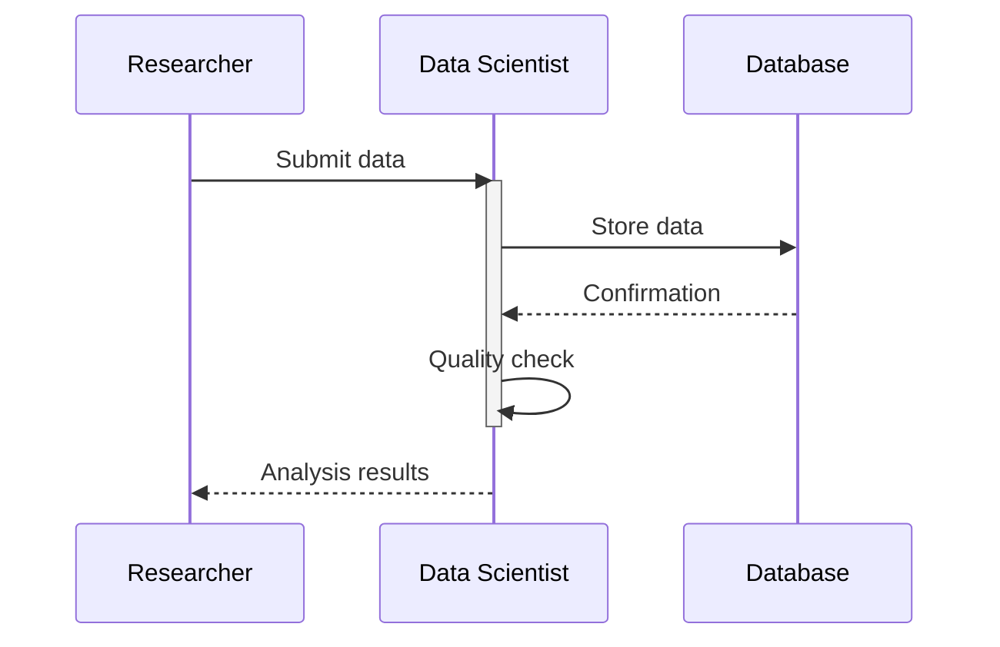

This page renders representative examples of every major content type in Stencila documents. It provides a canonical target for `stencila snap`, theme authors, and automated review agents. Each section exercises specific theme token families — look for the italic notes below each heading.

# Typography

Exercises: `heading-*`, `paragraph-*`, `link-*`, `text-*`, `font-family-*` tokens

This is a standard paragraph demonstrating **bold text**, *italic text*, `inline code`, [a hyperlink](/), ~~strikethrough~~, and a subscript H~2~O along with a superscript x^2^. Paragraphs are the most common content block and their spacing, line height, and text alignment are controlled by the `paragraph-*` token family.

A second paragraph follows to demonstrate inter-paragraph spacing. Good vertical rhythm between paragraphs is essential for readability, especially in long-form documents. The gap between these two paragraphs is governed by `--paragraph-spacing`.

A third paragraph with a soft line break
continues here on the next line, demonstrating how text reflows within a single paragraph block.

# Headings

Exercises: `heading-*` scale and weight progression tokens

## Heading Level 2

### Heading Level 3

#### Heading Level 4

##### Heading Level 5

###### Heading Level 6

# Lists

Exercises: `list-*` tokens including marker styles, indentation, and nested spacing

- First unordered item with enough text to potentially wrap to a second line on narrower viewports
- Second unordered item
  - Nested item demonstrating indentation
  - Another nested item
    - Deeply nested item
- Third unordered item

1. First ordered item
2. Second ordered item with enough text to demonstrate how numbered lists handle line wrapping and alignment of continuation text
3. Third ordered item
   1. Nested ordered item
   2. Another nested ordered item

# Quotes

Exercises: `quote-*` tokens for border, background, and typography

> This is a blockquote demonstrating the left border accent, background tint, and typography adjustments. Blockquotes are commonly used for pull quotes, testimonials, and highlighted passages.
>
> A second paragraph within the same blockquote tests multi-paragraph spacing inside the quote container.

# Code

Exercises: `code-*`, `code-font-family` tokens

Inline code like `fibonacci(10)` uses the `code-*` inline tokens for background, padding, and font size. Code blocks below exercise the block-level tokens and syntax highlighting.

```python
def greet(name: str) -> str:
    """Return a greeting message."""
    return f"Hello, {name}!"

class DataProcessor:
    def __init__(self, threshold: float = 0.5):
        self.threshold = threshold

    def process(self, values: list[float]) -> list[float]:
        return [v for v in values if v > self.threshold]
```

```javascript
function fibonacci(n) {
  if (n <= 1) return n;
  return fibonacci(n - 1) + fibonacci(n - 2);
}

const results = Array.from({ length: 10 }, (_, i) => fibonacci(i));
console.log("Fibonacci sequence:", results.join(", "));
```

```r
# Linear regression analysis
model <- lm(mpg ~ wt + hp, data = mtcars)
summary(model)

predict(model, newdata = data.frame(wt = 3.0, hp = 150))
```

# Math

Exercises: `math-*`, `math-font-family` tokens for block and inline expressions

The quadratic formula $x = \frac{-b \pm \sqrt{b^2 - 4ac}}{2a}$ appears inline within this paragraph, demonstrating how math integrates with surrounding text flow.

$$
\int_0^\infty e^{-x^2} \, dx = \frac{\sqrt{\pi}}{2}
$$

$$
\nabla \times \mathbf{E} = -\frac{\partial \mathbf{B}}{\partial t}
$$


# Images

Exercises: `image-*` tokens for layout, titles, and captions


# Tables

Exercises: `table-*` tokens including headers, borders, striping, captions, and notes

| Element   | Symbol | Atomic Number | Category       |
| :-------- | :----: | ------------: | :------------- |
| Hydrogen  |   H    |             1 | Nonmetal       |
| Helium    |   He   |             2 | Noble gas      |
| Lithium   |   Li   |             3 | Alkali metal   |
| Carbon    |   C    |             6 | Nonmetal       |
| Nitrogen  |   N    |             7 | Nonmetal       |
| Oxygen    |   O    |             8 | Nonmetal       |

Another table with caption and notes:

::: table Table 1

Selected physical properties of common solvents used in organic chemistry. Boiling points measured at standard atmospheric pressure.

| Solvent       | Formula           | Boiling Point (°C) | Density (g/mL) | Polarity |
| :------------ | :---------------- | ------------------: | --------------: | :------- |
| Water         | H₂O               |               100.0 |           0.997 | High     |
| Ethanol       | C₂H₅OH            |                78.4 |           0.789 | High     |
| Acetone       | (CH₃)₂CO          |                56.1 |           0.784 | Medium   |
| Dichloromethane | CH₂Cl₂          |                39.6 |           1.327 | Medium   |
| Hexane        | C₆H₁₄             |                69.0 |           0.659 | Low      |

Data sourced from CRC Handbook of Chemistry and Physics. All measurements at 25 °C unless noted otherwise.

:::


# Figures

Exercises: `figure-*` tokens including container styling, captions, labels, and content layout

::: figure

An example figure with a single-paragraph caption describing the placeholder image content. Figure captions use the `--figure-caption-*` token family.


:::

::: figure {layout=2}

  ::: figure

  

  A red placeholder image.

  :::

  ::: figure

  

  A green placeholder image.

  :::

  ::: figure

  

  A blue placeholder image.

  :::

  ::: figure

  

  An orange placeholder image.

  :::

  A figure with four subfigures. Exercises `--figure-subfigure-*` tokens.

:::

# Code Chunks

Code chunks can have `labelType: FigureLabel`:

::: figure

```echarts exec
{
  "xAxis": {
    "type": "category",
    "data": ["Jan", "Feb", "Mar", "Apr", "May", "Jun"]
  },
  "yAxis": {
    "type": "value"
  },
  "series": [
    {
      "type": "line",
      "smooth": true,
      "data": [120, 180, 160, 210, 260, 300],
      "areaStyle": {}
    }
  ]
}
```

A plot of visitors by month.

:::

Or they can have `labelType: TableLabel`:

::: table

A table of A and B.

```js exec
({
  type: "Table",
  rows: [
    {
      type: "TableRow",
      rowType: "HeaderRow",
      cells: [
        {
          type: "TableCell",
          cellType: "HeaderCell",
          content: [
            {
              type: "Paragraph",
              content: [{ type: "Text", value: { string: "A" } }]
            }
          ]
        },
        {
          type: "TableCell",
          cellType: "HeaderCell",
          content: [
            {
              type: "Paragraph",
              content: [{ type: "Text", value: { string: "B" } }]
            }
          ]
        }
      ]
    },
    {
      type: "TableRow",
      cells: [
        {
          type: "TableCell",
          content: [
            {
              type: "Paragraph",
              content: [{ type: "Text", value: { string: "1" } }]
            }
          ]
        },
        {
          type: "TableCell",
          content: [
            {
              type: "Paragraph",
              content: [{ type: "Text", value: { string: "2" } }]
            }
          ]
        }
      ]
    },
    {
      type: "TableRow",
      cells: [
        {
          type: "TableCell",
          content: [
            {
              type: "Paragraph",
              content: [{ type: "Text", value: { string: "3" } }]
            }
          ]
        },
        {
          type: "TableCell",
          content: [
            {
              type: "Paragraph",
              content: [{ type: "Text", value: { string: "4" } }]
            }
          ]
        }
      ]
    }
  ]
})
```

:::

# Admonitions

Exercises: `admonition-*` tokens including type-specific colors, borders, icons, and disclosure

> [!NOTE]
> This is an informational note. Notes are used for supplementary information that adds context without interrupting the main flow of the document.

> [!TIP]
> A helpful tip for the reader. Tips suggest best practices or shortcuts that improve the reader's experience.

> [!IMPORTANT]
> Important information that the reader should not overlook. This admonition type uses a distinct color to convey significance.

> [!WARNING]
> A warning about potential pitfalls. Warnings alert the reader to common mistakes or risky actions that could cause problems.

> [!DANGER]
> A danger alert for critical risks. This is the strongest admonition type and signals that the reader must take immediate care.

> [!NOTE]- Collapsible Admonition (Initially Expanded)
> This admonition uses the disclosure toggle. The chevron icon, its rotation animation, and open/closed state are controlled by the `--admonition-chevron-*` tokens.

> [!TIP]+ Collapsed Admonition (Initially Collapsed)
> This content is hidden by default and revealed when the reader clicks the toggle. It demonstrates the folded state for admonitions with lengthy supplementary content.

# Diagrams

Exercises: `diagram-*` tokens including node backgrounds, edge colors, text, and structural styling

A Mermaid flowchart testing node shapes, decision diamonds, edge labels, and connection styling:



A Mermaid sequence diagram testing actor backgrounds, signal colors, and activation boxes:




# Plots

Exercises: `plot-*` tokens including categorical colors, axes, grid, legends, typography, and background

An ECharts bar chart testing categorical color palette, axis lines, grid, and legend:

```echarts exec
{
  "xAxis": {
    "type": "category",
    "data": ["Q1", "Q2", "Q3", "Q4"]
  },
  "yAxis": {
    "type": "value"
  },
  "series": [
    {
      "name": "Revenue",
      "data": [320, 450, 390, 520],
      "type": "bar"
    },
    {
      "name": "Profit",
      "data": [120, 180, 150, 220],
      "type": "bar"
    }
  ]
}
```

A Vega-Lite line plot testing line marks, point marks, multi-series legend, and color encoding:

```vegalite exec
{
  "data": {
    "values": [
      {"day": "Mon", "series": "Sales", "value": 120},
      {"day": "Tue", "series": "Sales", "value": 200},
      {"day": "Wed", "series": "Sales", "value": 150},
      {"day": "Thu", "series": "Sales", "value": 80},
      {"day": "Fri", "series": "Sales", "value": 70},
      {"day": "Sat", "series": "Sales", "value": 110},
      {"day": "Sun", "series": "Sales", "value": 130},
      {"day": "Mon", "series": "Costs", "value": 80},
      {"day": "Tue", "series": "Costs", "value": 120},
      {"day": "Wed", "series": "Costs", "value": 100},
      {"day": "Thu", "series": "Costs", "value": 60},
      {"day": "Fri", "series": "Costs", "value": 50},
      {"day": "Sat", "series": "Costs", "value": 80},
      {"day": "Sun", "series": "Costs", "value": 90}
    ]
  },
  "mark": {
    "type": "line",
    "interpolate": "monotone",
    "point": true
  },
  "encoding": {
    "x": {
      "field": "day",
      "type": "ordinal",
      "sort": ["Mon", "Tue", "Wed", "Thu", "Fri", "Sat", "Sun"]
    },
    "y": {
      "field": "value",
      "type": "quantitative"
    },
    "color": {
      "field": "series",
      "type": "nominal"
    }
  }
}
```


# Thematic Breaks

Exercises: `thematic-break-*` tokens for border style, width, color, and spacing

Content before the thematic break.

---

Content after the thematic break demonstrates the vertical spacing and visual weight of horizontal rules.
