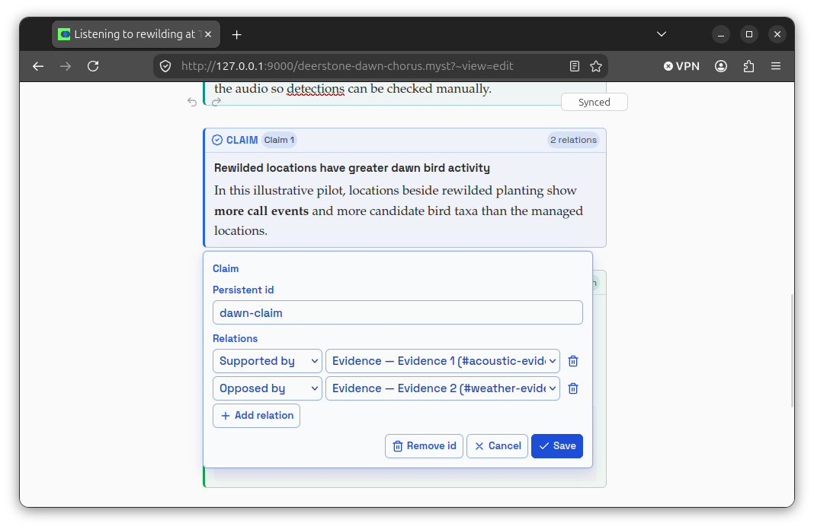
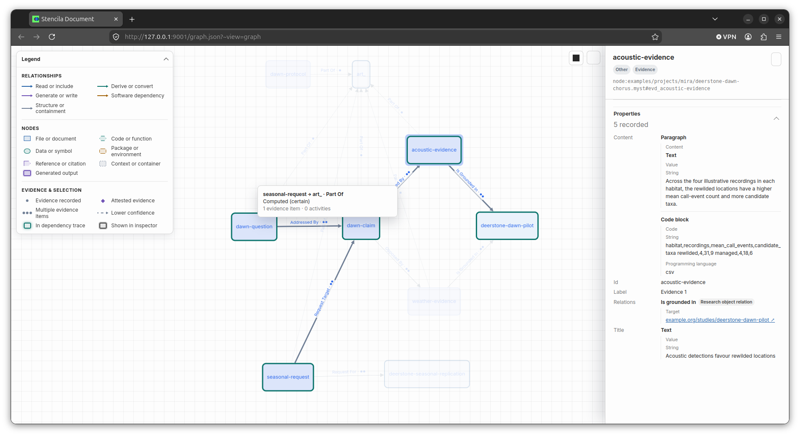

# Introduction

[MIRA](https://github.com/MIRA-science/schema) is a vocabulary for representing modular research objects and the relations between them. Stencila documents can now carry those objects directly: claims, evidence, questions, protocols, and requests are block nodes with identifiers, rich content, and typed relations.

The complete example used on this page is [a synthetic dawn-chorus study at The Deerstone](https://github.com/stencila/stencila/blob/main/examples/projects/mira/deerstone-dawn-chorus.myst) in County Wicklow. It was chosen as a nod to the venue of MIRA's inaugural gathering; its data and scientific conclusions are explicitly illustrative. The setting is real—[The Deerstone](https://thedeerstone.ie/) describes its rewilding work—but the study and observations are not.

> [!warning] Under development
>
> MIRA and OXA support are evolving. Treat the emitted JSON-LD and embedded OXA as provisional interfaces while their vocabularies stabilize.

# Authoring research objects

In MyST, use directives named `claim`, `evidence`, `question`, `protocol`, and `request`. Give every object that participates in a relation a stable `id`, and point to a local object with `#id`:

```myst
:::{question} Does rewilded planting support a richer dawn chorus?
:id: dawn-question
:label: Question 1
:addressed-by: #dawn-claim

Is bird acoustic activity greater around rewilded planting than around nearby
managed grassland during the dawn chorus?
:::

:::{claim} Rewilded locations have greater dawn bird activity
:id: dawn-claim
:label: Claim 1
:supported-by: #acoustic-evidence
:opposed-by: #weather-evidence

In this illustrative pilot, locations beside rewilded planting show **more call
events** and more candidate bird taxa than the managed locations.
:::
```

Relation targets can also be absolute identifiers. This lets a document refer to a study or another research object published elsewhere:

```myst
:::{evidence} Acoustic detections favour rewilded locations
:id: acoustic-evidence
:label: Evidence 1
:is-grounded-in: https://example.org/studies/deerstone-dawn-pilot

The rewilded locations have a higher mean call-event count.
:::
```

The same objects can be authored in Quarto Markdown:

```qmd
::: {.evidence #acoustic-evidence label="Evidence 1" is-grounded-in="https://example.org/studies/deerstone-dawn-pilot"}

The rewilded locations have a higher mean call-event count.

:::
```

Or in Stencila Markdown:

```smd
::: evidence Evidence 1 #acoustic-evidence

The rewilded locations have a higher mean call-event count.

:::
```

MyST and QMD currently provide the most complete syntax for authoring relations. The decoder recognizes relation property names in kebab case, snake case, camel case, or the corresponding MIRA local spelling. See the [Markdown directive decoder](https://github.com/stencila/stencila/blob/main/rust/codec-markdown/src/decode/blocks.rs#L774-L1057) for the MyST, QMD, and SMD mappings.

# Annotating in the document editor

In Stencila's document editor, select one or more blocks and wrap them as a claim, evidence, question, protocol, or request. Research objects remain part of the editable document rather than becoming detached graph records. Their property panel lets you assign a persistent identifier and add relations to another object in the document or to an external URI.



The shared Stencila representation is defined by [`ResearchObject`](https://github.com/stencila/stencila/blob/main/schema/ResearchObject.yaml#L1-L84). Its `content` accepts normal document blocks, while `relations` uses a constrained [MIRA-derived relation vocabulary](https://github.com/stencila/stencila/blob/main/schema/ResearchObjectRelationKind.yaml#L29-L62). This is why a research object can contain formatted prose or code and still participate in the graph. The editor uses [native ResearchObject wrappers and authoring commands](https://github.com/stencila/stencila/blob/main/web/src/tiptap/research-objects.ts#L14-L258) together with a [relation property control](https://github.com/stencila/stencila/blob/main/web/src/views/edit/properties/relations.ts#L21-L280).

# Exporting the MIRA graph

Run `stencila graph` with a `.mira.json` or `.mira.jsonld` output filename:

```sh
stencila graph examples/projects/mira/deerstone-dawn-chorus.myst \
  deerstone-dawn-chorus.mira.jsonld --output-losses abort
```

The strict `--output-losses abort` option is useful for demonstrations and automation: export stops if content cannot be represented faithfully. Stencila resolves local references, retains external identifiers, and writes the research objects and relations into the JSON-LD `@graph`. The graph construction and export paths are visible in the [document graph implementation](https://github.com/stencila/stencila/blob/main/rust/graph/src/document.rs#L512-L618) and [`stencila graph` exporter](https://github.com/stencila/stencila/blob/main/rust/cli/src/graph.rs#L300-L342).

A compact part of the result looks like this. Relations are first-class graph items with their own identifiers, source, and destination:

```json
[
  {
    "@id": "#dawn-claim",
    "@type": "mira:Claim",
    "label": "Claim 1",
    "description": {
      "@type": "Item",
      "format": "application/vnd.oxa+json",
      "content": "{\"type\":\"Document\",\"children\":[...]}"
    }
  },
  {
    "@id": "#rel_50e097be80bc5aea",
    "@type": "mira:supportedBy",
    "source": "#dawn-claim",
    "destination": "#acoustic-evidence"
  }
]
```

When the source is a committed file inside a Git repository, the exported `@context` can include an `@base` built from its repository, revision, and path metadata. Local fragment identifiers then expand to the exact document version that declared them.


# Rich content with OXA

MIRA's `description` is an `Item`. Stencila serializes each research object's block content as compact [OXA JSON](./oxa.md), stores that JSON string in `description.content`, and sets the sibling `description.format` to `application/vnd.oxa+json`.

For easier inspection with `jq`, parse that nested JSON string:

```sh
jq '."@graph"[]
  | select(."@type" == "mira:Evidence")
  | .description.content |= fromjson' \
  deerstone-dawn-chorus.mira.jsonld
```

Paragraphs, headings, code blocks, emphasis, strong text, and inline code have direct OXA mappings. Other Stencila nodes use OXA's evolving generic representation and may report conversion losses. The exact MIRA-to-OXA bridge is implemented in the [MIRA codec](https://github.com/stencila/stencila/blob/main/rust/codec-mira/src/lib.rs#L522-L600).

# Reading a MIRA graph

The integration is bidirectional. Stencila decodes MIRA JSON-LD into a `Graph`, reconstructing the five supported research-object types, their OXA content, and their relations. It can then be converted to a Stencila graph serialization or rendered directly:

```sh
stencila convert deerstone-dawn-chorus.mira.jsonld deerstone-graph.yaml \
  --output-losses abort

stencila graph deerstone-dawn-chorus.mira.jsonld deerstone-roundtrip.svg \
  --view discourse --containment none
```

# Viewing the discourse graph

The same authored relations can be rendered as a focused graph:

```sh
stencila graph examples/projects/mira/deerstone-dawn-chorus.myst --view discourse --containment none
```



# Supported MIRA vocabulary

Stencila currently maps five concrete ResearchObject types to MIRA:

| Stencila type | MIRA type |
| ------------- | --------- |
| `Claim`       | `mira:Claim` |
| `Evidence`    | `mira:Evidence` |
| `Protocol`    | `mira:Protocol` |
| `Question`    | `mira:Question` |
| `Request`     | `mira:Request` |

It supports all eleven authored relation kinds: `supports`, `supportedBy`, `opposes`, `opposedBy`, `addresses`, `addressedBy`, `follows`, `grounds`, `is_grounded_in`, `request_for`, and `request_target`.

MIRA also defines `Study`, but Stencila does not yet have a corresponding ResearchObject block. For now, evidence and requests can refer to studies by absolute identifiers, as the Deerstone example does. A typed Stencila claim such as a theorem or hypothesis exports as `mira:Claim`, but its Stencila-specific `claimType` is reported as a loss. Use an untyped `claim` when strict, lossless MIRA export is required.

# Implementation map

- [ResearchObject base schema](https://github.com/stencila/stencila/blob/main/schema/ResearchObject.yaml#L1-L84) — shared content, label, relation, and extra fields.
- [MIRA relation enumeration](https://github.com/stencila/stencila/blob/main/schema/ResearchObjectRelationKind.yaml#L29-L62) — the eleven relation kinds and their semantics.
- [Markdown decoding](https://github.com/stencila/stencila/blob/main/rust/codec-markdown/src/decode/blocks.rs#L774-L1057) — MyST, QMD, and SMD research-object syntax.
- [Document editor wrappers](https://github.com/stencila/stencila/blob/main/web/src/tiptap/research-objects.ts#L14-L258) and [relation control](https://github.com/stencila/stencila/blob/main/web/src/views/edit/properties/relations.ts#L21-L280) — visual annotation, identifiers, and local or external targets.
- [Document graph construction](https://github.com/stencila/stencila/blob/main/rust/graph/src/document.rs#L512-L618) — resolving local and external relation targets into graph edges.
- [MIRA JSON-LD and OXA encoding](https://github.com/stencila/stencila/blob/main/rust/codec-mira/src/lib.rs#L445-L600) — type mapping, rich descriptions, labels, and conversion losses.
- [`stencila graph` export](https://github.com/stencila/stencila/blob/main/rust/cli/src/graph.rs#L300-L342) — selecting MIRA JSON-LD from the output filename and writing it.
- [Format aliases and extensions](https://github.com/stencila/stencila/blob/main/rust/format/src/lib.rs#L539-L540) — recognizing both `.mira.json` and `.mira.jsonld`.
- [Pinned MIRA vocabulary fixture](https://github.com/stencila/stencila/blob/main/rust/schema/tests/fixtures/mira/vocabulary.json#L1-L95) — the upstream classes and properties validated by Stencila's schema tests.
