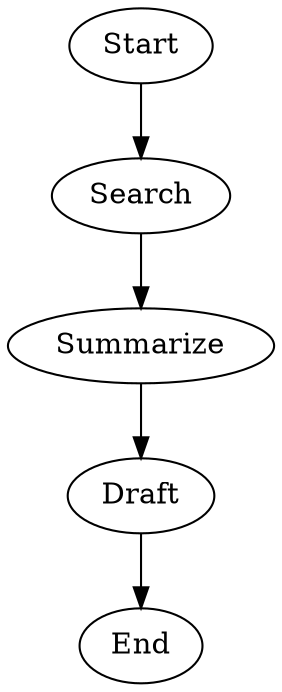
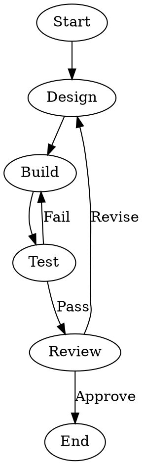
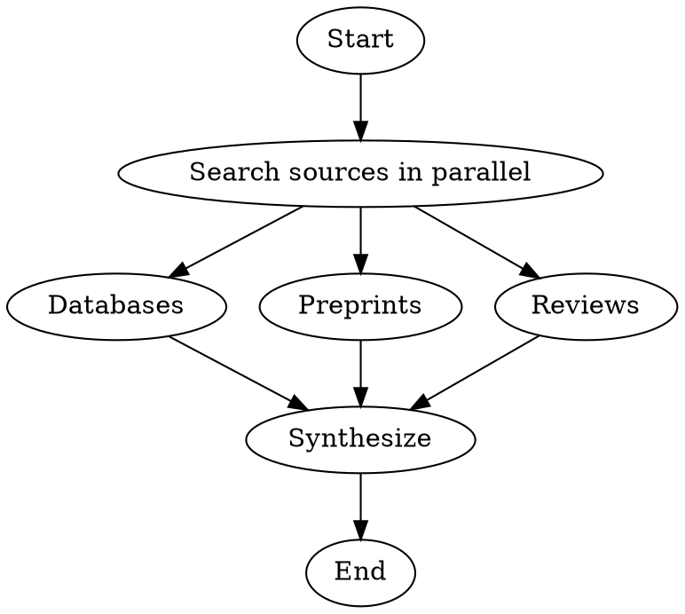
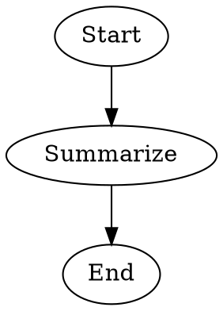

Create a new Stencila workflow. Use when asked to create, write, scaffold, or set up a workflow directory or WORKFLOW.md file. Covers workflow discovery, duplicate-name checks, ephemeral workflows, WORKFLOW.md frontmatter, DOT pipeline authoring, goals, agents, branching, composition, and validation.

**Keywords:** workflow · pipeline · create · scaffold · write · set up · WORKFLOW.md

> [!tip] Usage
>
> To use this skill, add `workflow-creation` to the `allowed-skills` list in your agent's AGENT.md. You can also ask `#agent-creator` to build an agent that uses it.

# Configuration

| Property | Value |
| -------- | ----- |
| Allowed tools | `read_file`, `write_file`, `edit_file`, `apply_patch`, `glob`, `grep`, `shell`, `ask_user`, `list_agents`, `list_workflows` |

# Instructions

## Overview

Create a new workflow directory and `WORKFLOW.md` file for Stencila. A workflow is a directory under `.stencila/workflows/` containing a `WORKFLOW.md` file with YAML frontmatter and a Markdown body. The body should begin with a short human-readable explanation of what the workflow does and how it works, followed by a `dot` fenced code block that defines the pipeline, and then any additional documentation or referenced content blocks.

Use this skill when the user wants to define a multi-stage AI workflow, orchestrate several agent or human steps, or scaffold a reusable pipeline that can be validated and run with Stencila.

## Steps

1. Determine the workflow name, description, and intended goal from the user's request
2. Validate the name against the naming rules below
3. Resolve the closest workspace by walking up from the current directory to find the nearest `.stencila/` directory; if none exists, use the repository root or current working directory and create `.stencila/workflows/<name>/`
4. Ask clarifying questions if the workflow's stages, branching behavior, composition boundaries, agents, or goal are unclear
5. Check whether a workflow with the same name already exists in the target workspace; if it does, ask whether to overwrite, merge, or abort before changing anything
6. Decide whether the workflow should be permanent or ephemeral:
   - default to a normal permanent workflow unless the user asks for a temporary workflow or the creating tool explicitly uses ephemeral creation
   - prefer ephemeral workflows for agent-created drafts, quick experiments, or workflows the user may want to discard after immediate use
   - if ephemeral, plan to mark the workflow directory using a `.gitignore` sentinel file containing `*`
7. Create the directory `<closest-workspace>/.stencila/workflows/<name>/`
8. Write `WORKFLOW.md` with:
   - YAML frontmatter containing at least `name` and `description`
   - `goal-hint` when the workflow expects user-supplied goals (see Optional frontmatter fields below); use `goal` only when the workflow has a stable, fixed objective
   - `keywords` with domain-relevant terms and `when-to-use`/`when-not-to-use` entries to improve discoverability and delegation accuracy
   - A Markdown body that begins with a short human-readable explanation of the workflow, followed by a `dot` fenced code block containing the workflow pipeline, and then any additional referenced content blocks or documentation
9. If ephemeral, create the `.gitignore` sentinel file with exactly `*` on its own line; if permanent, do not add that sentinel
10. Prefer a simple linear pipeline first, then add branching, retry loops, conditions, human review, workflow composition, or agent overrides only when the user asks for them or the workflow clearly needs them
11. Use `list_agents` and `list_workflows` when agent selection or workflow composition matters, so you can choose from real available resources instead of guessing names:
    - match `description` to the task and `keywords` to domain terms
    - use `when-to-use` for positive signals and `when-not-to-use` to avoid poor matches
12. Reference agents by name with `agent="name"` and child workflows with `workflow="name"`:
    - prefer specialized resources returned by the list tools
    - do not invent names unless the user requests them, they are clear project conventions, or the workflow is being designed top-down
13. **Top-down design**: When the user wants to design the workflow structure first and create dependencies afterward:
    - name planned agents and child workflows using kebab-case names that follow naming conventions
    - note which ones need to be created and inform the user of the outstanding dependencies
    - validation and the runtime accept forward references (unresolved agents produce a runtime warning, not an error), so the workflow can be authored and iterated on before all dependencies are in place
14. Replace placeholders such as `TODO` before considering the workflow complete
15. Validate the finished workflow with `stencila workflows validate <name>`, the workflow directory path, or the `WORKFLOW.md` path, and report the result to the user when possible

When working from a nested directory in a repository, create the workflow in the closest workspace's `.stencila/workflows/` directory rather than creating a new `.stencila/` tree under the current subdirectory.

## Naming Rules

Workflow names must be **lowercase kebab-case**:

- 1–64 characters
- Only lowercase alphanumeric characters and hyphens (`a-z`, `0-9`, `-`)
- Must not start or end with a hyphen
- Must not contain consecutive hyphens (`--`)
- Must match the parent directory name
- Pattern: `^[a-z0-9]([a-z0-9-]{0,62}[a-z0-9])?$`

By convention, workflow names should describe the **end-to-end process** the workflow accomplishes, not the exact sequence of steps in the graph.

Use these naming patterns:

- `thing-process` for the default case
- `thing-process-approach` when you need to distinguish multiple workflows for the same process

Where:

- `thing` is the artifact or domain the workflow acts on, such as `code`, `blog`, `agent`, or `schema`
- `process` is the broad lifecycle stage or end-to-end goal, such as `generation`, `refinement`, `publication`, `review`, or `creation`
- `approach` is an optional qualifier for strategy or tradeoffs, such as `quick`, `iterative`, `consensus`, `thorough`, or `guided`

Prefer names that communicate purpose rather than pipeline shape. Avoid brittle names that list every step, such as `create-review-refine-test-deploy` or `plan-implement-validate`, because they become outdated as the workflow evolves.

Good examples:

- `code-review`
- `code-generation-iterative`
- `blog-generation-quick`
- `architecture-design-consensus`
- `agent-creation-guided`

Common corrections: `workflowBuilder` → `workflow-builder`, `test_deploy` → `test-deploy`, `Code-Review` → `code-review`.

## WORKFLOW.md Format

The file has two parts:

1. **YAML frontmatter** between `---` delimiters — metadata such as `name`, `description`, and optional `goal`
2. **Markdown body** — a short human-readable explanation of the workflow, then a DOT pipeline in the first `dot` fenced code block, then optional additional documentation and referenced content blocks

### Required frontmatter fields

- `name` — the workflow name (must match directory name)
- `description` — what the workflow does and when to use it; keep it concise and specific

### Optional frontmatter fields

- `goal-hint` — hint text displayed across user interfaces (TUI, web, email, Slack, etc.) when the workflow is activated, guiding the user to provide a specific goal (e.g., "What kind of analysis do you want to perform?"). Most workflows should include this because most workflows expect the user to supply their own objective at run time. The user's response becomes `$goal` at runtime. This field is a UI hint and is never substituted into prompts directly
- `goal` — a fixed high-level objective for the workflow; use only when the workflow has a stable, predetermined intent that prompts interpolate as `$goal`. Omit generic goals that merely restate the workflow's purpose (e.g., "Produce an acceptable X for the requested purpose") — they add no value and clutter the user interface with unhelpful pre-filled text
- `keywords` — list of keywords or tags for discovery and routing; use terms that reflect the workflow's domain and purpose
- `when-to-use` — list of positive selection signals describing when this workflow should be used; helps managers choose the right workflow
- `when-not-to-use` — list of negative selection signals describing when this workflow should not be used
- `license` — SPDX identifier or reference to a license file if needed
- `compatibility` — environment requirements (max 500 characters)
- `metadata` — arbitrary key-value pairs if the workflow needs extra structured metadata

Ephemeral status is not stored in frontmatter. It is determined by whether the workflow directory has a `.gitignore` sentinel file containing exactly `*`.

### DOT Pipeline Expectations

- Start the Markdown body with a short human-readable explanation of what the workflow does and how it works, then put the executable pipeline in the first `dot` fenced code block
- Use a directed graph such as `digraph code_review { ... }`
- Add graph attributes in `graph [...]` only when required by execution semantics or to match an existing project style
- Use node attributes such as `prompt`, `agent`, and `ask` where needed
- For session persistence, prefer the `persist` shorthand when a node should retain its own conversational context but that thread does not need to be shared with other nodes; this is the simplest and preferred sugar for per-node persistence
- When multiple sequential nodes should share one conversation session, do not rely on `persist` alone because it auto-generates a distinct `thread-id` per node. Instead, set an explicit shared `thread-id` with `fidelity="full"`, or use graph-level defaults `default-fidelity="full"` and `default-thread-id="..."` for a whole shared thread
- Do not reuse the same `thread-id` across different agents or across parallel branches; shared threads should usually stay within one agent and one sequential path
- For long or multiline prompts, shell scripts, or human questions, use reusable fenced code blocks with ids and reference them via `prompt-ref`, `shell-ref`, `ask-ref`, or `interview-ref` instead of embedding long strings in DOT. Do not use refs for short single-line values
- Use `interview-ref` (pointing to a YAML block with preamble, typed questions, and `store` keys) when a human review step collects multiple pieces of information; use `ask` or `ask-ref` for single-question gates
- Use `show-if` on interview questions to conditionally display them based on a previous answer (e.g., `show-if: "decision == Revise"` to ask for revision notes only when the reviewer chose to revise); use `finish-if` on `yes-no`, `confirm`, or `single-select` questions to end the interview early when the answer matches a value (e.g., `finish-if: "no"` to skip remaining questions when the user declines to continue)
- When an `agent` node has multiple outgoing edges with labels, the engine provides routing instructions (via `workflow_set_route` tool or XML tag fallback). Give each outgoing edge a descriptive label (e.g., `Accept`, `Revise`, `Pass`, `Fail`) and the agent will signal its choice. Edge conditions take priority over preferred labels, so both mechanisms can coexist
- In iterative workflows, prefer tool-based context retrieval (`workflow_get_output`, `workflow_get_context`) over `$last_output` / `$human.feedback` interpolation — this avoids bloating prompts with long prior outputs. Write prompts that say "check for reviewer feedback" instead of embedding variables inline. Reserve `$`-variable interpolation for short values (`$goal`, `$last_stage`) and for shell commands and edge conditions where tools are unavailable
- Use edges to express sequencing, branching, retry loops, and approval paths
- Use a `FanOut…` node ID prefix for parallel fan-out — all outgoing edges from the fan-out node execute concurrently and reconverge at a downstream fan-in point. Set `join_policy` (`wait_all` or `first_success`), `error_policy` (`fail_fast`, `continue`, or `ignore`), and `max_parallel` (default 4) as needed. The fan-in node is detected automatically by structural convergence or can be made explicit with a `FanIn…` node ID prefix or `shape=tripleoctagon`. Static fan-out has a fixed number of branches defined by the outgoing edges in the DOT graph. For dynamic fan-out where the number of branches is determined at runtime, use `fan-out="key"` on a node to fan out over a list stored in the pipeline context under that key; the node must have exactly one outgoing edge pointing to the template entry node, and a fan-in node (explicit `FanIn…` prefix or `shape=tripleoctagon`) must follow the template subgraph to collect the results
- Shell nodes can use `store="key"` to write their stdout into the pipeline context, with optional `store-as="json"` or `store-as="string"` to control parsing (default: try JSON, fall back to string). This is the typical way to produce the list that a dynamic `fan-out` consumes — a shell node outputs a JSON array and stores it with `store="items" store-as="json"`, then a downstream fan-out node references `fan-out="items"`. Alternatively, an agent node with `context-writable=true` can produce a list by calling `workflow_set_context` with a JSON array value (e.g., `fan-out="items"`)
- Use `workflow="child-name"` on a node to run another workflow as a composed subprocess. Use `goal="..."` to pass an explicit child objective; if omitted, the child goal defaults to the node's resolved input (`prompt`, then `label`). Keep the parent focused on orchestration and the child on detailed execution; avoid composing trivial one-step tasks unless reuse is likely
- Prefer `persist="full"` (or another `persist` mode) over spelling out `fidelity` and `thread-id` when you only want per-node carryover sugar and do not need multiple nodes to share the same thread
- Do not create direct or indirect composition cycles; workflow nesting should remain acyclic. Current validation rejects direct self-reference, and indirect cycles should also be avoided even if they are not yet detected statically
- Prefer the house style of placing the entry edge near the top, then organizing each node as a block: node definition followed immediately by its outgoing edge or edges
- Forward references to agents and child workflows are valid — see step 13 (Top-down design)
- Prefer explicit agent selection over relying on the default agent fallback, unless the user wants a minimal draft. When a node has no `agent` attribute, the engine uses a default agent — note this to the user when it matters
- Stencila resolves agent names in order: workspace agents → user-level agents → CLI-detected agents
- Use the `ask` property for explicit human approval or review steps
- Prefer `goal-hint` over `goal` for most workflows; see Optional frontmatter fields for the distinction
- Keep the initial scaffold minimal and readable unless the user explicitly asks for a complex pipeline

The recommended body structure is: a short human-readable explanation of the workflow before the first DOT block, then the DOT pipeline, then any additional referenced content blocks or documentation. Only the first DOT block is extracted as the pipeline definition.

Reusable content references resolve against code blocks or code chunks with ids in the same `WORKFLOW.md`. Use them mainly for longer content, for example:

````markdown
```dot
digraph example {
  Create [agent="writer", prompt-ref="#creator-prompt"]
  Check  [shell-ref="#run-checks"]
  Ask    [ask-ref="#human-question", question-type="freeform"]
  Review [interview-ref="#review-interview"]
}
```

```markdown #creator-prompt
Create or revise the draft for this goal: $goal
Check for reviewer feedback from a previous iteration and revise rather than restart.
```

```sh #run-checks
cargo fmt -p workflows && cargo test -p workflows
```

```markdown #human-question
What should change before the next revision?
```

```yaml #review-interview
preamble: |
  Please review the draft and provide structured feedback.
questions:
  - header: Decision
    question: Is the draft ready to publish?
    type: single-select
    options:
      - label: Approve
      - label: Revise
    store: review.decision
  - header: Feedback
    question: What specific changes should be made?
    store: review.feedback
```
````

Ids must be unique within the document.

## Ephemeral Workflows

An ephemeral workflow is a temporary workflow directory under `.stencila/workflows/` that includes a `.gitignore` file containing exactly:

```text
*
```

This sentinel marks the workflow as temporary without adding any special frontmatter or DOT attributes.

Use ephemeral workflows when:

- the workflow is being created by an agent for immediate execution
- the user wants a draft or throwaway workflow
- the workflow should be easy to discard if the user does not keep it

Do not make a workflow ephemeral unless the user asks for temporary behavior or the surrounding flow clearly implies it.

When describing the result, explain whether the workflow is ephemeral or permanent. If ephemeral, mention `stencila workflows save <name>` to keep it and `stencila workflows discard <name>` to remove it.

## Common Workflow Patterns

### Linear agent-driven workflow

````markdown
---
name: lit-review
description: Search and summarize recent literature
goal: Review recent literature on CRISPR gene editing
---

This workflow searches for recent papers, summarizes the key findings, and drafts a literature review.


````

### Agent-driven workflow with structured review interview

````markdown
---
name: code-review-guided
description: Automated code review with structured human feedback
goal: Implement and review the feature with detailed feedback
---

This workflow designs, builds, and reviews code changes using a structured human review interview that collects both a routing decision and detailed feedback.

```dot
digraph code_review_guided {
  Start -> Design

  Design [agent="code-planner", prompt="Design the solution for: $goal"]
  Design -> Build

  Build [agent="code-engineer", prompt="Implement the design"]
  Build -> Review

  Review [interview-ref="#review-interview"]
  Review -> End        [label="Approve"]
  Review -> Design     [label="Revise"]
}
```

```yaml #review-interview
preamble: |
  Please review the implementation and provide structured feedback.

questions:
  - header: Decision
    question: Is the implementation ready to merge?
    type: single-select
    options:
      - label: Approve
      - label: Revise
    store: review.decision
    finish-if: Approve

  - header: Revision Notes
    question: What specific changes should be made?
    show-if: "review.decision == Revise"
    store: review.feedback
```
````

### Agent-driven review with label routing

When an LLM agent decides the branch, use labeled edges without conditions.

````markdown
---
name: draft-review-iterative
description: Draft and iteratively refine with agent-driven review
goal-hint: What would you like drafted and refined?
---

This workflow uses a writer agent to create or revise a draft, then a reviewer agent to evaluate it. The reviewer chooses between Accept and Revise branches via `workflow_set_route`. On acceptance, the draft enters a structured human review interview where the user can accept or request further revisions with feedback. The `Create` node retrieves reviewer feedback via `workflow_get_output` and human revision notes via `workflow_get_context` to keep prompts compact across iterations.

```dot
digraph draft_review_iterative {
  Start -> Create

  Create [agent="writer", prompt-ref="#creator-prompt"]
  Create -> Review

  Review [agent="reviewer", prompt-ref="#reviewer-prompt"]
  Review -> HumanReview  [label="Accept"]
  Review -> Create       [label="Revise"]

  HumanReview [interview-ref="#human-review-interview"]
  HumanReview -> End     [label="Accept"]
  HumanReview -> Create  [label="Revise"]
}
```

```markdown #creator-prompt
Create or update the draft for: $goal

Before starting, check for reviewer feedback from a previous iteration. If feedback is present, use it to revise the existing draft instead of starting over. Also check for human revision notes and incorporate those as well.
```

```markdown #reviewer-prompt
Review the current draft for the goal '$goal'.

If the draft is acceptable, choose the Accept branch.
If the draft needs changes, choose the Revise branch and provide specific feedback in your response.
```

```yaml #human-review-interview
preamble: |
  The reviewer agent has approved the current draft.
  Please review and decide whether to accept or revise.

questions:
  - header: Decision
    question: Is the draft acceptable?
    type: single-select
    options:
      - label: Accept
      - label: Revise
    store: human.decision
    finish-if: Accept

  - header: Revision Notes
    question: What changes should be made?
    store: human.feedback
    show-if: "human.decision == Revise"
```
````

### Condition-based branching

Use edge conditions for deterministic routing based on handler status. Unlike label routing above, condition-based branching evaluates structured outcome fields.

````markdown
---
name: code-review
description: Automated code review with human approval gate
goal: Implement and review the feature
---

This workflow designs, builds, and tests a code change, then routes to human review on success or loops back on test failure. The human reviewer can approve or send the change back for revision.


````

### Parallel fan-out

Use a `FanOut…` node ID prefix to execute independent branches concurrently. Branches reconverge at a shared downstream node (the fan-in point), which can be made explicit with a `FanIn…` node ID prefix or `shape=tripleoctagon`. Use this pattern when the workflow has multiple independent tasks that do not depend on each other's output — for example, searching different sources, running independent analyses, or generating alternative candidates.

Fan-out can be **static** or **dynamic**. Static fan-out has a fixed number of branches defined by the outgoing edges in the DOT graph. Dynamic fan-out uses `fan-out="key"` to iterate over a runtime list stored in the pipeline context, spawning one branch per item — use this when the number of items is not known until execution time.

#### Static fan-out

````markdown
---
name: literature-search-parallel
description: Search multiple sources in parallel and synthesize findings
goal-hint: What topic should the literature search cover?
---

This workflow fans out to three independent source searches in parallel, then synthesizes their combined results into a unified review.


````

#### Dynamic fan-out

Use a shell node with `store` and `store-as` to produce a runtime list, then a `FanOut…` node with `fan-out="key"` to iterate over it. The fan-out node must have exactly one outgoing edge pointing to the template entry node. A fan-in node collects the results after the template subgraph. Alternatively, an agent node with `context-writable=true` can populate the list by calling `workflow_set_context` with a JSON array value (e.g., key `items`), which the downstream fan-out node references with `fan-out="items"`.

````markdown
---
name: batch-analysis
description: Dynamically analyze items discovered at runtime
goal-hint: What kind of items should be discovered and analyzed?
---

This workflow discovers items with a shell command, fans out dynamically to process each one in parallel, then merges the results.

```dot
digraph batch_analysis {
  Start -> Discover

  Discover [shell="find src -name '*.rs' -printf '%f\\n' | head -20 | jq -R -s 'split(\"\\n\") | map(select(. != \"\"))'", store="items", store-as="json"]
  Discover -> FanOutItems

  FanOutItems [fan-out="items", label="Process each item"]
  FanOutItems -> Analyze

  Analyze [prompt="Analyze $fan_out.item and produce a summary"]
  Analyze -> FanInResults

  FanInResults [label="Merge results"]
  FanInResults -> Report

  Report [prompt="Compile all analysis summaries into a final report"]
  Report -> End
}
```
````

## Practical Workflow Design Guidance

Design the workflow so that each stage makes visible progress toward the goal instead of just adding more prompts. Start from the user's real objective, then map it to stages such as research, plan, build, test, review, and publish.

- Break broad objectives into stages that reduce uncertainty or produce a concrete artifact for the next step
- For each non-trivial node, be able to state its input, output, success condition, and revision path
- Prefer node prompts that describe the local task; use frontmatter `goal` for the stable overall objective
- After major generative steps, add a test, review, critique, or approval gate when the next action depends on quality
- Add loops only when a later node can provide specific feedback that improves an earlier node
- Base branches on meaningful decisions such as pass/fail, approve/revise, or sufficient/insufficient evidence
- Use human approval when the workflow crosses a trust boundary such as publish, deploy, or accept consequential changes
- If a stage does not change what the workflow knows, decides, or produces, it is usually unnecessary
- Alternate generation and evaluation so later steps decide whether earlier work is good enough to continue
- Use parallel fan-out (via a `FanOut…` node ID prefix) when the workflow has independent tasks that can run concurrently, such as searching multiple sources or generating alternative approaches. Ensure all branches are truly independent — if one branch needs another's output, use sequential edges instead. When the set of items is known at design time, use static fan-out with explicit branches; when items are determined at runtime (e.g., discovered by a shell command or produced by a prior agent), use dynamic fan-out with `fan-out="key"` over a stored list

Common shapes by objective type (simplify or extend to fit the request):

| Objective type | Typical shape |
|---|---|
| Research / literature review | clarify → search → extract → synthesize → critique → draft |
| Coding / implementation | clarify → design → implement → test → review → approve |
| Publishing / editorial | brief → draft → edit → fact-check → approve → publish |
| Decision support | define criteria → gather options → evaluate → compare → recommend → approve |
| Data analysis | define question → collect → clean → analyze → interpret → review |

## Example Walkthrough

Input: "Create a workflow that designs, implements, tests, and then asks for human approval before finishing"

Process: Derive name `code-generation-iterative` (process-oriented, not step-by-step like `plan-implement-validate`). Resolve workspace, check for duplicates, write the file, and validate.

Output:

````markdown
---
name: code-generation-iterative
description: Generate and refine a requested software change through design, implementation, testing, and review
goal: Implement and validate the requested feature
---

This workflow designs an implementation plan, builds it, runs tests, and gates progression on test success. On failure, it loops back to rebuild. On success, a human reviewer can approve or send the change back to redesign.


````

Validated with: `stencila workflows validate code-generation-iterative`

## Ephemeral Example

Input: "Create a temporary workflow I can try once to summarize a set of notes"

Output structure:

```text
.stencila/workflows/note-summary/
├── .gitignore   # contains exactly: *
└── WORKFLOW.md
```

Example `WORKFLOW.md`:

````markdown
---
name: note-summary
description: Summarize a temporary set of notes
goal: Summarize the provided notes into a concise brief
---

A simple one-step workflow that summarizes notes into a concise brief.


````

Validated with: `stencila workflows validate note-summary`

## Edge Cases

- **Workflow directory already exists**: Ask the user whether to overwrite, merge, or abort before modifying an existing workflow. Never silently overwrite.
- **Name mismatch**: If the requested name is not valid kebab-case, suggest a corrected version rather than failing silently.
- **Nested workspaces**: If multiple `.stencila/` directories exist in the ancestor chain, use the nearest one. Do not create a duplicate `.stencila/workflows/` tree.
- **Empty or placeholder content**: Do not consider the workflow complete if any `TODO`, `<placeholder>`, or empty `description` remains in the final `WORKFLOW.md`.
- **No DOT block**: A workflow without a DOT block may still be partially drafted, but it is incomplete for execution; add a valid first `dot` block before reporting completion unless the user explicitly asks for documentation only.
- **Missing goal**: `goal` is optional — omit it if the user has not provided a stable objective. Use `goal-hint` when the workflow expects a user-supplied goal (the common case).
- **Unknown agents or child workflows**: List outstanding dependencies so the user can create them. This is valid in top-down design (see step 13) — validation passes, and the runtime falls back to a default agent for unresolved names. Do not remove references just because the targets do not exist yet.
- **Overriding agent properties**: Use inline `agent.*` attributes sparingly; prefer reusable agent definitions unless the user clearly needs a node-specific override.
- **Ephemeral status**: Do not add custom frontmatter like `ephemeral: true`; ephemeral workflows are identified solely by the `.gitignore` sentinel file containing `*`.

## Validation

Before finishing, validate the workflow:

```sh
# By workflow name
stencila workflows validate <workflow-name>

# By directory path
stencila workflows validate .stencila/workflows/<workflow-name>

# By WORKFLOW.md path
stencila workflows validate .stencila/workflows/<workflow-name>/WORKFLOW.md
```

Validation should pass before you report the workflow as complete.

## Limitations

- This skill covers workflow structure, metadata, and authoring conventions. It does not execute the workflow or verify runtime behavior. Some design issues may only surface during execution.

---

This page was generated from [`.stencila/skills/workflow-creation/SKILL.md`](https://github.com/stencila/stencila/blob/main/.stencila/skills/workflow-creation/SKILL.md).
