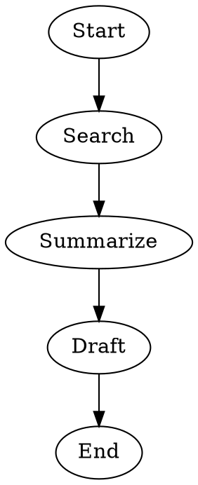
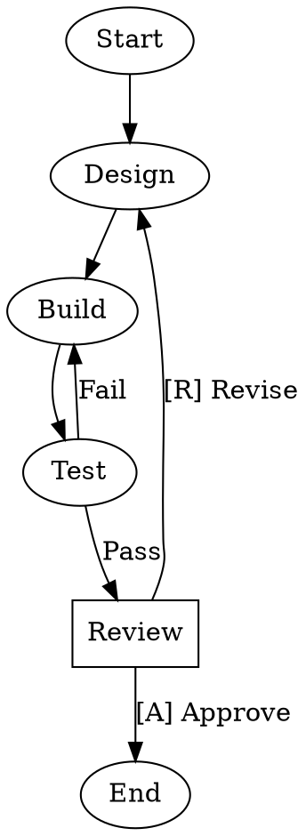

## Quick Start

Create a new workflow with the CLI:

```sh
stencila workflows create my-workflow "A multi-stage data pipeline"
```

This creates `.stencila/workflows/my-workflow/WORKFLOW.md` in your workspace with a template pipeline you can edit.

## The WORKFLOW.md File

A workflow is a directory containing a `WORKFLOW.md` file. The file has two parts:

1. **YAML frontmatter** — metadata (name, description, goal)
2. **Markdown body** — a DOT pipeline in a `` ```dot `` fenced code block, plus optional documentation

Here is a minimal example:

````markdown
---
name: lit-review
description: Search and summarize recent literature
---


````

And a fully configured example with agents, branching, and human review:

````markdown
---
name: code-review
description: Automated code review with human approval gate
---

# Code Review Workflow

This workflow implements, tests, and reviews code changes.


````

Markdown content outside the `` ```dot `` block serves as human-readable documentation for the workflow. Only the first `` ```dot `` block is extracted as the pipeline definition.

## Workflow Names

Workflow names follow the same rules as [agent names](../agents/creating#agent-names) — **lowercase kebab-case**:

- 1–64 characters
- Only lowercase alphanumeric characters and hyphens
- No leading, trailing, or consecutive hyphens

By convention, names describe the workflow's purpose:

| Name | Purpose |
| ---- | ------- |
| `code-review` | Review code changes |
| `test-and-deploy` | Run tests then deploy |
| `lit-review` | Literature search and review |
| `plan-implement-validate` | Design, build, and validate |

The workflow's directory name must match the `name` field in the frontmatter.

## Directory Structure

Workflow definitions live in `.stencila/workflows/` in the workspace. Each workflow gets its own subdirectory:

```
.stencila/
  workflows/
    code-review/
      WORKFLOW.md
    test-and-deploy/
      WORKFLOW.md
    lit-review/
      WORKFLOW.md
```

## Referencing Agents

Pipeline nodes reference [agents](../agents/) by name using the `agent` attribute:

```dot
Build [agent="code-engineer", prompt="Implement the design"]
Test  [agent="code-tester", prompt="Run tests and validate"]
```

The engine resolves agent names using the standard agent discovery order (workspace agents first, then user-level, then CLI-detected). This means:

- **Shared workflows** can be committed to a repository and used by the whole team
- **Personal agents** (in `~/.config/stencila/agents/`) let each user configure their preferred model, provider, and API keys
- The same `code-engineer` node runs with different backing models depending on who runs the workflow

When a node has no `agent` attribute, the engine uses a default agent. Explicit node attributes (like `agent.model` or `agent.provider`) override the agent's defaults.

You can also override specific agent properties inline using `agent.*` dotted-key attributes:

```dot
Build [agent="code-engineer", agent.provider="openai", agent.model="o3"]
Test  [agent="code-tester", agent.reasoning-effort="high"]
```

See [Pipelines — Agent property overrides](pipelines#agent-property-overrides) for details.

## Setting a Goal

The `goal` field provides a high-level objective for the pipeline. It is expanded as `$goal` in node prompts:

```yaml
---
name: data-analysis
description: Analyze and report on experimental data
goal: Analyze climate data from 2020-2024
---
```

The goal can also be set as a graph-level attribute in the DOT source:

```dot
digraph analysis {
    graph [goal="Analyze climate data from 2020-2024"]
    ...
}
```

When running a workflow, the goal can be overridden from the command line with `--goal`.

## Validation

Validate a workflow definition before running it:

```sh
# Validate by name
stencila workflows validate code-review

# Validate by path
stencila workflows validate .stencila/workflows/code-review/

# Validate a WORKFLOW.md file directly
stencila workflows validate .stencila/workflows/code-review/WORKFLOW.md
```

Validation checks:

- Name format (kebab-case, 1–64 characters)
- Name matches directory name
- Description is non-empty
- Pipeline DOT syntax is valid (if present)

## Next Steps

Once you have a workflow, see [Using Workflows](using) to run it, or dive into [Pipelines](pipelines) for the full pipeline syntax reference covering nodes, edges, conditions, parallel execution, and more.
