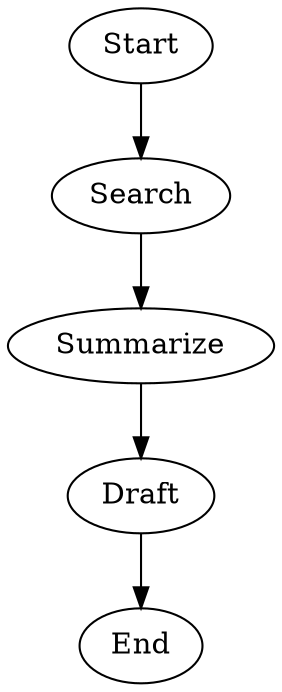
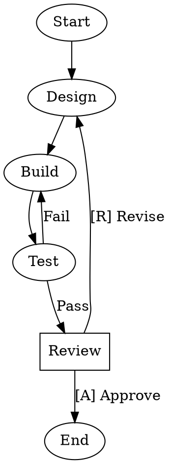

## Quick Start

Create a new workflow with the CLI:

```sh
stencila workflows create my-workflow "A multi-stage data pipeline"
```

This creates `.stencila/workflows/my-workflow/WORKFLOW.md` in your workspace with a template pipeline you can edit.

## Permanent vs Ephemeral Workflows

Most hand-authored workflows are **permanent** workflows that remain in `.stencila/workflows/` until you edit or delete them.

Stencila also supports **ephemeral** workflows for temporary or agent-created pipelines. An ephemeral workflow is stored in the same location as any other workflow, but its directory is marked with a `.gitignore` file containing `*`. This makes it easy to create a workflow, run it immediately, and either keep or discard it later.

Use ephemeral workflows when:

- an agent creates a workflow on your behalf
- you want to try a short-lived workflow before deciding to keep it
- you want a workflow that should not be committed or retained by default

See [Using Workflows](using#managing-ephemeral-workflows) for how to save or discard ephemeral workflows.

## Workflow Names

Workflow names follow the same rules as [agent names](../agents/creating#agent-names) — **lowercase kebab-case**:

- 1–64 characters
- Only lowercase alphanumeric characters and hyphens
- No leading, trailing, or consecutive hyphens

By convention, workflow names should describe the **end-to-end process** the workflow accomplishes, not the literal sequence of nodes in the pipeline.

For skills, the recommended naming convention is `thing-activity` (for example, `code-review`). For agents, it is `thing-role` (for example, `code-reviewer`). For workflows, use:

- **`thing-process`** for the default case
- **`thing-process-approach`** when you need to distinguish multiple workflows for the same broad process

Where:

- **thing** is the artifact or domain the workflow acts on, such as `code`, `blog`, `agent`, or `schema`
- **process** is the broad lifecycle stage or end-to-end goal, such as `generation`, `refinement`, `publication`, or `review`
- **approach** is an optional qualifier for the workflow's strategy, cost, or tradeoffs, such as `quick`, `iterative`, `consensus`, `thorough`, or `guided`

Starting with the `thing` helps related skills, agents, and workflows group together alphabetically in listings and directories.

### Prefer purpose over pipeline shape

Avoid encoding the exact pipeline structure in the name. Names like `create-review-refine-test-deploy` or `draft-review-edit-publish` quickly become too long, hard to scan, and brittle as the workflow evolves.

Use the name to communicate **what the workflow is for**, not every internal step it currently contains. This keeps names stable even if you later add another review loop, a lint step, a human checkpoint, or a parallel branch.

### Recommended patterns

| Pattern | Use when | Examples |
| ------- | -------- | -------- |
| `thing-process` | A single clear workflow exists for that process, or the strategy is not important to the name | `code-review`, `documentation-generation`, `agent-refinement`, `schema-publication` |
| `thing-process-approach` | You have multiple workflows for the same process with different tradeoffs or shapes | `documentation-generation-quick`, `code-generation-iterative`, `architecture-design-consensus`, `agent-creation-guided` |

### Common approach modifiers

These modifiers are optional, but can be useful when you want the name to signal the workflow's broad shape or tradeoff without spelling out the whole graph:

- **`quick`** or **`linear`** — a simple, low-cost, usually single-pass workflow
- **`iterative`** or **`agile`** — a workflow with review and refinement loops
- **`consensus`** or **`ensemble`** — multiple parallel branches whose outputs are compared or combined
- **`thorough`** or **`exhaustive`** — a deeper, more expensive workflow with extra checks or specialist stages
- **`guided`** or **`interactive`** — a workflow that pauses for user input at important decision points

Choose approach words sparingly and consistently. They should express a meaningful difference in how the workflow operates, not just add detail for its own sake.

### Examples

| Name | Purpose |
| ---- | ------- |
| `code-review` | Review code changes |
| `code-generation-iterative` | Generate code using a creation-review-refinement loop |
| `documentation-generation-quick` | Produce a fast first draft with minimal iteration |
| `architecture-design-consensus` | Compare multiple parallel designs and combine the best parts |
| `agent-creation-guided` | Create an agent while pausing for user decisions |

The workflow's directory name must match the `name` field in the frontmatter.

## Directory Structure

Workflow definitions live in `.stencila/workflows/` in the workspace. Each workflow gets its own subdirectory:

```
.stencila/
  workflows/
    code-review/
      WORKFLOW.md
    test-and-deploy/
      WORKFLOW.md
    lit-review/
      WORKFLOW.md
```

An ephemeral workflow has the same structure, plus the temporary marker file:

```
.stencila/
  workflows/
    draft-review/
      .gitignore    # contains: *
      WORKFLOW.md
```


## The WORKFLOW.md File

A workflow is a directory containing a `WORKFLOW.md` file. The file has two parts:

1. **YAML frontmatter** — metadata (name, description, goal)
2. **Markdown body** — a DOT pipeline in a `` ```dot `` fenced code block, plus optional documentation

Here is a minimal example:

````markdown
---
name: lit-review
description: Search and summarize recent literature
---


````

And a more complex example with agents, branching, and human review:

````markdown
---
name: code-review
description: Automated code review with human approval gate
---

This workflow implements, tests, and reviews code changes.


````

Markdown content outside the `` ```dot `` block serves as human-readable documentation for the workflow. Only the first `` ```dot `` block is extracted as the pipeline definition.

## Recommended DOT organization

Prefer organizing the DOT block as:

1. any graph-level attributes first
2. the entry edge (`Start -> FirstNode`) near the top
3. then, for each node, the node definition followed immediately by that node's outgoing edge or edges

This keeps each node's configuration and routing logic together, which is usually easier to scan and maintain than listing all edges first and all node details afterward.

```dot
digraph thing_creation_iterative {
    Start -> Create

    Create [agent="thing-creator", prompt-ref="#creator-prompt"]
    Create -> Review

    Review [agent="thing-reviewer", prompt-ref="#reviewer-prompt"]
    Review -> HumanReview [label="Accept", condition="context.last_output=yes"]
    Review -> Create      [label="Revise", condition="context.last_output!=yes"]

    HumanReview [ask="Is the thing acceptable after reviewer approval?"]
    HumanReview -> End           [label="Accept"]
    HumanReview -> HumanFeedback [label="Revise"]

    HumanFeedback [
        ask="Describe what must be improved before the next revision",
        question-type="freeform",
        store="human.feedback"
    ]
    HumanFeedback -> Create
}
```

## Reusing multiline prompts, shell scripts, and questions

When prompts, shell commands, or human questions get long or multiline, write the DOT node first and then define the referenced fenced code blocks after it. Use kebab-case reference attributes: `prompt-ref`, `shell-ref`, `ask-ref`, and `interview-ref`.

Use refs where they improve readability. For short single-line values, inline DOT attributes are usually clearer.

````markdown
---
name: thing-creation
description: Create and review a thing using referenced multiline content
---

```dot
digraph thing_creation {
    Start -> Create
    
    Create [agent="thing-creator", prompt-ref="#creator-prompt"]
    Create -> Check

    Check [shell-ref="#run-checks"]
    Check -> HumanFeedback

    HumanFeedback [ask-ref="#human-question", question-type="freeform"]
    HumanFeedback -> End
}
```

```text #creator-prompt
Create or update a Stencila thing for this goal: $goal

If reviewer feedback is present, revise the current draft:
$last_output
```

```sh #run-checks
make lint
uv test
./integration-tests.sh
```

```text #human-question
What should be improved before the next revision?
```
````

References resolve against code blocks and code chunks in the same `WORKFLOW.md`. Ids must be unique within the document.

## Multi-question interviews

When a human review step needs to collect multiple pieces of information — such as a routing decision and freeform feedback — use `interview-ref` pointing to a YAML code block that defines a structured interview.

Continue to use `ask` or `ask-ref` for single-question human gates. Use `interview-ref` when you need to combine two or more questions in a single human pause.

### Interview spec format

An interview spec is a YAML block with an optional `preamble` and a required `questions` array. Each question has:

| Field | Required | Description |
| --- | --- | --- |
| `question` | yes | The question text (keep concise — one or two sentences) |
| `question_type` | no | `freeform` (default), `yes_no`, `confirmation`, `multiple_choice`, or `multi_select` |
| `header` | no | Short label displayed above the question |
| `options` | for choice types | Array of `{label, description?}` objects |
| `default` | no | Default answer when the user skips or times out |
| `store` | no | Context key to store the answer under (e.g., `review.feedback`) |

### Routing

Routing in multi-question interviews is driven by the first `multiple_choice` question's answer, matched against outgoing edge labels — the same mechanism used by single-question human nodes. Keep routing edges visible in the DOT graph, not hidden in the YAML spec.

When an interview has no `multiple_choice` question, the handler follows the first outgoing edge (same as `question_type="freeform"` for single-question nodes). An interview node with no outgoing edges is treated as a terminal node — it succeeds after collecting answers.

### Storing answers

Every question that downstream nodes need to reference should have a `store` key. Answers are stored as strings in the pipeline context and can be referenced later with `$KEY` expansion (e.g., `$review.feedback`).

A freeform question without a `store` key will collect an answer that is never stored — workflow validation warns about this.

### Example: review with decision and feedback

````markdown
---
name: code-review-guided
description: Implement and review with structured human feedback
goal: Implement the feature and get approval
---

```dot
digraph code_review_guided {
    Start -> Build

    Build [agent="code-engineer", prompt="Implement: $goal"]
    Build -> Review

    Review [interview-ref="#review-interview"]
    Review -> End     [label="Approve"]
    Review -> Build   [label="Revise"]
}
```

```yaml #review-interview
preamble: |
  Please review the implementation and provide structured feedback.

questions:
  - question: "Is the implementation ready to merge?"
    header: Decision
    question_type: multiple_choice
    options:
      - label: Approve
      - label: Revise
    store: review.decision

  - question: "What specific changes should be made?"
    header: Feedback
    question_type: freeform
    store: review.feedback
```
````

In this workflow:

1. The `Build` node implements the feature
2. The `Review` node pauses and presents both questions as a single form
3. The first `multiple_choice` question ("Decision") determines routing — its option labels match the outgoing edge labels `Approve` and `Revise`
4. The freeform question ("Feedback") stores the human's detailed feedback as `review.feedback`
5. If the human selects "Revise", the pipeline loops back to `Build` where the prompt can reference `$review.feedback`

### Example: terminal feedback collection

An interview node with no outgoing edges serves as a terminal feedback collector:

```dot
digraph survey {
    Start -> Generate

    Generate [prompt="Generate the report for: $goal"]
    Generate -> Collect

    Collect [interview-ref="#final-survey"]
}
```

```yaml #final-survey
preamble: |
  The report has been generated. Please provide your assessment.

questions:
  - question: "How would you rate the quality?"
    question_type: multiple_choice
    options:
      - label: Excellent
      - label: Good
      - label: Needs improvement
    store: survey.quality

  - question: "Any additional comments?"
    question_type: freeform
    store: survey.comments
```

Since `Collect` has no outgoing edges and no routing question drives edge selection, the pipeline succeeds after storing the answers.

### When to use interviews vs separate human nodes

Use `interview-ref` when:

- a review step naturally combines a routing decision with structured feedback
- you want to collect multiple related answers in a single human pause
- reducing the number of separate human pauses improves the reviewer experience

Use separate `ask` / `ask-ref` nodes when:

- the questions are independent and belong to different stages of the pipeline
- the answers drive different routing decisions at different points in the graph
- simpler single-question nodes make the graph easier to read


## Improving Discoverability and Delegation

When a manager agent decides which workflow to delegate to, it uses the workflow's `description`, `keywords`, `when-to-use`, and `when-not-to-use` fields. Adding these fields improves delegation accuracy.

```yaml
---
name: code-review
description: Automated code review with human approval gate
keywords:
  - code
  - review
  - testing
  - approval
when-to-use:
  - when the user wants an automated code review pipeline
  - when changes need testing and human approval before merging
when-not-to-use:
  - when the user wants a quick one-shot code review without a pipeline
  - when the task is about writing new code rather than reviewing it
---
```

Each `when-to-use` and `when-not-to-use` entry should be a short, specific sentence. Avoid vague signals like "when appropriate" — be concrete about the scenarios that match or don't match.

## Referencing Agents

Pipeline nodes reference [agents](../agents/) by name using the `agent` attribute:

```dot
Build [agent="code-engineer", prompt="Implement the design"]
Test  [agent="code-tester", prompt="Run tests and validate"]
```

The engine resolves agent names using the standard agent discovery order (workspace agents first, then user-level, then CLI-detected). This means:

- **Shared workflows** can be committed to a repository and used by the whole team
- **Personal agents** (in `~/.config/stencila/agents/`) let each user configure their preferred model, provider, and API keys
- The same `code-engineer` node runs with different backing models depending on who runs the workflow

When a node has no `agent` attribute, the engine uses a default agent. Explicit node attributes (like `agent.model` or `agent.provider`) override the agent's defaults.

You can also override specific agent properties inline using `agent.*` dotted-key attributes:

```dot
Build [agent="code-engineer", agent.provider="openai", agent.model="o3"]
Test  [agent="code-tester", agent.reasoning-effort="high"]
```

See [Pipelines — Agent property overrides](pipelines#agent-property-overrides) for details.

## Setting a Goal

The `goal` field provides a high-level objective for the pipeline. It is expanded as `$goal` in node prompts:

```yaml
---
name: data-analysis
description: Analyze and report on experimental data
goal: Analyze climate data from 2020-2024
---
```

The goal can also be set as a graph-level attribute in the DOT source:

```dot
digraph analysis {
    graph [goal="Analyze climate data from 2020-2024"]
    ...
}
```

When running a workflow, the goal can be overridden from the command line with `--goal`.

## Validation

Validate a workflow definition before running it:

```sh
# Validate by name
stencila workflows validate code-review

# Validate by path
stencila workflows validate .stencila/workflows/code-review/

# Validate a WORKFLOW.md file directly
stencila workflows validate .stencila/workflows/code-review/WORKFLOW.md
```

Validation checks:

- Name format (kebab-case, 1–64 characters)
- Name matches directory name
- Description is non-empty
- Pipeline DOT syntax is valid (if present)

## Next Steps

Once you have a workflow, see [Using Workflows](using) to run it, or dive into [Pipelines](pipelines) for the full pipeline syntax reference covering nodes, edges, conditions, parallel execution, and more.
