Pipelines let you define multi-stage AI workflows as directed graphs using [Graphviz DOT syntax](https://graphviz.org/doc/info/lang.html). Each node in the graph is a task — an LLM call, a human review gate, a conditional branch, or a parallel fan-out — and edges define the flow between them.

Pipelines are declarative: you describe _what_ the workflow looks like, and the execution engine decides _how_ and _when_ to run each stage.

# Quick start

A pipeline is a `digraph` block in a workflow file. Here is a minimal pipeline that searches for literature, summarizes findings, and drafts a report:

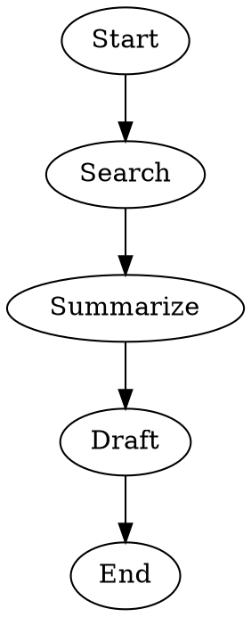

Key elements:

- **`digraph`** declares a directed graph. Every pipeline must be a single `digraph`.
- **`graph [goal="..."]`** sets a pipeline-level goal. The `$goal` variable is expanded in node prompts.
- **`Start`** and **`End`** are the entry and exit points, recognized automatically by name.
- **Nodes** are tasks. By default they run as LLM stages.
- **Edges** (`->`) define the flow between stages.

# Nodes

Every node represents a task in the pipeline. The node's `shape` determines what kind of task it is.

## Shapes

| Shape           | Purpose                        | Example |
|-----------------|--------------------------------|---------|
| `box` (default) | LLM task                       | `Analyze [prompt="Analyze the data"]` |
| `hexagon`       | Human review gate              | `Review [shape=hexagon]` |
| `diamond`       | Conditional routing            | `Check [shape=diamond]` |
| `component`     | Parallel fan-out               | `FanOut [shape=component]` |
| `invtriangle`   | Explicit failure               | `Fail [shape=invtriangle]` |

You can also write `shape=human` as a shorthand for `shape=hexagon`.

## Shorthand conventions

To reduce boilerplate, the pipeline engine recognizes certain node IDs and attribute names as implying a handler type. You do not need to set `shape` explicitly when using these conventions.

### Node IDs

| Node ID              | Implied shape     | Handler type     |
|----------------------|-------------------|------------------|
| `Start`, `start`     | `Mdiamond`        | Entry point      |
| `End`, `end`, `Exit`, `exit` | `Msquare` | Exit point       |
| `Fail`, `fail`       | `invtriangle`     | Failure          |
| `FanOut…`            | `component`       | Parallel fan-out |
| `Review…`, `Approve…`| `hexagon`         | Human review     |
| `Check…`, `Branch…`  | `diamond`         | Conditional      |
| `Shell…`, `Run…`     | `parallelogram`   | Shell command    |

The first three are exact ID matches; the rest are prefix matches (e.g. `FanOutSearch`, `ReviewDraft`, `CheckQuality`).

An explicit `shape` attribute always takes precedence over ID-based inference. If a node has a `prompt` or `agent` attribute, it is treated as an LLM task (`box`), overriding prefix-based ID inference — so `ReviewData [prompt="Summarize the reviews"]` stays a codergen node, not a human gate. Reserved structural IDs (`Start`/`End`/`Exit`/`Fail`) are exempt: they always receive their structural shape.

### Property shortcuts

| Shorthand                  | Expands to                                          |
|----------------------------|-----------------------------------------------------|
| `ask="Do you approve?"`    | `shape=hexagon, label="Do you approve?"`            |
| `cmd="make build"`         | `shape=parallelogram, shell_command="make build"`   |
| `shell="cargo test"`       | `shape=parallelogram, shell_command="cargo test"`   |
| `branch="Quality OK?"`    | `shape=diamond, label="Quality OK?"`                |

Property shortcuts never override an explicitly set `shape`, `label`, or `shell_command`. All sugar keys (`ask`, `cmd`, `shell`, `branch`) are always removed from the node, even when a higher-precedence shortcut wins.

### Resolution order

When a node has no explicit `shape`, the engine applies the first matching rule:

1. **Property shortcuts** — `ask` > `cmd`/`shell` > `branch` (all consumed regardless of which wins)
2. **`prompt` or `agent`** — node is an LLM task, prefix-based ID inference is skipped (structural IDs exempt)
3. **Node ID** — exact or prefix match from the table above

**Example** — the combined example from below can be written more concisely:

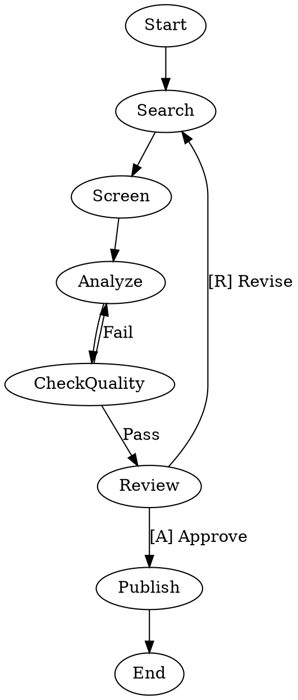

Here `CheckQuality` is automatically a conditional node and `Review` is automatically a human gate — no `shape=` needed.

## Common attributes

| Attribute         | Type     | Description |
|-------------------|----------|-------------|
| `label`           | String   | Display name for the node. Used as the prompt fallback if `prompt` is empty. |
| `prompt`          | String   | Instruction for the LLM. Supports variable expansion (see below). |
| `agent`           | String   | Stencila agent to execute this node (e.g., `"code-engineer"`). |
| `max_retries`     | Integer  | Additional retry attempts beyond the initial execution. |
| `goal_gate`       | Boolean  | If `true`, this node must succeed before the pipeline can exit. |
| `timeout`         | Duration | Maximum execution time (e.g., `900s`, `15m`). |
| `class`           | String   | Comma-separated class names for model stylesheet targeting. |

## Prompt variables

Use `$`-prefixed variables in `prompt` attributes to inject dynamic values:

| Variable         | Description                                              | When expanded |
|------------------|----------------------------------------------------------|---------------|
| `$goal`          | The pipeline-level goal from `graph [goal="..."]`        | Before the pipeline runs |
| `$last_output`   | Full text of the previous stage's LLM response           | At each stage |
| `$last_stage`    | Node ID of the previous completed stage                  | At each stage |
| `$last_outcome`  | Outcome status of the previous stage (`success`, `fail`) | At each stage |

`$goal` is expanded once before the pipeline starts. The other variables are expanded at execution time, so each stage sees the outputs of the stage that ran before it.

Example using runtime variables:

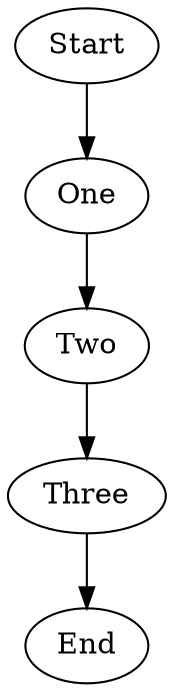

# Edges

Edges define transitions between nodes. They can carry labels, conditions, and weights to control routing.

## Attributes

| Attribute    | Type     | Description |
|--------------|----------|-------------|
| `label`      | String   | Display caption. Also used for preferred-label matching. |
| `condition`  | String   | Boolean guard expression (e.g., `"outcome=success"`). |
| `weight`     | Integer  | Priority for edge selection. Higher weight wins among equally eligible edges. |

## Edge selection

After a node completes, the engine selects the next edge using this priority order:

1. **Condition match** — edges whose `condition` evaluates to `true`
2. **Preferred label** — edge whose label matches the handler's preferred label
3. **Highest weight** — among unconditional edges, the highest `weight` wins
4. **Lexical tiebreak** — alphabetical by target node ID

## Chained edges

You can chain edges as shorthand:

```dot
Start -> Search -> Analyze -> Report -> End
```

This creates individual edges between each consecutive pair.

# Conditions

Edge conditions use a simple expression language to gate transitions:

```dot
Validate -> Publish    [condition="outcome=success"]
Validate -> Revise     [condition="outcome!=success"]
```

Supported syntax:

| Operator | Meaning     | Example |
|----------|-------------|---------|
| `=`      | Equals      | `outcome=success` |
| `!=`     | Not equals  | `outcome!=success` |
| `&&`     | Logical AND | `outcome=success && context.citations_valid=true` |

Available variables:

- `outcome` — the current node's result status (`success`, `fail`, `retry`, `partial_success`)
- `preferred_label` — the handler's preferred edge label
- `context.*` — values from the shared pipeline context

When an LLM writes context via the `set_workflow_context` tool, keys are stored under the `llm.` namespace (for example, writing `decision` stores `llm.decision`). Keys starting with `internal.` are reserved.

# Workflow patterns

## Linear pipeline

The simplest pattern: stages execute one after another.

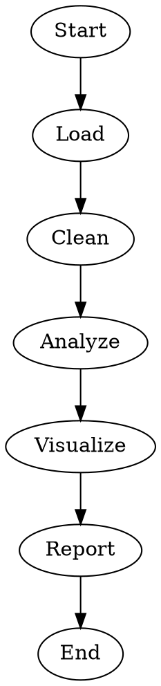

## Conditional branching

Use conditions on edges to route based on outcomes.

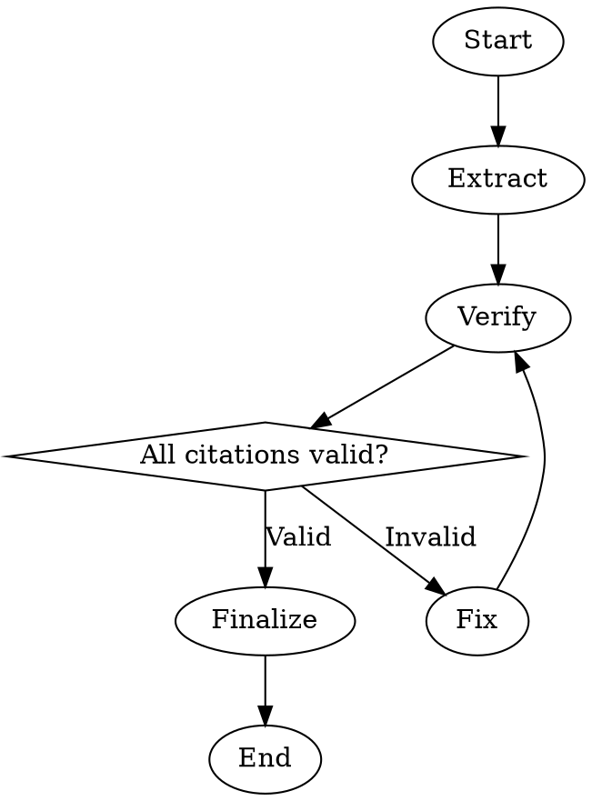

The `diamond` shape creates a conditional routing point. The engine evaluates edge conditions against the current outcome and context to decide which path to take.

## Retry loops

Nodes can retry automatically on failure using `max_retries`:

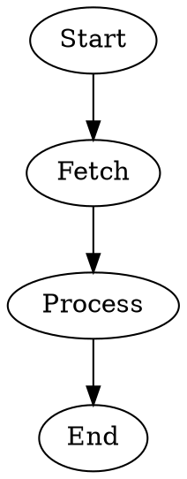

`max_retries=2` means up to 3 total executions (1 initial + 2 retries).

For more control, use edge-based retry loops that route back to an earlier stage on failure:

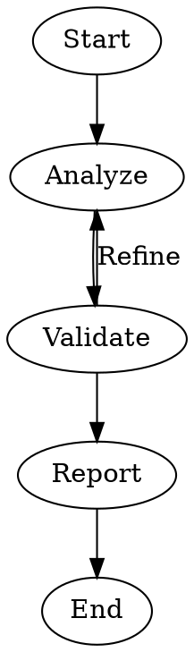

## Goal gates

Mark critical stages with `goal_gate=true` to prevent the pipeline from exiting until they succeed:

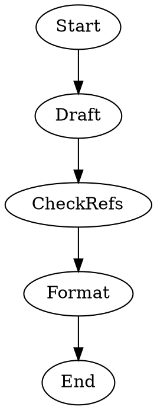

If the pipeline reaches the exit node and any goal gate node has not succeeded, the engine looks for a `retry_target` to jump back to instead of exiting.

## Human-in-the-loop

Use `shape=human` to create a gate that pauses for human input. The choices are derived from the node's outgoing edge labels:

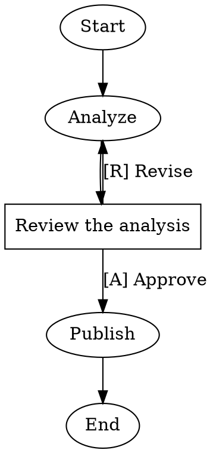

The human is presented with the choices derived from the outgoing edges:
- **[A] Approve** — continues to publication
- **[R] Revise** — loops back to re-analyze

The letters in brackets (`[A]`, `[R]`) are accelerator keys for quick selection. You can also use `K) Label` or `K - Label` formats.

## Parallel execution

Fan out to multiple branches using `shape=component` and collect results with a fan-in node:

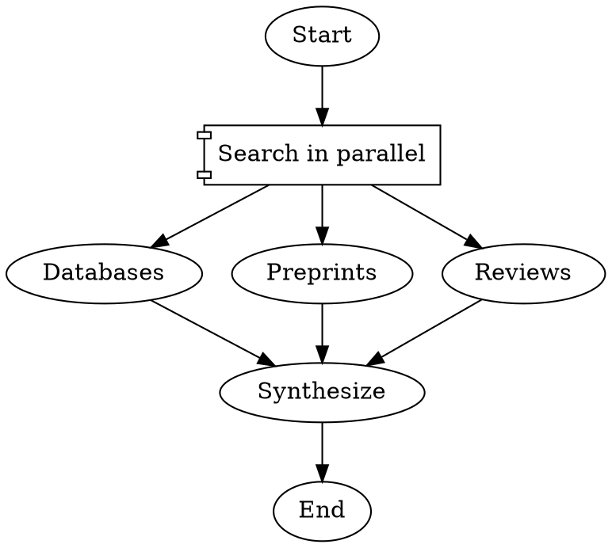

Branches execute concurrently. The fan-in node waits for all branches to complete before proceeding.

## Model stylesheet

Centralize LLM model selection with a CSS-like stylesheet instead of setting `llm_model` on every node:

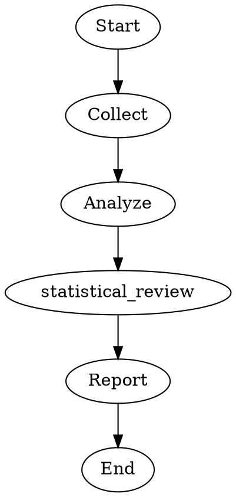

Selectors and specificity:

| Selector      | Matches               | Specificity |
|---------------|-----------------------|-------------|
| `*`           | All nodes             | Lowest      |
| `.class_name` | Nodes with that class | Medium      |
| `#node_id`    | Specific node by ID   | Highest     |

Explicit attributes on a node always override stylesheet values.

## Combined example

Here is a more complete pipeline combining several patterns:

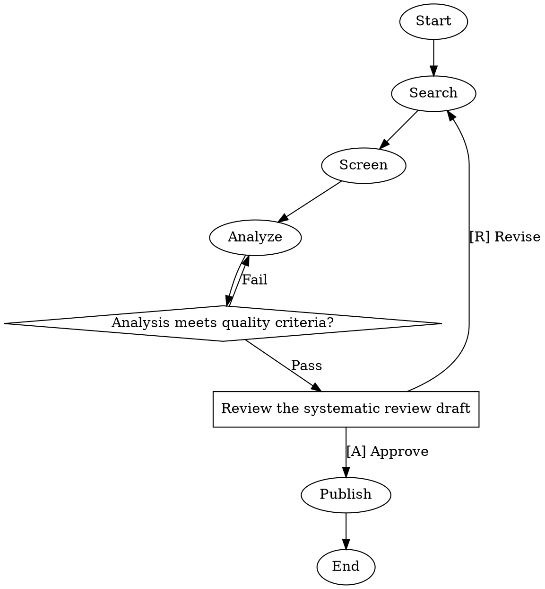

This pipeline:

1. **Searches** for papers using the default model (Sonnet)
2. **Screens** for relevance with up to 2 retries on failure
3. **Analyzes** using Opus (via `.deep_analysis` class) with a goal gate ensuring it must succeed
4. **Branches** based on quality check — passing goes to review, failing loops back to re-analyze
5. **Pauses** for human review with approve/revise options
6. **Formats** the approved review for publication

# Graph attributes

| Attribute             | Type    | Default | Description |
|-----------------------|---------|---------|-------------|
| `goal`                | String  | `""`    | Pipeline-level goal. Expanded as `$goal` in prompts. |
| `label`               | String  | `""`    | Display name for the pipeline. |
| `model_stylesheet`    | String  | `""`    | CSS-like LLM model/provider stylesheet. |
| `default_max_retry`   | Integer | `0`     | Global retry ceiling for nodes that omit `max_retries`. |
| `default_fidelity`    | String  | `""`    | Default context fidelity mode. |
| `retry_target`        | String  | `""`    | Node to jump to when goal gates are unsatisfied at exit. |

# Context and state

Nodes communicate through a shared key-value **context**. After each node executes, its outcome and any `context_updates` are merged into the context. Subsequent nodes can reference these values in edge conditions (e.g., `context.citations_valid=true`).

The engine also saves a **checkpoint** after each node completes. If the pipeline crashes, it can resume from the last checkpoint.

# Syntax reference

## DOT basics

- One `digraph` per file
- Node IDs must match `[A-Za-z_][A-Za-z0-9_]*`
- Edges use `->` (directed only)
- Attributes go in `[key=value, key=value]` blocks
- String values use double quotes: `"hello world"`
- Comments: `// line` and `/* block */`
- Semicolons are optional

## Duration values

Duration attributes like `timeout` use an integer with a unit suffix:

| Unit | Example | Meaning |
|------|---------|---------|
| `ms` | `250ms` | Milliseconds |
| `s`  | `900s`  | Seconds |
| `m`  | `15m`   | Minutes |
| `h`  | `2h`    | Hours |
| `d`  | `1d`    | Days |

## Subgraphs

Subgraphs scope default attributes for a group of nodes:

```dot
subgraph cluster_analysis {
    label = "Analysis Phase"
    node [timeout="900s"]

    Analyze   [prompt="Analyze the dataset"]
    Visualize [prompt="Create visualizations", timeout="1800s"]
}
```

Nodes inside the subgraph inherit its defaults unless they explicitly override them.
