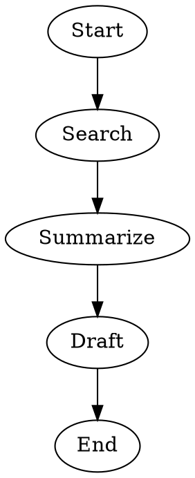
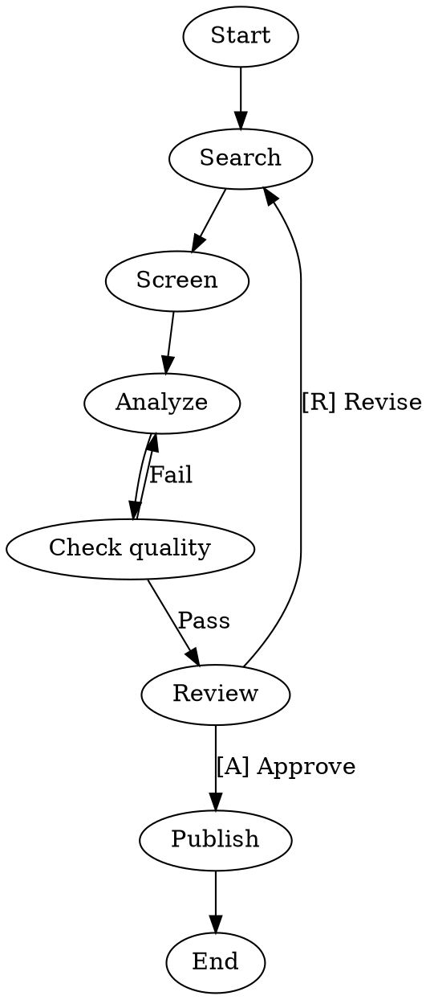
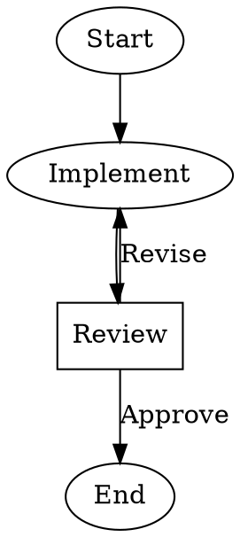
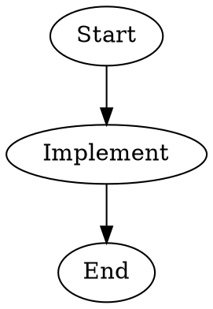
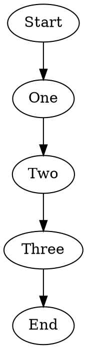
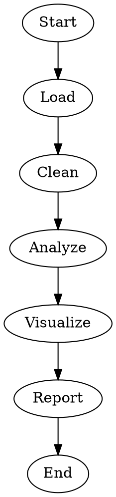
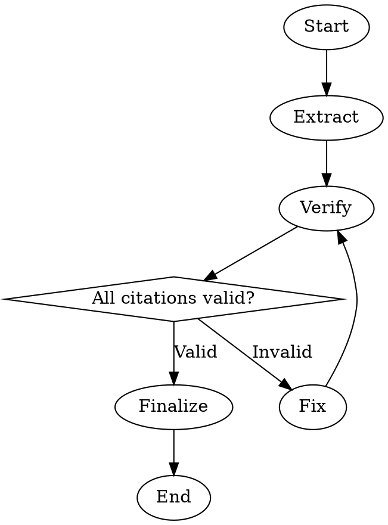
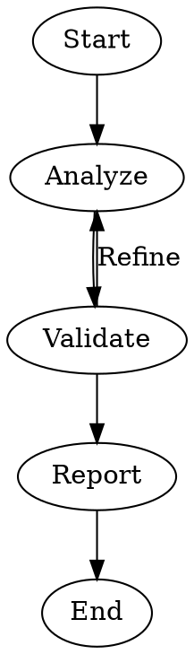
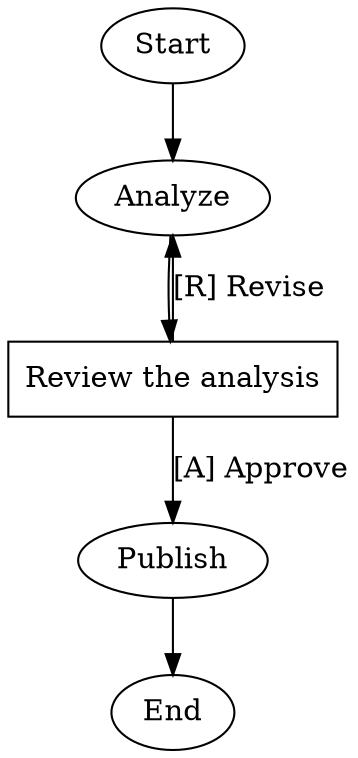

Pipelines let you define multi-stage AI workflows as directed graphs using [Graphviz DOT syntax](https://graphviz.org/doc/info/lang.html). Each node in the graph is a task — an LLM call, a human review gate, a conditional branch, or a parallel fan-out — and edges define the flow between them.

Pipelines are declarative: you describe _what_ the workflow looks like, and the execution engine decides _how_ and _when_ to run each stage.

> Node and graph attribute names can be written in kebab-case, snake_case, or camelCase. We recommend **kebab-case** for readability, and this page uses that casing.

# Quick start

A pipeline is a `digraph` block in a workflow file. Here is a minimal pipeline that searches for literature, summarizes findings, and drafts a report:


```dot
digraph LitReview {
  Start -> Search

  Search [prompt="Search for recent papers on: $goal"]
  Search -> Summarize

  Summarize [prompt="Summarize the key findings across the papers"]
  Summarize -> Draft

  Draft [prompt="Draft a literature review from the summaries"]
  Draft -> End
}
```

Key elements:

- **`digraph`** declares a directed graph. Every pipeline must be a single `digraph`.
- **`graph [goal="..."]`** sets a pipeline-level goal. The `$goal` variable is expanded in node prompts.
- **`Start`** and **`End`** are the entry and exit points, recognized automatically by name.
- **Nodes** are tasks. By default they run as LLM stages.
- **Edges** (`->`) define the flow between stages.

# Nodes

Every node represents a task in the pipeline. The node's `shape` determines what kind of task it is.

## Shapes

| Shape           | Purpose             | Example                               |
| --------------- | ------------------- | ------------------------------------- |
| `box` (default) | LLM task            | `Analyze [prompt="Analyze the data"]` |
| `hexagon`       | Human review gate   | `Review [shape=hexagon]`              |
| `diamond`       | Conditional routing | `Check [shape=diamond]`               |
| `component`     | Parallel fan-out    | `FanOut [shape=component]`            |
| `invtriangle`   | Explicit failure    | `Fail [shape=invtriangle]`            |

You can also write `shape=human` as a shorthand for `shape=hexagon`.

## Shorthand conventions

To reduce boilerplate, the pipeline engine recognizes certain node IDs and attribute names as implying a handler type. You do not need to set `shape` explicitly when using these conventions.

### Node IDs

| Node ID                      | Implied shape   | Handler type     |
| ---------------------------- | --------------- | ---------------- |
| `Start`, `start`             | `Mdiamond`      | Entry point      |
| `End`, `end`, `Exit`, `exit` | `Msquare`       | Exit point       |
| `Fail`, `fail`               | `invtriangle`   | Failure          |
| `FanOut…`                    | `component`     | Parallel fan-out |
| `Review…`, `Approve…`        | `hexagon`       | Human review     |
| `Check…`, `Branch…`          | `diamond`       | Conditional      |
| `Shell…`, `Run…`             | `parallelogram` | Shell command    |

The first three are exact ID matches; the rest are prefix matches (e.g. `FanOutSearch`, `ReviewDraft`, `CheckQuality`).

An explicit `shape` attribute always takes precedence over ID-based inference. If a node has a `prompt` or `agent` attribute, it is treated as an LLM task (`box`), overriding prefix-based ID inference — so `ReviewData [prompt="Summarize the reviews"]` stays a codergen node, not a human gate. Reserved structural IDs (`Start`/`End`/`Exit`/`Fail`) are exempt: they always receive their structural shape.

### Property shortcuts

| Shorthand               | Expands to                                        |
| ----------------------- | ------------------------------------------------- |
| `ask="Do you approve?"` | `shape=hexagon, label="Do you approve?"`          |
| `workflow="child"`      | `type="workflow"`                                 |
| `cmd="make build"`      | `shape=parallelogram, shell_command="make build"` |
| `shell="cargo test"`    | `shape=parallelogram, shell_command="cargo test"` |
| `branch="Quality OK?"`  | `shape=diamond, label="Quality OK?"`              |

Additionally, a node with an `interview` attribute (typically set via `interview-ref`) is inferred as `shape=hexagon` (a human gate).

Property shortcuts never override an explicitly set `shape`, `label`, `type`, or `shell_command`. All sugar keys (`ask`, `workflow`, `cmd`, `shell`, `branch`) are always normalized on the node, even when a higher-precedence shortcut wins.

### Resolution order

When a node has no explicit `shape`, the engine applies the first matching rule:

1. **Property shortcuts** — `ask` > `cmd`/`shell` > `branch` (all consumed regardless of which wins)
   - `workflow` is also treated as a property shortcut and normalized to a workflow handler node
2. **`interview`** — node has an `interview` attribute (typically from `interview-ref`), inferred as human gate
3. **`prompt` or `agent`** — node is an LLM task, prefix-based ID inference is skipped (structural IDs exempt)
4. **Node ID** — exact or prefix match from the table above

**Example** — the combined example from below can be written more concisely:


```dot
digraph ResearchWorkflow {
  graph [goal="Systematic review of renewable energy storage technologies"]

  Start -> Search

  Search [prompt="Search databases for recent papers on: $goal"]
  Search -> Screen

  Screen [prompt="Screen papers for relevance and quality"]
  Screen -> Analyze

  Analyze [prompt="Extract and synthesize key findings"]
  Analyze -> CheckQuality

  CheckQuality [label="Check quality"]
  CheckQuality -> Review    [label="Pass", condition="outcome=success"]
  CheckQuality -> Analyze   [label="Fail", condition="outcome!=success"]

  Review [label="Review"]
  Review -> Publish         [label="[A] Approve"]
  Review -> Search          [label="[R] Revise"]

  Publish [prompt="Format the final review for publication"]
  Publish -> End
}
```

Here `CheckQuality` is automatically a conditional node and `Review` is automatically a human gate — no `shape=` needed.

## Common attributes

| Attribute                | Type     | Description                                                                                                                                          |
| ------------------------ | -------- | ---------------------------------------------------------------------------------------------------------------------------------------------------- |
| `label`                  | String   | Display name for the node. Used as the prompt fallback if `prompt` is empty.                                                                         |
| `prompt`                 | String   | Instruction for the LLM. Supports variable expansion (see below).                                                                                    |
| `agent`                  | String   | Stencila agent to execute this node (e.g., `"code-engineer"`).                                                                                       |
| `agent.model`            | String   | Override the agent's model (e.g., `"gpt-4o"`, `"o3"`).                                                                                               |
| `agent.provider`         | String   | Override the agent's provider (e.g., `"openai"`, `"anthropic"`).                                                                                     |
| `agent.reasoning-effort` | String   | Override reasoning effort (`"low"`, `"medium"`, `"high"`).                                                                                           |
| `agent.trust-level`      | String   | Override the agent's trust level (`"low"`, `"medium"`, `"high"`).                                                                                    |
| `agent.max-turns`        | Integer  | Override maximum conversation turns (0 = unlimited).                                                                                                 |
| `workflow`               | String   | Run another workflow as a composed child workflow (e.g., `"code-implementation"`).                                                                   |
| `goal`                   | String   | For `workflow` nodes, override the child workflow's goal. If omitted, the child goal defaults to the node's resolved input (`prompt`, then `label`). |
| `max-retries`            | Integer  | Additional retry attempts beyond the initial execution.                                                                                              |
| `goal-gate`              | Boolean  | If `true`, this node must succeed before the pipeline can exit.                                                                                      |
| `timeout`                | Duration | Maximum execution time (e.g., `900s`, `15m`).                                                                                                        |
| `class`                  | String   | Comma-separated class names for overrides targeting.                                                                                                 |
| `question-type`          | String   | Human node question type: `"yes-no"`, `"confirm"`. `"single-select'`, `"freeform"`, Default: single select from edges.                               |
| `store`                  | String   | Human node context key to store the answer in (e.g., `"human.feedback"`).                                                                            |
| `interview-ref`          | String   | Reference to a YAML code block defining a multi-question interview (e.g., `"#review-interview"`).                                                    |

## Agent property overrides

When a node references an agent via `agent="name"`, you can override specific agent properties inline using `agent.*` dotted-key attributes:

```dot
Build [agent="code-engineer", agent.provider="openai", agent.model="o3"]
Test  [agent="code-tester", agent.reasoning-effort="high"]
Risky [agent="code-engineer", agent.trust-level="high", agent.max-turns="20"]
```

This lets you use a shared agent definition while customizing its behavior per-node — for example, running a particular stage with a more capable model or a different provider.

The override precedence order (highest to lowest):

1. **`agent.*` node attributes** — explicit overrides on the node
2. **Overrides rules** — from `overrides` selectors
3. **Agent definition** — from the named agent's `AGENT.md`
4. **System defaults**

## Workflow composition

Use the `workflow` node attribute to run another workflow as a child workflow.


```dot
digraph ParentWorkflow {
  Start -> Implement

  Implement [workflow="code-implementation"]
  Implement -> Review

  Review [shape=human]
  Review -> End       [label="Approve"]
  Review -> Implement [label="Revise"]
}
```

In this example, `Implement` does not execute a prompt directly. Instead, it resolves and runs the `code-implementation` workflow and maps the child workflow's result back into the parent pipeline.

### When to use composition

Composition is most useful when:

- a stage is complex enough to deserve its own internal graph
- the same subprocess should be reused by multiple parent workflows
- the parent workflow should stay readable by delegating detail to a child workflow

Prefer a normal node with `prompt`, `agent`, or `shell` when the stage is simple and unlikely to be reused.

### Input, parent context, and output mapping

When a child workflow runs:

- the parent run id and parent node id are tracked as parent metadata
- the child receives context values identifying its parent workflow and parent node
- any node input is passed to the child under `input`
- the child workflow's `goal` is set from the node's explicit `goal` attribute when present; otherwise it defaults to the node's resolved input (`prompt`, then `label`)
- the child workflow's final output is mapped back to the parent as that node's output

So, after a composed node completes, downstream parent nodes can continue using normal variables such as `$last_output`.

This means child workflows can usually keep using `$goal` whether they run standalone or as a composed subprocess.


```dot
digraph ParentWorkflow {
  Start -> Implement

  Implement [workflow="code-implementation", goal="$last_output"]
  Implement -> End
}
```

If `goal` is omitted, the child goal falls back to the composed node's resolved input.

The parent also receives workflow-scoped context updates including:

- `workflow.output.<node-id>` — the child workflow's final output for that composed node
- `workflow.outcome.<node-id>` — the child workflow's full outcome object

### Composition should be acyclic

Workflow composition should remain acyclic. A workflow should not compose itself directly or indirectly through another workflow.

Current validation rejects direct self-reference within the same workflow definition. Avoid indirect composition cycles as well, even if they are not yet detected statically.

## Prompt variables

Use `$`-prefixed variables in `prompt` attributes to inject dynamic values:

| Variable        | Description                                              | When expanded            |
| --------------- | -------------------------------------------------------- | ------------------------ |
| `$goal`         | The pipeline-level goal from `graph [goal="..."]`        | Before the pipeline runs |
| `$last_output`  | Full text of the previous stage's agent response         | At each stage            |
| `$last_outcome` | Outcome status of the previous stage (`success`, `fail`) | At each stage            |
| `$last_stage`   | Node ID of the previous completed stage                  | At each stage            |
| `$KEY`          | Any value from the pipeline context (see below)          | At each stage            |

`$goal` is expanded once before the pipeline starts. The other variables are expanded at execution time, so each stage sees the outputs of the stage that ran before it.

### Built-in variables

Example using runtime variables:


```dot
digraph CountToThree {
  graph [goal="Count from one to three"]

  Start -> One -> Two -> Three -> End

  One    [prompt="Reply with just the number: 1"]
  Two    [prompt="Add one to $last_output and reply with just the result."]
  Three  [prompt="Add one to $last_output and reply with just the result."]
}
```

### Context variables (`$KEY`)

Use `$KEY` to reference any value stored in the pipeline context. The key can contain letters, digits, underscores, and dots. Missing keys resolve to an empty string.

This is especially useful for incorporating human feedback into later stages (see [Collecting human feedback](#collecting-human-feedback) below):

```dot
Create [prompt="Create a skill for: $goal\n\nHuman feedback: $human.feedback"]
```

Context values can come from several sources:

- **Human answers** stored via the `store` attribute on human nodes
- **LLM tool calls** that write to the context (stored under the `llm.` namespace)
- **Handler outputs** like `human.gate.selected` and `human.gate.label`

## Referencing multiline content from Markdown

Instead of escaping long prompts, shell scripts, or human questions inside DOT strings, you can define them in fenced code blocks or code chunks with ids and reference them from node attributes.

Recommended style:

- put the executable DOT block first for easier scanning
- define the referenced code blocks after the DOT block
- use kebab-case attribute names in examples and authored workflows
- use refs mainly for long or multiline content; keep short single-line values inline when that is clearer

Supported reference attributes:

| Reference attribute   | Resolves to                                 |
| --------------------- | ------------------------------------------- |
| `prompt-ref="#id"`    | `prompt`                                    |
| `shell-ref="#id"`     | `shell_command`                             |
| `ask-ref="#id"`       | human question label                        |
| `interview-ref="#id"` | `interview` (multi-question interview spec) |

Example:

````markdown
```dot
digraph Example {
  Start -> Create -> Check -> Ask -> End

  Create [agent="writer", prompt-ref="#creator-prompt"]
  Check  [shell-ref="#run-checks"]
  Ask    [ask-ref="#human-question", question-type="freeform"]
}
```

```text #creator-prompt
Create or update the draft for this goal: $goal

Use reviewer feedback when present:
$last_output
```

```sh #run-checks
cargo fmt -p workflows
cargo test -p workflows
```

```text #human-question
What should change before the next revision?
```
````

References resolve only against code blocks and code chunks in the same `WORKFLOW.md`. It is an error if a referenced id does not exist, if ids are duplicated, or if a node sets both a literal attribute and its corresponding `*_ref` attribute.

# Edges

Edges define transitions between nodes. They can carry labels, conditions, and weights to control routing.

For authored workflows, the recommended style is to keep outgoing edges close to their source node: define the node, then place its outgoing edge or edges immediately after it. A small exception is the initial `Start -> …` entry edge, which is often kept near the top of the graph.

## Attributes

| Attribute   | Type    | Description                                                                   |
| ----------- | ------- | ----------------------------------------------------------------------------- |
| `label`     | String  | Display caption. Also used for preferred-label matching.                      |
| `condition` | String  | Boolean guard expression (e.g., `"outcome=success"`).                         |
| `weight`    | Integer | Priority for edge selection. Higher weight wins among equally eligible edges. |

## Edge selection

After a node completes, the engine selects the next edge using this priority order:

1. **Condition match** — edges whose `condition` evaluates to `true`
2. **Preferred label** — edge whose label matches the handler's preferred label
3. **Highest weight** — among unconditional edges, the highest `weight` wins
4. **Lexical tiebreak** — alphabetical by target node ID

## Chained edges

You can chain edges as shorthand:

```dot
Start -> Search -> Analyze -> Report -> End
```

This creates individual edges between each consecutive pair.

# Conditions

Edge conditions use a simple expression language to gate transitions:

```dot
Validate -> Publish    [condition="outcome=success"]
Validate -> Revise     [condition="outcome!=success"]
```

Supported syntax:

| Operator | Meaning     | Example                                           |
| -------- | ----------- | ------------------------------------------------- |
| `=`      | Equals      | `outcome=success`                                 |
| `!=`     | Not equals  | `outcome!=success`                                |
| `&&`     | Logical AND | `outcome=success && context.citations_valid=true` |

Available variables:

- `outcome` — the current node's result status (`success`, `fail`, `retry`, `partial_success`)
- `preferred_label` — the handler's preferred edge label
- `context.*` — values from the shared pipeline context

When an LLM writes context via the `set_workflow_context` tool, keys are stored under the `llm.` namespace (for example, writing `decision` stores `llm.decision`). Keys starting with `internal.` are reserved.

## Agent routing with `set_preferred_label`

When an agent node has outgoing edges with labels, the engine automatically provides routing instructions so the agent can make a structured routing decision instead of relying on text output matching.

For sessions with tool support, the agent receives a `set_preferred_label` tool and calls it with the chosen label. For sessions without tool support, the agent is instructed to end its response with a `<preferred-label>` XML tag, which the engine parses.

For example, this review node gives the agent two labeled branches:

```dot
Review [agent="reviewer", prompt="Review the draft for: $goal"]
Review -> HumanReview  [label="Accept"]
Review -> Create       [label="Revise"]
```

The agent sees both labels and signals its choice — via a tool call or XML tag — with either `Accept` or `Revise`. The engine matches the chosen label against outgoing edge labels (case-insensitive) and follows the corresponding edge.

This is more reliable than prompting the agent to reply with a specific word and matching against `context.last_output`, because routing is decoupled from the agent's text response. The agent can provide detailed feedback in its text output while separately signaling the routing decision.

Note that edge conditions (Step 1 in the edge selection algorithm) take priority over preferred labels (Step 2).

# Workflow patterns

## Linear pipeline

The simplest pattern: stages execute one after another.


```dot
digraph DataAnalysis {
  graph [goal="Analyze climate data from 2020-2024"]

  Start -> Load

  Load [prompt="Load the climate dataset for: $goal"]
  Load -> Clean

  Clean [prompt="Clean the data: handle missing values and outliers"]
  Clean -> Analyze

  Analyze [prompt="Perform statistical analysis on the cleaned data"]
  Analyze -> Visualize

  Visualize [prompt="Create visualizations of the key trends"]
  Visualize -> Report

  Report [prompt="Write a summary report of the analysis and findings"]
  Report -> End
}
```

## Conditional branching

Use conditions on edges to route based on outcomes.


```dot
digraph CitationCheck {
  graph [goal="Verify citations in the manuscript"]
  Start -> Extract

  Extract [prompt="Extract all citations from the manuscript"]
  Extract -> Verify

  Verify [prompt="Verify each citation against its source"]
  Verify -> Check

  Check [shape=diamond, label="All citations valid?"]
  Check -> Finalize [label="Valid",   condition="outcome=success"]
  Check -> Fix      [label="Invalid", condition="outcome!=success"]

  Fix [prompt="Fix invalid citations and find correct references"]
  Fix -> Verify

  Finalize [prompt="Format the verified reference list"]
  Finalize -> End
}
```

The `diamond` shape creates a conditional routing point. The engine evaluates edge conditions against the current outcome and context to decide which path to take.

## Retry loops

Nodes can retry automatically on failure using `max-retries`:

```dot
digraph FetchData {
  graph [goal="Retrieve datasets from remote repositories"]

  Start -> Fetch

  Fetch [prompt="Download the dataset from the repository", max-retries=3]
  Fetch -> Process

  Process [prompt="Parse and validate the downloaded data", max-retries=2]
  Process -> End
}
```

`max-retries=2` means up to 3 total executions (1 initial + 2 retries).

For more control, use edge-based retry loops that route back to an earlier stage on failure:


```dot
digraph IterativeAnalysis {
  graph [goal="Produce a statistically sound analysis"]

  Start -> Analyze

  Analyze  [prompt="Analyze the experimental data"]
  Analyze -> Validate

  Validate [prompt="Check statistical significance and validate assumptions"]
  Validate -> Report  [condition="outcome=success"]
  Validate -> Analyze [condition="outcome!=success", label="Refine"]

  Report   [prompt="Write up the validated results"]
  Report -> End
}
```

## Goal gates

Mark critical stages with `goal-gate=true` to prevent the pipeline from exiting until they succeed:

```dot
digraph Submission {
  graph [goal="Prepare manuscript for journal submission"]
  Start -> Draft

  Draft [prompt="Draft the manuscript sections", goal-gate=true]
  Draft -> CheckRefs

  CheckRefs [prompt="Verify all references are complete and correctly cited", goal-gate=true]
  CheckRefs -> Format

  Format [prompt="Format according to journal guidelines"]
  Format -> End
}
```

If the pipeline reaches the exit node and any goal gate node has not succeeded, the engine looks for a `retry-target` to jump back to instead of exiting.

## Human-in-the-loop

Use `shape=human` to create a gate that pauses for human input. The choices are derived from the node's outgoing edge labels:


```dot
digraph PeerReview {
  graph [goal="Analyze experimental results"]

  Start -> Analyze

  Analyze [prompt="Analyze the experimental data and summarize results"]
  Analyze -> Review

  Review [shape=human, label="Review the analysis"]
  Review -> Publish [label="[A] Approve"]
  Review -> Analyze [label="[R] Revise"]

  Publish [prompt="Format the approved results for publication"]
  Publish -> End
}
```

The human is presented with the choices derived from the outgoing edges:

- **[A] Approve** — continues to publication
- **[R] Revise** — loops back to re-analyze

### Accelerator keys

Each outgoing edge from a human gate becomes a selectable option with an **accelerator key** — a short string the user can type or press to quickly select that option. The engine extracts the key from the edge label using these formats:

| Format                 | Example           | Parsed key |
| ---------------------- | ----------------- | ---------- |
| `[K] Label`            | `[Y] Yes, deploy` | `Y`        |
| `K) Label`             | `A) Option A`     | `A`        |
| `K - Label`            | `X - Choice X`    | `X`        |
| Plain label (fallback) | `Deploy`          | `D`        |

The space after the delimiter (`]`, `)`) is optional — `[Y]Yes` works the same as `[Y] Yes`. Brackets support multi-character keys like `[OK] Continue` or `[AB] Option AB`. The parenthesis and dash formats are limited to a single character.

**Explicit keys are optional.** When a label has no recognized prefix, the engine automatically derives the key from the first character of the label (uppercased). For example, these two blocks are functionally equivalent:

```dot
// Explicit keys
Review -> Publish [label="[A] Approve"]
Review -> Analyze [label="[R] Revise"]

// Auto-derived keys (A from "Approve", R from "Revise")
Review -> Publish [label="Approve"]
Review -> Analyze [label="Revise"]
```

**When to use explicit keys:**

- **Disambiguating collisions** — If two labels start with the same letter (e.g., `Staging` and `Send`), auto-derived keys would both be `S`. Use `[S] Staging` and `[X] Send` to assign distinct keys.
- **Multi-character keys** — The bracket format supports keys like `[OK]` that can't be expressed with the single-character fallback.
- **Choosing a more intuitive key** — e.g., `[N] No, abort deployment` assigns `N` instead of the auto-derived `N` from "No" — same result here, but explicit keys make intent clear when the first letter isn't the most natural accelerator.

Here is an example with a three-way choice using auto-derived keys:

```dot
Picked [ask="Pick an environment"]
Picked -> Deploy  [label="Staging"]
Picked -> Deploy  [label="Production"]
Picked -> Deploy  [label="Development"]
```

The engine derives keys `S`, `P`, `D` from the first letter of each label. No brackets are needed because the first letters are already unique.

### Question types

By default, human nodes derive a multiple-choice question from their outgoing edge labels. You can override this by setting the `question-type` attribute:

| `question-type` | Description                                      | Routing                     |
| --------------- | ------------------------------------------------ | --------------------------- |
| _(default)_     | Single-select (multiple choice) from edge labels | Routes to the selected edge |
| `"freeform"`    | Free-form text input                             | Follows first outgoing edge |
| `"yes-no"`      | Yes/no binary choice                             | Follows first outgoing edge |
| `"confirm"`     | Confirmation prompt                              | Follows first outgoing edge |

For non-choice types, the node always follows its first outgoing edge — there is no choice-matching step. The node still needs at least one outgoing edge for routing.

### Storing answers (`store`)

The `store` attribute writes the human's answer into the pipeline context under a named key. Later nodes can reference this value using [`$KEY`](#context-variables-key) in their prompts:

```dot
HumanFeedback [
  ask="Describe what must be improved",
  question-type="freeform",
  store="human.feedback"
]
```

When the human provides an answer, it is stored as a string:

- **Freeform text** — the entered text
- **Single-select** — the selected accelerator key
- **Yes/no** — `"yes"` or `"no"`
- **Timeout or skip** — key is not set (resolves to `""` when referenced)

### Collecting human feedback

Combining `question-type`, `store`, and `$KEY` enables iterative workflows where a human can provide specific feedback that guides subsequent stages.

Here is a complete example of a create–review–revise workflow:

```dot
digraph SkillCreation {
  graph [goal="Create a code-review skill"]

  Start -> Create

  Create [
    agent="skill-creator",
    prompt="Create or update a Stencila skill that achieves: $goal\n\nHuman feedback: $human.feedback"
  ]
  Create -> Review

  Review [
    agent="skill-reviewer",
    prompt="Review the current skill draft for the goal '$goal'."
  ]
  Review -> HumanDecision   [label="Accept", condition="outcome=success"]
  Review -> Create          [label="Revise", condition="outcome!=success"]

  HumanDecision [shape=human, label="Is the skill acceptable?"]
  HumanDecision -> End            [label="Accept"]
  HumanDecision -> HumanFeedback  [label="Revise"]

  HumanFeedback [
    ask="Describe what must be improved before the next revision",
    question-type="freeform",
    store="human.feedback"
  ]
  HumanFeedback -> Create
}
```

This pipeline:

1. **Creates** the initial skill draft (or revises it based on feedback)
2. **Reviews** the draft automatically with a reviewer agent
3. **Routes** to human review on success, or loops back to revise on failure
4. **Asks the human** whether to accept or revise
5. If revising, **collects freeform feedback** that describes what to change
6. The feedback is stored as `human.feedback` and interpolated into the `Create` prompt on the next iteration via `$human.feedback`

On the first iteration, `$human.feedback` resolves to an empty string (the key doesn't exist yet), so the prompt naturally adapts.

### Multi-question interviews

When a single human pause needs to collect multiple pieces of information — such as a routing decision and detailed feedback — use `interview-ref` to reference a YAML code block that defines a structured interview.

The YAML block specifies a `preamble` (optional context shown before the questions) and a `questions` array. Each question can have a `type` (defaults to `freeform`), `options` (for `single-select` and `multi-select` types), a `default`, and a `store` key for saving the answer to the pipeline context.

```dot
Review [interview-ref="#review-interview"]
Review -> End     [label="Approve"]
Review -> Build   [label="Revise"]
```

```yaml #review-interview
preamble: |
  Please review the implementation.

questions:
  - question: "Is the implementation ready to merge?"
    header: Decision
    type: single-select
    options:
      - label: Approve
      - label: Revise
    store: review.decision

  - question: "What specific changes should be made?"
    header: Feedback
    store: review.feedback
```

**Routing** is driven by the first `single-select` question's answer, matched against outgoing edge labels — the same mechanism as single-question human nodes. When an interview has no `single-select` question, the node follows its first outgoing edge. An interview node with no outgoing edges succeeds as a terminal node after collecting answers.

**Storing answers** — each question with a `store` key writes its answer to the pipeline context. Downstream nodes reference these values using `$KEY` expansion (e.g., `$review.feedback` in a prompt). Freeform questions without a `store` key will trigger a validation warning, since the answer would be collected but never stored.

**Conditional questions** — use `show-if` to display a question only when a previous answer matches a condition (e.g., `show-if: "decision == Revise"`), and `finish-if` to end the interview early when an answer matches a value (e.g., `finish-if: "no"` on a `yes-no` gate question). These can be combined to build branching interviews with early-exit gates.

Use `interview-ref` when a review step naturally combines routing with structured feedback. Use separate `ask` / `ask-ref` nodes when the questions are independent or belong to different pipeline stages.

See [Creating Workflows — Multi-question interviews](creating#multi-question-interviews) for the full spec format, conditional question examples, and guidance.

## Parallel execution

Fan out to multiple branches using `shape=component` and collect results with a fan-in node:

```dot
digraph ParallelReview {
  graph [goal="Comprehensive literature review on machine learning in genomics"]

  Start -> FanOut

  FanOut [shape=component, label="Search in parallel"]
  FanOut -> Databases
  FanOut -> Preprints
  FanOut -> Reviews

  Databases [prompt="Search published databases (PubMed, Scopus) for: $goal"]
  Databases -> Synthesize

  Preprints [prompt="Search preprint servers (bioRxiv, arXiv) for: $goal"]
  Preprints -> Synthesize

  Reviews [prompt="Search existing review articles for: $goal"]
  Reviews -> Synthesize

  Synthesize [prompt="Synthesize findings across all sources into a unified review"]
  Synthesize -> End
}
```

Branches execute concurrently. The fan-in node waits for all branches to complete before proceeding.

## Composed subprocess

Use this pattern when a single stage in the parent workflow should expand into a reusable internal process:

```dot
digraph PublicationWorkflow {
  Start -> Draft

  Draft [workflow="paper-drafting"]
  Draft -> Review

  Review [shape=human]
  Review -> Publish [label="Approve"]
  Review -> Draft   [label="Revise"]

  Publish [prompt="Prepare the approved paper for publication"]
  Publish -> End
}
```

The parent graph stays focused on orchestration, while `paper-drafting` can own the internal research, outlining, drafting, and checking stages.

## Overrides

Centralize agent property overrides with CSS-like rules instead of setting `agent.model` on every node:

```dot
digraph StyledWorkflow {
  graph [
    goal="Analyze and report on experimental results",
    overrides="
      * { model: claude-sonnet-4; provider: anthropic; }
      .analysis { model: claude-opus-4; }
      #Review { model: gpt-5.4; provider: openai; reasoning_effort: high; trust_level: high; max_turns: 15; }
    "
  ]
  Start -> Collect

  Collect [prompt="Collect experimental data"]
  Collect -> Analyze

  Analyze [prompt="Perform data analysis", class="analysis"]
  Analyze -> Review

  Review [prompt="Review statistical methods and validity", class="analysis"]
  Review -> Report

  Report [prompt="Draft the results section"]
  Report -> End
}
```

Selectors and specificity:

| Selector      | Matches               | Specificity |
| ------------- | --------------------- | ----------- |
| `*`           | All nodes             | Lowest      |
| `.class_name` | Nodes with that class | Medium      |
| `#node_id`    | Specific node by ID   | Highest     |

Explicit `agent.*` attributes on a node always override values from the `overrides` rules.

## Combined example

Here is a more complete pipeline combining several patterns:

```dot
digraph ResearchWorkflow {
  graph [
    goal="Systematic review of renewable energy storage technologies",
    overrides="
      * { model: claude-sonnet-4-5; provider: anthropic; }
      .deep_analysis { model: claude-opus-4; }
    "
  ]

  Start -> Search

  Search [prompt="Search databases for recent papers on: $goal"]
  Search -> Screen

  Screen [prompt="Screen papers for relevance and quality", max-retries=2]
  Screen -> Analyze

  Analyze [prompt="Extract and synthesize key findings", class="deep_analysis", goal-gate=true]
  Analyze -> CheckQuality

  CheckQuality [shape=diamond, label="Analysis meets quality criteria?"]
  CheckQuality -> Review    [label="Pass", condition="outcome=success"]
  CheckQuality -> Analyze   [label="Fail", condition="outcome!=success"]

  Review [ask="Review the systematic review draft"]
  Review -> Publish [label="Approve"]
  Review -> Search  [label="Revise"]

  Publish [prompt="Format the final review for publication"]
  Publish -> End
}
```

This pipeline:

1. **Searches** for papers using the default model (Sonnet)
2. **Screens** for relevance with up to 2 retries on failure
3. **Analyzes** using Opus (via `.deep_analysis` class) with a goal gate ensuring it must succeed
4. **Branches** based on quality check — passing goes to review, failing loops back to re-analyze
5. **Pauses** for human review with approve/revise options
6. **Formats** the approved review for publication

# Graph attributes

| Attribute           | Type    | Default | Description                                              |
| ------------------- | ------- | ------- | -------------------------------------------------------- |
| `goal`              | String  | `""`    | Pipeline-level goal. Expanded as `$goal` in prompts.     |
| `label`             | String  | `""`    | Display name for the pipeline.                           |
| `overrides`         | String  | `""`    | CSS-like per-node agent override rules.                  |
| `default-max-retry` | Integer | `0`     | Global retry ceiling for nodes that omit `max-retries`.  |
| `default-fidelity`  | String  | `""`    | Default context fidelity mode.                           |
| `retry-target`      | String  | `""`    | Node to jump to when goal gates are unsatisfied at exit. |

# Context and state

Nodes communicate through a shared key-value **context**. After each node executes, its outcome and any `context_updates` are merged into the context. Subsequent nodes can reference these values in edge conditions (e.g., `context.citations_valid=true`) and in prompt variables (e.g., `$human.feedback`).

Context values come from several sources:

- **Human node `store`** — the `store` attribute on human nodes writes the answer into a named key (e.g., `store="human.feedback"`)
- **LLM tool calls** — when an LLM writes context via the `set_workflow_context` tool, keys are stored under the `llm.` namespace
- **Handler outputs** — built-in keys like `human.gate.selected`, `human.gate.label`, `last_output`, `last_stage`
- **Graph attributes** — `graph.*` keys are mirrored into context at pipeline start

The engine also saves a **checkpoint** after each node completes. If the pipeline crashes, it can resume from the last checkpoint.

# Syntax reference

## DOT basics

- One `digraph` per file
- Node IDs must match `[A-Za-z_][A-Za-z0-9_]*`
- Edges use `->` (directed only)
- Attributes go in `[key=value, key=value]` blocks
- String values use double quotes: `"hello world"`
- Comments: `// line` and `/* block */`
- Semicolons are optional

## Duration values

Duration attributes like `timeout` use an integer with a unit suffix:

| Unit | Example | Meaning      |
| ---- | ------- | ------------ |
| `ms` | `250ms` | Milliseconds |
| `s`  | `900s`  | Seconds      |
| `m`  | `15m`   | Minutes      |
| `h`  | `2h`    | Hours        |
| `d`  | `1d`    | Days         |

## Subgraphs

Subgraphs scope default attributes for a group of nodes:

```dot
subgraph cluster_analysis {
  label = "Analysis Phase"
  node [timeout="900s"]

  Analyze   [prompt="Analyze the dataset"]
  Visualize [prompt="Create visualizations", timeout="1800s"]
}
```

Nodes inside the subgraph inherit its defaults unless they explicitly override them.
