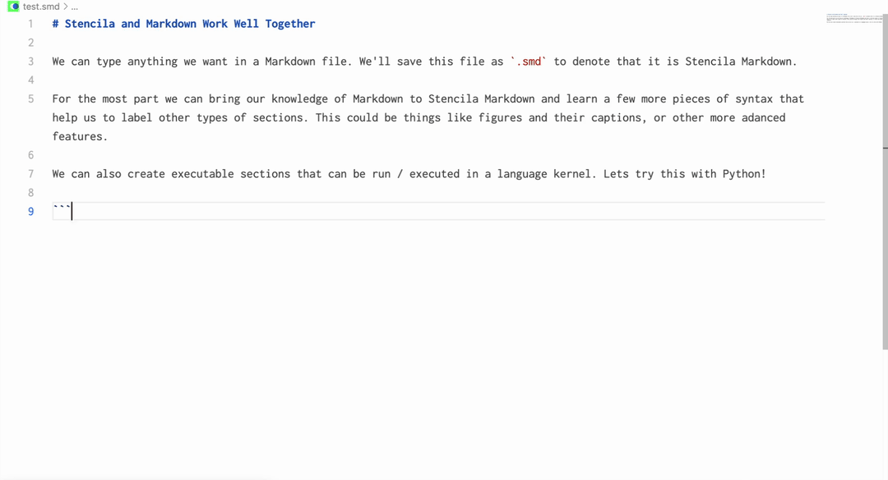

# Stencila VSCode Extension

> ![NOTE]
>
> This is an early release of the extension. We'd love for you to try it out but expect bugs and missing docs.
> Please report any issues or ideas on our Github repo, or join us on our Discord server!  

This extension provides a user interface to [Stencila](https://stencila.io), a tool to help scientists and researchers to develop rich documents utilizing a structured schema. Stencila bring semantic horsepower and flexible executable documents with structure 🏗️ and power 💪🏼 driven by the [Stencila Schema](https://github.com/stencila/stencila/tree/main/schema).

[Discord](https://discord.gg/GADr6Jv) | [Code of Conduct](https://github.com/stencila/stencila/blob/main/CODE_OF_CONDUCT.md) | [Contributing](https://github.com/stencila/stencila/blob/main/vscode/CONTRIBUTING.md) | [Contributors](https://github.com/stencila/stencila#-contributors) | [License](https://github.com/stencila/stencila/blob/main/vscode/LICENSE)

